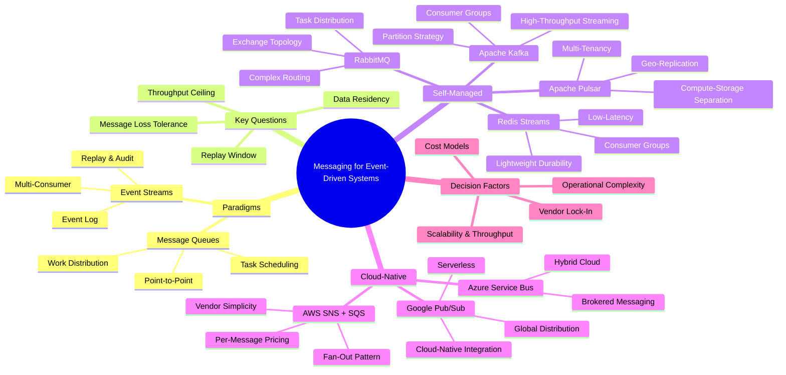
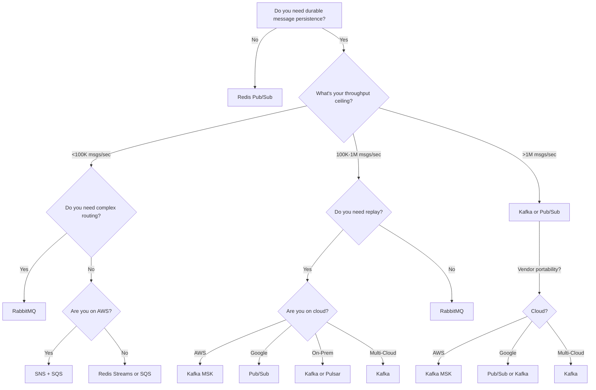

# Messaging Options for Event-Driven Systems

> When you choose a messaging system, you're not just picking a technology—you're deciding how your services will fail, what data you can afford to lose, and whether your team will sleep well at night.

[← Back to Event-Driven Design](./README.md) | **Related:** [Core Principles](./01-principles.md) · [Kafka Internals](./03-kafka-internals.md) · [Delivery Semantics](./05-delivery-semantics.md)

---

## Quick Revision Mind Map



---

## The Four Questions That Shape Your Choice

Before you evaluate specific technologies, answer these four architectural questions. They're the north star that guides every messaging decision and typically eliminate half your options immediately.

### Throughput Requirements

What is your absolute peak load, plus 50% headroom for growth and customer surges? Not your average load—your peak. This single number eliminates half your options immediately. Redis Pub/Sub maxes out around 500K msgs/sec on a single node. RabbitMQ clusters reach 50K-500K msgs/sec depending on network conditions. Kafka and cloud-native services handle 1M+ msgs/sec. These aren't dials you turn up later; they're foundational architectural choices that cascade through your entire system design.

Consider the temporal aspect too. Do you have sustained high throughput, or bursty traffic? Kafka handles sustained volume elegantly. SQS handles bursts by buffering. Redis Pub/Sub under sustained pressure will drop messages silently from slow subscribers' buffers. Know the difference.

### Message Loss Tolerance

This is where many architects stumble. They say "we can't lose messages" when what they mean is "we can't lose financial transactions." But you absolutely can lose notifications that your friend liked your photo. Some events are tolerable as best-effort; others are business-critical.

Distinguish between three categories: financial events (zero loss acceptable, exactly-once or at-least-once with deduplication required), operational events (at-least-once with idempotent processing), and informational events (best-effort, fire-and-forget acceptable). This determines whether you need persistent message logs, transactional guarantees, or simple ephemeral channels.

Also ask: can the business tolerate duplicates? Exactly-once delivery sounds wonderful until you realize the cost: it requires stateful processing, idempotency keys, distributed transactions, and operational complexity that will haunt you for years. In most systems, "at-least-once with idempotent consumers" is simpler and equally correct.

### Replay and Audit Needs

How far back must you replay events when a new consumer joins, or when you discover a bug in consumption logic? Do you need to replay the last 7 days, the last 30 days, or forever? This determines whether you can afford a simple queue (limited retention window) or need something with a commit log.

Consider also your audit and compliance needs. Do regulators require you to retain events for seven years? Or can you delete after 30 days? This directly impacts storage costs and technology selection. Kafka storing six months of events costs differently than Redis Streams (which persist to disk) or SNS/SQS (which auto-delete).

Replay capability is the difference between a work queue and an event log. If you need to rebuild entire services from historical events, only Kafka, Pulsar, and Redis Streams fit. Cloud-native services have limited retention windows (7-14 days).

### Operational Ownership

Where does your data live, and who owns the infrastructure? Are you AWS-only, locked into Google Cloud, running hybrid cloud, or on-premises? Are you a startup with two engineers or a platform company with a dedicated infrastructure team?

This is often the deciding factor in real architecture meetings. If your entire infrastructure is in AWS, fighting against the grain to run self-managed Kafka when SNS/SQS exists is premature optimization. If you're multi-cloud, self-managed Kafka becomes portable across deployments. If you're a three-person startup, managed services let you focus on product. If you're a scale-up with five billion events daily, self-managed infrastructure lets you optimize costs.

---

## Two Paradigms: Message Queues vs. Event Streams

Different messaging systems solve fundamentally different problems. Understanding which paradigm fits your use case is more important than comparing feature matrices.

### Message Queues: Work Distribution

Traditional message queues (RabbitMQ, SQS, NATS JetStream) were designed to distribute work. A producer enqueues a task, and exactly one consumer processes it. The model is simple: enqueue, dequeue, process, acknowledge.

#### How They Work

Producers send messages to queues. Consumers pull messages, process, and acknowledge completion. Acknowledged messages are deleted. Each message gets delivered to exactly one consumer, ensuring work isn't duplicated across workers. If a consumer crashes mid-processing, the message stays in the queue and another worker picks it up.

This is elegant for task distribution. You have 10,000 image resize jobs queued, and 50 workers process them in parallel. No coordination needed. No consumer offset tracking. No partition rebalancing. Just work.

#### The Mental Model

Think of a physical mailroom. Letters arrive (producers send messages). Workers pick up letters from an inbox (consumers dequeue). They process and file (acknowledge). The inbox is empty when done. Scale to 100 workers, 10,000 letters per second—the mental model still holds.

### Event Streams: Event Log

Event streams (Kafka, Pulsar, Redis Streams) take a different approach. Every event is an immutable log entry. Producers append to the log; consumers read sequentially, tracking their position.

#### How They Work

Producers write events to a partitioned log. Consumers subscribe to the log and read from a specific offset (position). Multiple consumers can read the same log independently, each tracking its own position. Unlike queues where each message goes to one consumer, streams let multiple consumers consume the same events without interference.

The log is immutable. Once appended, events never change. This enables replay: start from offset zero and reconstruct the entire history. It enables audit trails: query the log to answer "what happened between 3 PM and 4 PM?" It enables multi-consumer patterns: one service builds analytics, another trains ML models, another sends notifications—all from the same stream.

#### The Mental Model

Think of a newspaper printing press. Stories (events) are printed in sequence. Newspapers are distributed to subscribers. Each subscriber reads at their own pace. A late subscriber can still read yesterday's issue. No story is lost; the archive is permanent. Multiple readers read the same stories independently.

### When the Distinction Matters

| Dimension | Message Queues | Event Streams |
|---|---|---|
| **Consumption Model** | Exactly-one consumer per message | Multiple independent consumers |
| **Message Lifecycle** | Deleted after processing | Persisted indefinitely (or by retention policy) |
| **Replay** | Limited or manual | First-class feature (offset-based) |
| **Ordering Guarantee** | Per-queue | Per-partition (for same key) |
| **Use Case** | Task distribution, work scheduling | Event sourcing, audit, analytics |
| **Scalability Pattern** | Horizontal by queue count | Horizontal by partition count |
| **Operational Overhead** | Moderate | High (brokers, replication, offsets) |
| **Typical Throughput** | 50K-500K msgs/s | 1M+ msgs/s |
| **Cost Model** | Fixed per broker | Fixed per broker + storage |

Choose message queues when you're distributing work (send emails, process images, handle payments). Choose event streams when you're recording history and need multiple consumers or replay capability.

---

## Apache Kafka: The Event Streaming Standard

Kafka is what you reach for when you're ready to build real event-driven systems at scale. I've deployed it across multiple companies handling everything from clickstreams (10M events/day) to IoT sensor data (10B events/day), and it's the only technology in this list that gets better as your scale increases.

### Architectural Philosophy

Kafka fundamentally treats events as an immutable, partitioned log. Every message appended to a partition receives an offset—its position in the log. Producers write to partitions (usually selected by a key for affinity), and consumers read sequentially, committing their position. That simplicity is deceptive: it unlocks ordering guarantees within a partition, replay semantics, consumer groups at scale, and stream processing that handles joins and state correctly.

The cost is that you must think about partitioning. A single partition is a throughput bottleneck; ten partitions on high-traffic topics scales linearly until network I/O limits. In production, I typically start at 10 partitions for low-volume topics, scale to 50-100 for user events or transaction logs, and keep even higher partition counts for high-velocity IoT or payment streams.

### Where Kafka Shines

**High-Throughput Event Streaming.** Kafka handles millions of messages per second across a cluster. I've seen production clusters sustaining 50M events/day (500+ msgs/s) across financial transaction logs, clickstreams, and user activity platforms. Consumer groups enable elegant multi-subscriber patterns where five different services read the same topic independently—each with its own offset tracking. One consumer falls behind by an hour, and it doesn't impact others. One consumer crashes and replays from its last committed offset.

**Event Sourcing and Replay.** Because Kafka retains messages (based on your retention policy), you can replay the entire history of events to reconstruct state or audit compliance. I've used this pattern to answer questions like "what was the exact sequence of events that led to this customer's refund status?" and "rebuild the entire ML feature store from historical data." A new service starts consuming from offset 0 and builds its state from the beginning of time. This is invaluable.

**Multi-Consumer Fan-Out.** In RabbitMQ, you'd need a separate queue per consumer. In SNS, you'd pay per-delivery to each subscriber. In Kafka, multiple consumer groups reading the same topic is free and elegant. One group feeds real-time notifications. Another feeds your data warehouse. A third trains ML models offline. All independent.

**Stream Processing with Ordering Guarantees.** Kafka Streams (or Flink) can join streams, aggregate, and statefully process events with the guarantee that if two events have the same key, they're processed in order. This is how you build real-time fraud detection, recommendation engines, and anomaly detection without descending into eventual consistency hells.

**Operational Observability.** Consumer lag—the difference between the latest message offset and a consumer's current position—is observable, alertable, and actionable. A consumer slowly falling behind? You see it immediately. A deployment stalled a consumer? You track its recovery. This visibility is invaluable in production.

### Where Kafka Struggles

**Operational Complexity.** Kafka clusters require ZooKeeper (or KRaft mode in modern versions), multiple brokers for replication, careful configuration of `log.retention.bytes`, `log.segment.bytes`, and `replica.lag.time.max.ms`. I've spent nights debugging Kafka clusters because someone misconfigured `min.insync.replicas` and didn't realize they were silently losing durability. Managed Kafka (AWS MSK, Confluent Cloud) solves this, but costs more and gives less internal visibility.

**Complexity of Exactly-Once Semantics.** If your business genuinely requires exactly-once delivery (not just "at-least-once with deduplication"), Kafka's transactions feature is powerful but operationally subtle. You're writing transactional state with messages in a way that survives failures. Most of the time, "at-least-once with idempotent consumers" is simpler and equally correct.

**Long-Tail Latency.** Kafka prioritizes throughput over latency. A single message might take 100-200ms to persist and replicate when you have slow followers. For ultra-low-latency systems (sub-millisecond), Kafka isn't the tool. Use Redis Pub/Sub or NATS.

**Wasted Capacity on Low-Volume Topics.** Even if a topic gets one message per minute, Kafka keeps all 10 partitions warm, consuming broker resources. This is an operational grind at scale.

### Production Code: Spring Kafka Producer and Consumer

```java
// Spring Boot Kafka Producer
@RestController
public class OrderProducer {
    @Autowired
    private KafkaTemplate<String, Order> kafkaTemplate;

    @PostMapping("/orders")
    public void publishOrder(@RequestBody Order order) {
        kafkaTemplate.send("orders-topic", order.getId(), order);
    }
}

// Spring Boot Kafka Consumer with Consumer Group
@Service
public class OrderConsumer {
    @KafkaListener(
        topics = "orders-topic",
        groupId = "notification-service",
        containerFactory = "kafkaListenerContainerFactory"
    )
    public void consumeOrder(Order order, Acknowledgment ack) {
        try {
            // Process order (send notification, update DB, etc.)
            notificationService.sendOrderConfirmation(order);
            ack.acknowledge(); // Commit offset
        } catch (Exception e) {
            // On exception, offset is not committed
            // Message will be re-delivered after session timeout
            logger.error("Failed to process order", e);
        }
    }
}

// Advanced: Manual offset management
@Service
public class AdvancedOrderConsumer {
    @Autowired
    private KafkaTemplate<String, Order> kafkaTemplate;

    @KafkaListener(topics = "orders-topic", groupId = "analytics-service")
    public void consumeWithManualOffsets(
        Order order,
        @Header(KafkaHeaders.RECEIVED_PARTITION_ID) int partition,
        @Header(KafkaHeaders.OFFSET) long offset,
        KafkaOperations template
    ) {
        // Process
        analyticsService.recordOrder(order);

        // Commit specific offset with partition
        template.executeInTransaction(ops -> {
            ops.sendOffsetsToTransaction(Map.of(
                new TopicPartition("orders-topic", partition),
                new OffsetAndMetadata(offset + 1)
            ));
            return null;
        });
    }
}
```

### Real-World Scenario: Fintech Activity Platform

Imagine building a user activity platform for a fintech company. Services need to know when users sign up, log in, transfer funds, and make investments. You have 50M users generating 100K events/second at peak. You need to:

- Send real-time notifications (when a transfer completes)
- Build an audit log (for compliance and dispute resolution)
- Recalculate user segments (based on behavior)
- Train ML models (offline, on historical data)
- Detect fraud (real-time anomaly detection)

This is Kafka's sweet spot. One `user-events` topic (100 partitions) handles all throughput. The notifications service consumes and filters for relevant events. The audit team runs time-range queries on retained logs. The ML team replays six months of history. The fraud team runs stream processors that join with user profiles. Each service operates independently without blocking others. The cost is operational: you run a managed Kafka cluster (AWS MSK or Confluent Cloud), monitor broker health, tune replication factors, and occasionally explain to product why you can't "just delete events to save money."

---

## RabbitMQ: Complex Routing for Hybrid Deployments

RabbitMQ is the traditional message broker—mature, feature-rich, with one foot in enterprise datacenters and one foot in cloud infrastructure. I've used it for systems where Kafka felt like overkill and where the routing expressiveness mattered more than raw throughput.

### Architectural Philosophy

RabbitMQ is built around exchanges and queues. Producers publish messages to exchanges (not directly to queues), and exchanges apply routing rules to decide which queues receive the message. This abstraction is powerful. A single exchange can intelligently fan out messages to multiple queues based on topic patterns, headers, or exact keys. Consumers bind to queues independently, and queues can be temporary (for one client) or durable (surviving broker restarts).

This model is expressive—you can build complex routing topologies without application code. But that expressiveness comes at the cost of operational complexity. You're managing exchanges, declaring bindings, deciding which queues are durable. It's easy to build a tangled web of routing that nobody understands six months later.

### Where RabbitMQ Shines

**Complex Content-Based Routing.** Imagine a logistics company routing shipment events. If a package is "fragile," route it to one team's queue. If it's "perishable," route it to the temperature-monitoring team. If it contains "hazardous materials," notify compliance. In RabbitMQ, you use a headers exchange to inspect headers and route accordingly. In Kafka, every consumer reads every shipment and filters client-side. RabbitMQ's headers-based routing is more elegant and observable.

**Flexible Topic Subscriptions.** Topic exchanges support wildcard matching (`logs.*.error`, `user.payment.*`). Services can subscribe to `#` (everything) or narrow patterns. This is more expressive than Kafka's partition-based model. If you have hundreds of event types and services only care about a subset, RabbitMQ's routing is cleaner.

**Hybrid Cloud Deployments.** RabbitMQ runs on-premises, in Kubernetes, in VMs, across clouds. You can run a cluster spanning your datacenter and AWS, with replication plugins ensuring messages sync. If your architecture is hybrid (and many enterprises still are), RabbitMQ is simpler than running Kafka across cloud and on-prem.

**Dead-Letter Queues and Retry Patterns.** RabbitMQ has built-in DLQ support: if a consumer rejects a message N times, it automatically routes to a DLQ. You can then replay from the DLQ with exponential backoff. Kafka requires you to build this pattern explicitly (though it's not hard).

### Where RabbitMQ Breaks Down

**Throughput Ceiling.** A single RabbitMQ cluster maxes out around 50K-500K msgs/sec depending on message size and network. If you need 1M+ msgs/sec, RabbitMQ becomes a bottleneck. You'd have to shard: topic A goes to one cluster, topic B to another. Now you have a coordination problem.

**No Native Consumer Groups.** In Kafka, multiple consumers in the same group read the same topic independently with automatic partition rebalancing. In RabbitMQ, you'd create separate queues per consumer, defeating elegance.

**Replay is Cumbersome.** RabbitMQ doesn't have Kafka's offset-based replay model. If a consumer crashes, it resumes from its last acknowledged message. But if you want to replay from scratch (after a bug in consumption logic), you typically re-publish messages to a replay queue. It works, but it's manual.

**Memory Pressure at Scale.** RabbitMQ queues live in memory (or lazily spilled to disk). With millions of messages queued, you need a lot of RAM. Kafka, storing messages on disk in a log structure, is dramatically cheaper at scale.

### Production Code: Spring AMQP

```java
// RabbitMQ Configuration with Exchanges and Queues
@Configuration
public class RabbitMQConfig {
    public static final String SHIPMENT_EXCHANGE = "shipment-exchange";
    public static final String FRAGILE_QUEUE = "fragile-shipments";
    public static final String HAZMAT_QUEUE = "hazmat-shipments";

    @Bean
    public DirectExchange shipmentExchange() {
        return new DirectExchange(SHIPMENT_EXCHANGE, true, false);
    }

    @Bean
    public Queue fragileQueue() {
        return QueueBuilder.durable(FRAGILE_QUEUE)
            .deadLetterExchange("dlx-exchange")
            .ttl(30000) // 30 second expiration
            .build();
    }

    @Bean
    public Queue hazmatQueue() {
        return QueueBuilder.durable(HAZMAT_QUEUE).build();
    }

    @Bean
    public Binding fragileBinding() {
        return BindingBuilder.bind(fragileQueue())
            .to(shipmentExchange())
            .with("shipment.fragile");
    }

    @Bean
    public Binding hazmatBinding() {
        return BindingBuilder.bind(hazmatQueue())
            .to(shipmentExchange())
            .with("shipment.hazmat");
    }
}

// Producer with Headers-Based Routing
@Service
public class ShipmentProducer {
    @Autowired
    private RabbitTemplate rabbitTemplate;

    public void publishShipment(Shipment shipment) {
        rabbitTemplate.convertAndSend(
            RabbitMQConfig.SHIPMENT_EXCHANGE,
            "shipment." + shipment.getCategory(),
            shipment
        );
    }
}

// Consumer
@Service
public class FragileShipmentConsumer {
    @RabbitListener(queues = RabbitMQConfig.FRAGILE_QUEUE)
    public void handleFragileShipment(Shipment shipment, Channel channel,
            @Header(AmqpHeaders.DELIVERY_TAG) long tag) throws IOException {
        try {
            temperatureMonitoringService.registerShipment(shipment);
            channel.basicAck(tag, false); // Acknowledge
        } catch (Exception e) {
            channel.basicNack(tag, false, true); // Retry
        }
    }
}
```

### Real-World Scenario: E-Commerce Order Processing

You're building an order fulfillment system for a retailer. Orders arrive in an exchange. Routing rules depend on the order type: large corporate orders (>$10K) route to an expedited fulfillment team; international orders route to customs compliance; same-day delivery orders route to the fast-pack queue. You also have notification rules: expensive orders trigger a manual review queue.

RabbitMQ shines here. You create a headers exchange, bind queues with routing keys matching order attributes, and add a dead-letter exchange for orders that fail fulfillment five times. Each team owns their queue independently. The system is expressive and self-documenting: one look at the exchange/queue topology tells you how orders are routed.

If you tried this in Kafka, every consumer would read every order from a central topic and filter client-side. It works, but it's less elegant and harder to monitor.

---

## Apache Pulsar: Unified Queue + Stream with Geo-Replication

Apache Pulsar is the newer player in the streaming space, built at Yahoo to unify message queuing and event streaming while adding geo-replication and multi-tenancy. If Kafka feels heavy for your use case but you need Kafka-like features, Pulsar deserves serious consideration.

### Architectural Philosophy

Pulsar separates compute (brokers) from storage (BookKeeper), which gives it advantages for multi-tenant and geo-distributed systems. Producers write to topics; consumers subscribe independently. Consumer groups provide load balancing. The key difference from Kafka: Pulsar's storage layer is external and scalable independently. You can add a broker to increase throughput without adding storage, or add BookKeeper nodes to expand storage without broker overhead.

This architecture makes Pulsar elegant for cloud-native deployments where elasticity matters. Scale brokers up and down based on throughput demand. Scale storage independently based on retention needs.

### Where Pulsar Shines

**Unified Queue + Stream Model.** Pulsar treats both message queuing (exclusive consumer) and event streaming (multiple consumers) as first-class patterns. You don't have to choose between RabbitMQ and Kafka; Pulsar does both. A topic can have exclusive consumers (work queue pattern) or shared consumers (streaming pattern).

**Built-In Geo-Replication.** Multi-region replication is native. Producers publish to one cluster; messages automatically replicate to other clusters. Consumers in different regions read locally. Kafka's multi-region setup requires MirrorMaker or Confluent Platform—Pulsar makes it built-in.

**Multi-Tenancy.** Pulsar has native tenant and namespace isolation. Different teams can share a Pulsar cluster without seeing each other's topics or data. Fine-grained access control per tenant. This is Kafka's weakness; it lacks native multi-tenancy.

**Tiered Storage.** Pulsar's storage layer supports tiering to object storage (S3, GCS). Keep recent data hot on BookKeeper; archive old data to S3 automatically. This reduces long-term retention costs dramatically compared to Kafka's local disks.

### Where Pulsar Struggles

**Operational Complexity.** Pulsar requires brokers, BookKeeper nodes (usually 3+), and ZooKeeper. That's more moving parts than Kafka. It's complex to operate and debug.

**Smaller Ecosystem.** Kafka has a massive ecosystem: Kafka Streams, Confluent Platform, integration libraries, tooling. Pulsar's ecosystem is smaller. You'll spend more time building integrations yourself.

**Adoption in 2025.** Kafka dominates the market. If you need to hire engineers or buy commercial support, Kafka is easier. Pulsar is excellent technology but represents a niche.

### When to Consider Pulsar Over Kafka

Use Pulsar when you need geo-distributed systems (Kafka multi-region is harder), multi-tenancy (Kafka lacks it), or tiered storage for cost-sensitive retention. Use Pulsar if your team has the operational expertise. Use Kafka if you want the biggest ecosystem and easiest hiring.

---

## Redis Streams: Lightweight Durability for Low-Latency Systems

Redis Streams, introduced in Redis 5.0, bridges the gap between Redis Pub/Sub (ephemeral) and Kafka (heavy). It adds durability and consumer groups to Redis while keeping latency ultra-low.

### Architectural Philosophy

Redis Streams are append-only logs stored in memory (but optionally persisted to disk via RDB/AOF). Each entry has a unique ID (timestamp-based), and consumers can read from any ID forward. Consumer groups provide load balancing: multiple consumers in the same group partition the stream, each processing different entries. Unlike Redis Pub/Sub, messages persist; if a consumer goes down, it can resume from where it left off.

The trade-off: throughput is lower than Kafka (limited by single-node RAM), but latency is lower and operational complexity is much lower. If you already run Redis for caching, adding Streams is just a new data structure—no new infrastructure.

### Where Redis Streams Shine

**Low-Latency Lightweight Streaming.** Latency is sub-millisecond, significantly lower than Kafka's 100ms+. For real-time dashboards, notifications, and live collaborative tools, Redis Streams are fast enough. And they're durable—unlike Pub/Sub, messages persist even if subscribers are offline.

**Already-Have-Redis Deployments.** Your caching layer runs Redis. Adding Streams is one feature flag. No new infrastructure, no new cluster to monitor. One platform does caching, sessions, and now messaging.

**Consumer Groups Without Complexity.** Redis Streams have consumer groups simpler than Kafka. You don't manage offsets or rebalancing manually. Automatic load balancing across consumers in a group. Pending entry lists let you track which messages are unacknowledged.

**Lightweight Event Processing.** For simple event processing (filter, enrich, notify), Redis Streams are sufficient. You don't need the operational overhead of Kafka if your processing is simple.

### Where Redis Streams Struggle

**Throughput Ceiling.** A single Redis instance maxes out around 100K-200K commands/sec (combined operations). For millions of events per second, you'd need sharding, which complicates topology.

**Limited Retention.** Redis runs in memory (or with disk-based persistence). Retaining months of events requires a lot of RAM. Kafka's disk-log model is dramatically cheaper for long-term retention.

**Single Point of Failure (Without Replication).** Redis Streams don't replicate automatically. You need Redis Cluster or Sentinel for replication. Kafka replication is built-in.

### Production Code: Lettuce Consumer Group

```java
// Redis Streams Producer (using Lettuce)
@Service
public class NotificationProducer {
    @Autowired
    private RedisTemplate<String, String> redisTemplate;

    public void publishEvent(String eventType, Map<String, String> data) {
        redisTemplate.opsForStream().add(
            RedisStreamCommands.XAddOptions.empty()
                .id("*"), // Auto-generate ID
            "notifications:" + eventType,
            data
        );
    }
}

// Redis Streams Consumer Group with Lettuce
@Service
public class NotificationConsumer {
    @Autowired
    private ReactiveRedisTemplate<String, String> reactiveRedisTemplate;

    private final String STREAM_KEY = "notifications:user-signup";
    private final String GROUP_NAME = "email-service";
    private final String CONSUMER_NAME = "email-worker-1";

    @PostConstruct
    public void init() {
        // Create consumer group if it doesn't exist
        reactiveRedisTemplate.opsForStream()
            .createGroup(STREAM_KEY, GROUP_NAME)
            .onErrorResume(e -> Mono.empty())
            .block();
    }

    @Scheduled(fixedRate = 1000)
    public void consumeEvents() {
        reactiveRedisTemplate.opsForStream()
            .read(
                Consumer.from(GROUP_NAME, CONSUMER_NAME),
                StreamReadOptions.empty().block(),
                StreamOffset.fromStart(STREAM_KEY)
            )
            .doOnNext(message -> {
                String eventId = message.getId();
                Map<String, String> data = message.getValue();

                // Process: send email
                emailService.sendWelcomeEmail(data.get("email"));

                // Acknowledge message
                reactiveRedisTemplate.opsForStream()
                    .acknowledge(GROUP_NAME, eventId)
                    .block();
            })
            .blockLast();
    }

    // Pending Entry List: monitor unacknowledged messages
    public Mono<Long> getPendingCount() {
        return reactiveRedisTemplate.opsForStream()
            .pending(STREAM_KEY, GROUP_NAME)
            .map(PendingMessagesSummary::getTotalPendingMessages);
    }
}
```

### Real-World Scenario: Real-Time Notifications System

You're building a notification system for a SaaS product. When users perform actions (upload file, invite teammate, comment), you need to notify other users in real-time. Notifications should be durable (don't lose them if a consumer is offline), but latency is critical (should appear within 100ms).

Redis Streams is perfect. Producers publish events; multiple notification workers consume via consumer groups. If a worker crashes, it resumes from where it left off. Latency is sub-millisecond. Operational complexity is near zero (you already run Redis).

If you used Kafka, you'd get the durability and consumer groups, but you'd add operational overhead for a use case that doesn't need it. If you used Pub/Sub, you'd get the latency but lose durability.

---

## Cloud-Native Options

Cloud-native messaging services abstract away operational burden by removing broker management from your team's responsibility. The trade-off is vendor lock-in and per-message pricing that can surprise you at scale.

### AWS SNS + SQS: Fan-Out and Queuing

SNS (Simple Notification Service) is topic-based pub/sub. SQS (Simple Queue Service) is a durable queue. Together, they handle most AWS-native event-driven architectures.

#### SNS: Fan-Out Distribution

SNS is designed to broadcast messages to multiple subscribers (SQS queues, Lambda functions, HTTP webhooks, email). One publish operation fans out to all subscriptions.

**Key characteristics:**
- Delivery: At-least-once (with rare duplicates)
- Ordering: No guarantees (messages can arrive out of order)
- Persistence: 0 seconds (immediate delivery only)
- Replay: No

**Where SNS shines:** Architectural fan-out patterns. You want one event (an order placed) to trigger multiple workflows: inventory update, payment processing, notification sending, analytics. SNS fanout is simpler than maintaining separate queues per subscriber.

Cost-effective for low-frequency events. You pay per publish + per delivery. If you publish 10K events/day and have 5 subscribers, you pay for 50K deliveries. Cheap. At 1B msgs/day to 5 subscribers, per-message pricing dominates Kafka costs at scale.

**Where SNS breaks down:** No message ordering. If you publish events in order (user created → user activated → user subscribed), SNS delivers them independently, and ordering isn't guaranteed. For order-dependent workflows, this breaks things.

No consumer groups. If three instances of a service read SNS messages, you need three SQS queues subscribed to the same SNS topic. You're triplicating message storage.

#### SQS: Point-to-Point Queuing

SQS is a durable queue. Producers send messages; consumers poll; each message is processed once and deleted.

**Key characteristics:**
- Delivery: At-least-once
- Ordering: FIFO queues available (`.fifo` suffix), but limited to 300 msgs/sec
- Persistence: 14-day default retention (configurable)
- Replay: Limited to retention window

**Where SQS shines:** Simple producer-consumer patterns. Web servers enqueue jobs (send email, resize image), and workers dequeue and process. SQS is perfect. Durability is built-in. Visibility timeout means if a worker crashes, the message reappears after 30 seconds for another worker.

Decoupling services from load spikes. Traffic spike causes producers to enqueue faster than consumers can process. SQS buffers them, consumers process at their own pace.

Serverless architectures. Lambda functions read from SQS, process, and delete. Auto-scaling is automatic (Lambda scales based on queue depth).

**Where SQS breaks down:** FIFO queues max at 300 msgs/sec. Standard queues don't guarantee ordering but burst higher. If you need both high throughput and ordering, you're stuck.

No consumer groups. If five workers read from one queue, the queue partitions work: worker A gets some messages, worker B gets others. But there's no offset tracking. Redeployment might reprocess messages if handling isn't idempotent.

No replay. If a bug in processing logic is discovered, you can't replay messages from 24 hours ago (unless you pre-configured retention to 24 hours and didn't delete from the queue).

#### The SNS + SQS Pattern

The most common pattern: SNS topic fans out to multiple SQS queues.

```
Order Placed Event → SNS Topic
                   ├→ SQS Queue (Inventory Team)
                   ├→ SQS Queue (Payment Team)
                   └→ SQS Queue (Analytics)
```

This decouples publishers from subscribers (publisher only knows about SNS). Each team owns their queue independently. If the inventory service crashes, analytics continues. If you need a new subscriber, create a new queue and subscribe it to the topic.

The downside: cost. If you publish 1M orders and have 3 subscribers, SNS charges for 1M publishes + 3M deliveries. Whereas Kafka charges based on cluster cost (fixed), SNS charges based on usage.

#### When to Choose SNS/SQS

You're a startup with limited ops capacity. You're building on AWS. Operational simplicity and velocity are critical. SNS/SQS let you ship without managing infrastructure. Costs are acceptable at your current scale. You predict per-message costs in a year and decide if they're reasonable.

---

### Google Cloud Pub/Sub: Managed Cloud-Native Streaming

Google Pub/Sub is the Google Cloud equivalent of Kafka meets SNS/SQS. It's fully managed, scales to 1M+ msgs/sec, supports consumer groups (called subscriptions), and offers global distribution across regions.

#### Architectural Philosophy

Pub/Sub borrows Kafka's consumer group model but adds cloud-native simplicity. You create topics and subscriptions; publishers write to topics; subscribers pull from subscriptions. Multiple subscriptions to the same topic form consumer groups. But unlike Kafka, you don't manage brokers or replication.

It supports both pull delivery (clients pull on demand) and push delivery (Pub/Sub pushes to HTTP endpoints, Cloud Functions, or Dataflow). This flexibility is powerful. Real-time services pull messages; batch jobs use push delivery.

#### Where Pub/Sub Shines

**Global-Scale Distribution.** Pub/Sub replicates messages across regions automatically. Publish in us-central1, subscribers in europe-west1 get messages with low latency. If a region fails, subscribers automatically fail over. Kafka multi-region requires explicit MirrorMaker configuration.

**Cloud-Native Integration.** Pub/Sub natively triggers Cloud Functions, feeds BigQuery, integrates with Dataflow. If your entire stack is Google Cloud, this is seamless. One Pub/Sub topic feeds your real-time dashboard (via Cloud Functions), your data warehouse (via BigQuery streaming insert), and your batch jobs (via Dataflow).

**Serverless Operations.** No brokers to manage, no replication factors to tweak. You set desired throughput and Google scales infrastructure. Costs scale with usage, not with provisioned capacity.

#### Where Pub/Sub Breaks Down

**Vendor Lock-In.** If your business later wants to migrate, Pub/Sub knowledge doesn't transfer. Kafka skills transfer across companies and clouds.

**Ordering Guarantees are Weaker.** Pub/Sub offers per-subscription ordering (with a performance cost), but it's not as natural as Kafka's per-partition ordering.

**Limited Replay Window.** Default retention is 7 days (up to 31 days). Kafka's "unlimited" retention (if you afford storage) is more flexible for long-term event sourcing.

#### When to Choose Pub/Sub

You're all-in on Google Cloud. You're ingesting clickstream data, storing in BigQuery, and updating real-time dashboards. You don't want to manage brokers. Vendor lock-in isn't a concern because you're already locked in.

---

### Azure Service Bus: Enterprise Messaging for Hybrid Cloud

Azure Service Bus combines message queuing (point-to-point) and topic-based pub/sub, with native support for hybrid cloud scenarios.

**Key characteristics:**
- Topics support publish-subscribe (similar to SNS)
- Queues support point-to-point messaging (similar to SQS)
- Dead-letter queues and retry policies built-in
- Delivery: At-least-once
- Ordering: Available via sessions (FIFO)
- Persistence: 1-14 day configurable retention

**Where Service Bus Shines:** Hybrid cloud deployments (on-premises + Azure). Enterprise features like session-based ordering (messages grouped by session ID processed sequentially). Advanced dead-letter queue handling.

**Where Service Bus Breaks Down:** Vendor lock-in to Azure. Throughput is lower than Kafka (maxes around 100K-200K msgs/sec). Ordering is session-based, not partition-based, which adds complexity.

**When to Choose Service Bus:** You're committed to Azure. You need hybrid cloud support. You value enterprise features and managed operations over raw throughput.

---

### Cloud Services Comparison Matrix

| Service | Throughput | Delivery | Ordering | Replay Window | Push/Pull | Cost Model | Lock-In |
|---|---|---|---|---|---|---|---|
| **AWS SNS** | 100K+ msgs/s | At-least-once | None | None | Push | Per-publish + per-delivery | High |
| **AWS SQS** | 100K+ msgs/s (std) or 300 msgs/s (FIFO) | At-least-once | FIFO only | 14 days max | Pull | Per-message | High |
| **Google Pub/Sub** | 1M+ msgs/s | At-least-once | Per-subscription (cost) | 7-31 days | Both | Per-GB transferred | High |
| **Azure Service Bus** | 100K-200K msgs/s | At-least-once | Sessions | 1-14 days | Pull | Per-operation | High |

---

## Master Comparison Table: All Technologies

| Technology | Throughput | Delivery | Ordering | Persistence | Replay | Complexity | Cost Model | Ecosystem |
|---|---|---|---|---|---|---|---|---|
| **Message Queues (RabbitMQ)** | 50K-500K msgs/s | At-least-once | Per-queue | Disk | Limited | High | Per-broker | Large |
| **Apache Kafka** | 1M+ msgs/s | Configurable | Per-partition | Disk (infinite if storage allows) | Full history | High | Per-broker | Very Large |
| **Apache Pulsar** | 1M+ msgs/s | Configurable | Per-partition | Disk + tiering | Full history | Very High | Per-broker | Medium |
| **Redis Streams** | 100K-200K cmds/s | At-least-once | Per-stream | Memory + RDB/AOF | Limited | Low | Per-instance | Medium |
| **Redis Pub/Sub** | 500K+ msgs/s | At-most-once | None | Memory only | None | Very Low | Per-instance | Medium |
| **AWS SNS/SQS** | 100K+ msgs/s | At-least-once | SQS FIFO only | 14 days | Limited | Very Low | Per-message/operation | Large |
| **Google Pub/Sub** | 1M+ msgs/s | At-least-once | Optional (cost) | 7-31 days | Limited | Very Low | Per-GB transferred | Medium |
| **Azure Service Bus** | 100K-200K msgs/s | At-least-once | Sessions | 1-14 days | Limited | Very Low | Per-operation | Medium |
| **NATS JetStream** | 500K+ msgs/s | Configurable | Per-subject | Disk | Limited | Low | Per-instance | Small |

**How to read this table:**

- **Throughput:** Maximum sustained messages per second at scale.
- **Delivery:** At-most-once (some loss), at-least-once (some duplicates), exactly-once (complex).
- **Ordering:** Within what scope? Per-partition, per-subject, per-session?
- **Persistence:** Memory (lost on restart), disk (survive failures), unlimited (cost-permitting).
- **Replay:** Full history (arbitrarily far back), limited (retention window), none (fire-and-forget).
- **Complexity:** Operational burden on your team.
- **Cost Model:** What scale do you optimized for?
- **Ecosystem:** Libraries, tools, community, hiring pool.

---

## Decision Framework

### The Decision Tree



### Narrative Guide: Walking Through a Real Decision

You've got a new event-driven feature to build. Walk through these questions in order. Most real decisions are forced by one or two hard constraints.

**Question 1: What is your absolute peak throughput?** If less than 10K msgs/sec, almost anything works. If 100K-1M msgs/sec, narrow to Kafka, Pub/Sub, or Pulsar. If above 1M msgs/sec, only Kafka or Pub/Sub. This usually forces a decision.

**Question 2: Do you need durability?** If no (real-time dashboards, notifications, game state), Redis Pub/Sub is fastest and simplest. If yes, continue.

**Question 3: Do you need to replay messages or reconstruct historical state?** If yes, you need an event log: Kafka, Pulsar, or Pub/Sub. If no, simpler systems (SQS, RabbitMQ, Redis Streams) work.

**Question 4: Do you need complex content-based routing?** If yes (shipping events, order fulfillment), RabbitMQ's exchange topology is elegant. If no, continue.

**Question 5: Where is your infrastructure?** If all-in on AWS, SNS/SQS are pragmatic. If all-in on Google Cloud, Pub/Sub. If multi-cloud or on-premises, Kafka. This often overrides other factors.

**Question 6: How much operational complexity can you absorb?** If you have platform engineers, Kafka's complexity is acceptable. If you're a startup, managed services (SNS/SQS, Pub/Sub) let you ship faster.

Start with Question 1. If throughput requires Kafka, stop debating—use Kafka. If replay is essential, that's Kafka or Pub/Sub. If your cloud vendor is the constraint, that often overrides everything. Most decisions are forced by one or two hard constraints.

### Hybrid Architectures at Scale

Real systems don't fit neatly into single technologies. Leading companies use hybrids optimized for specific use cases.

**Kafka + Redis Streams (Stream + Cache):** Kafka handles high-volume, durable event streaming. Redis Streams handles lower-volume, ultra-low-latency operations. Producers write to both: financial transactions go to Kafka (for audit), real-time updates go to Redis (for speed). Consumer applications read from the appropriate system.

Example: An exchange's order management system. Trade events go to Kafka (for audit and replay). Order book updates go to Redis Streams (for sub-millisecond delivery to traders). The two systems are decoupled; if Kafka is slow, traders still see fast updates.

**SNS/SQS + Kafka (Cloud Fan-Out + Durable Stream):** AWS SNS fans out to multiple SQS queues. But one SQS queue also publishes to Kafka for long-term retention and analytics. You get AWS's simplicity for most subscribers, plus Kafka's replay for data teams.

Example: An e-commerce platform. Orders publish to SNS, which fans out to SQS queues for payment, fulfillment, and notification teams. Additionally, one SQS queue publishes to Kafka for analytics and ML teams. The orders system is simple (SNS/SQS), but analytics teams get full replay.

**RabbitMQ + Kafka (Task Queue + Event Log):** RabbitMQ handles task scheduling and complex routing. Kafka handles event streaming and analytics. Systems that are primarily task-oriented (microservices, job scheduling) use RabbitMQ. Systems that are event-oriented (analytics, compliance) use Kafka.

Example: A SaaS platform. Microservices communicate via RabbitMQ (complex routing, task scheduling). User activity streams to Kafka (analytics, compliance, ML).

The cost is operational complexity: you're managing multiple systems. But you're optimizing each system for what it's best at.

---

## Hard Trade-Offs: What Architects Actually Debate

In real meetings, teams don't compare feature matrices. They debate these thorny trade-offs.

### Complexity vs. Features

Kafka is dramatically more powerful than SQS if you need replay, consumer groups, or stream processing. But it's dramatically more operationally complex. I've seen teams choose SQS for a year, then switch to Kafka as requirements grew, then spend three months migrating. I've also seen teams spend six months managing Kafka when SQS would have been fine forever.

The pragmatic path: Start with managed simplicity (SQS or Pub/Sub). Migrate to Kafka only when you have a specific use case (replay, stream processing, billion+ events/day) that SQS can't handle. Operational simplicity compounds; every complexity decision is a potential 24/7 on-call rotation.

### Vendor Lock-In vs. Managed Simplicity

AWS SNS/SQS and Google Pub/Sub abstract away operational burden but lock you in. Kafka is portable; your knowledge transfers across companies and clouds.

The pragmatic path: If your business is cloud-native (you're using Lambda, Cloud Functions, etc.), vendor services are fine—you're already locked in. If your business requires flexibility (you support customers on multiple clouds or on-premises), Kafka's portability matters.

### Throughput vs. Latency

Kafka prioritizes throughput and durability. A message might take 100ms to persist. Redis Pub/Sub prioritizes latency (sub-millisecond) and sacrifices durability. If you need both, you're in a bind.

The pragmatic path: Few systems need both. Kafka's latency is acceptable for most event streaming (100ms is fine for fraud detection, ML training, analytics). Redis Pub/Sub's lack of durability is fine for notifications and real-time updates. If you genuinely need both, use both: Redis for real-time, Kafka for durability, with a replay mechanism.

### Per-Message Costs vs. Fixed Infrastructure

SNS/SQS charge per-message. At small scale, this is cheap. At billion-message scale, this becomes your biggest cost. Kafka charges per-broker (fixed) and per-storage-GB.

The pragmatic path: Calculate costs at your projected 12-month scale. Run the numbers both ways. Often the crossover point is 100-500M msgs/month. Below that, SNS/SQS wins. Above that, Kafka wins.

---

## Common Mistakes and How to Avoid Them

| Mistake | What Happens | Fix |
|---|---|---|
| **Choosing Kafka too early** | You spend six months managing brokers and ZooKeeper for a 10K msgs/sec load that SQS handles effortlessly. Your startup's velocity stalls. | Start with managed services (SNS/SQS). Migrate to Kafka only when you have a replay use case or hit throughput limits. |
| **Not accounting for message ordering** | You publish events in order (user created → user activated → user subscribed). SNS delivers them out of order. Your notifications send in wrong sequence. | Require ordering only where it matters. Use Kafka partitions or FIFO queues. Don't assume ordering in distributed systems. |
| **Underestimating operational complexity** | You run a Kafka cluster with one person on your team who knows it. That person leaves. Nobody else knows how to restart brokers or fix replication. | Invest in documentation, runbooks, and cross-training. Consider managed services (MSK, Confluent Cloud) to reduce burden. |
| **Misconfiguring retention** | Your Kafka cluster retains 6 months of data. Storage costs explode. Or you set retention to 1 day and your replay use case breaks. | Calculate retention costs upfront. Start conservative (7 days). Expand only for explicit use cases. Monitor storage costs. |
| **Consumer lag going unmonitored** | A consumer slowly falls behind for three days before anyone notices. By then, messages have expired from Kafka. You've lost data. | Expose consumer lag as a metric. Set alerts for lag > 1 hour. Monitor and investigate immediately. |
| **Mixing durable and ephemeral in same system** | You build a Kafka system expecting full replay, but your team only retains 3 days of data "to save money." Later you need 30-day replay for compliance. | Get stakeholders to agree on retention upfront. Document the replay use case explicitly. Include retention costs in capacity planning. |
| **Ignoring idempotency** | You deploy at-least-once Kafka consumers without idempotency keys. A consumer crash causes reprocessing. You charge the same customer twice. | Implement idempotency keys in all consumers. Design processing to be idempotent even if called multiple times. |
| **Not testing failure scenarios** | Your SNS+SQS system works perfectly in happy path. A queue gets stuck. Messages build up. You discover you have no monitoring or alerting. | Test failure modes: queue stuck, consumer slow, producer overwhelmed, broker down. Build monitoring and alerting first. |
| **Choosing based on technology hype** | You read about Apache Pulsar and want to use it because it's newer. You spend months learning operational details that don't apply to your use case. | Choose based on requirements, not hype. Kafka's simplicity (by ecosystem standards) often outweighs Pulsar's theoretical advantages. |
| **Assuming cloud vendors' pricing scales linearly** | SNS/SQS seemed cheap at 1M msgs/month. At 1B msgs/month, costs are 100x with per-message pricing surprises. | Model cloud pricing at 12-month projected scale. Calculate the crossover point where Kafka becomes cheaper. Budget accordingly. |

---

## Interview Tip

**The architect-level answer to "How would you choose a messaging system?"**

> I'd start with non-functional requirements: throughput (msgs/sec at peak), latency (p99), retention window, and whether the business tolerates message loss. Then I'd check delivery semantics—does exactly-once matter, or is at-least-once with idempotent consumers sufficient?
>
> For **high-volume event streaming with replay needs** (billions of events daily), **Kafka wins**. I've scaled it to handle 100M+ events/day across financial transactions and user activity. Consumer groups enable elegant multi-subscriber patterns without replicated queues. The cost is operational: you need brokers, monitor replication, tune retention, and debug lag. If you can absorb that complexity, Kafka is unbeatable.
>
> For **AWS-native companies at scale**, **SNS + SQS is pragmatic**. You get durability, fan-out, and auto-scaling without managing brokers. The trade-off is vendor lock-in and per-message pricing. I'd start here, migrate to Kafka only when SQS becomes a bottleneck or replay becomes essential.
>
> For **real-time, non-durable messaging** (dashboards, notifications, game state), **Redis Pub/Sub** is the fastest and simplest. Message loss is acceptable in these domains.
>
> **RabbitMQ** is my pick for **complex routing scenarios and hybrid deployments**. Headers-based routing is elegant if you need content-based message distribution. Hybrid cloud support is native. But it doesn't scale to Kafka levels, so I only use it when expressiveness matters more than raw throughput.
>
> **Apache Pulsar** is emerging as a solid middle ground: it unifies queue + stream models, adds geo-replication natively, and separates compute from storage. But it's operationally complex and has a smaller ecosystem than Kafka. I'd consider it for multi-tenant, geo-distributed systems where Kafka feels insufficient.
>
> The critical architectural decision is always the **partition/consumer strategy**. In Kafka, one partition per logical stream ensures ordering but is a bottleneck. You scale by adding partitions (but can't rebalance them later without downtime). In RabbitMQ, you manage queues per consumer. In SNS/SQS, each team owns a queue. Get this wrong and you'll regret it for years.
>
> I also consider **team expertise and operational budget**. Kafka requires platform engineers who've debugged consumer lag and offset commits. SNS/SQS requires AWS knowledge but less deep systems expertise. For a startup, bet on velocity. For a platform company, bet on scalability.

---

**Navigation:** [← 01 Core Principles](./01-principles.md) | [03 Kafka Internals →](./03-kafka-internals.md)

