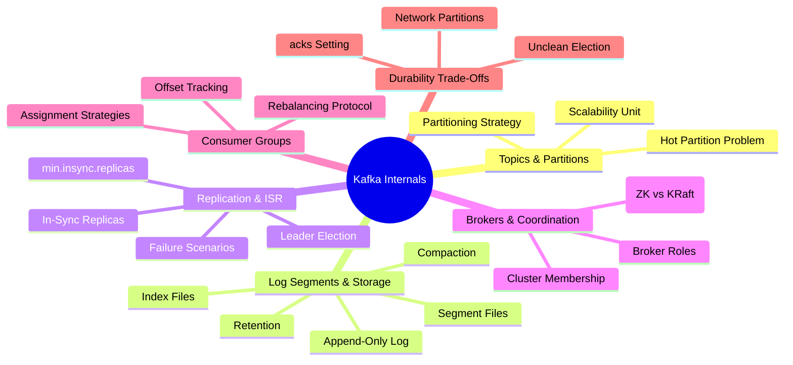
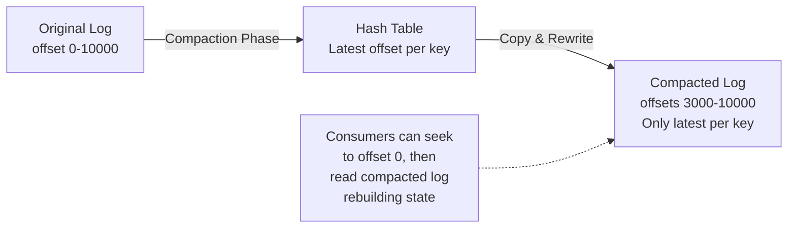
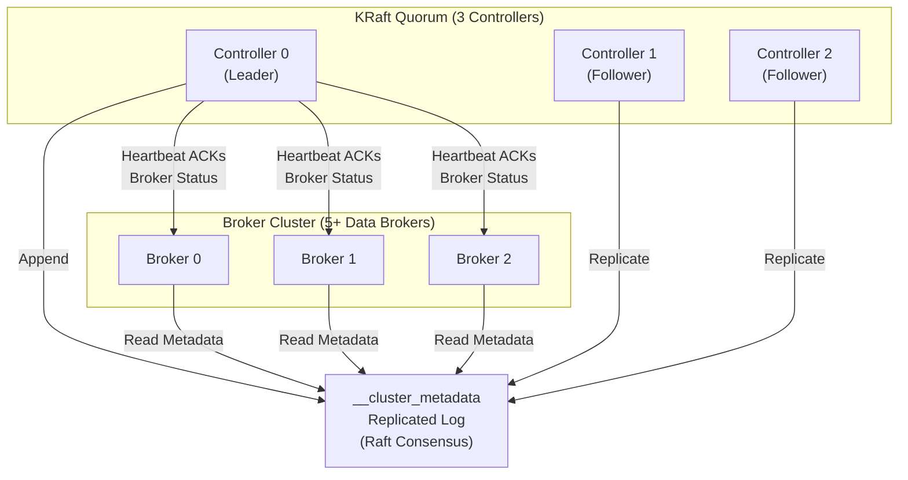
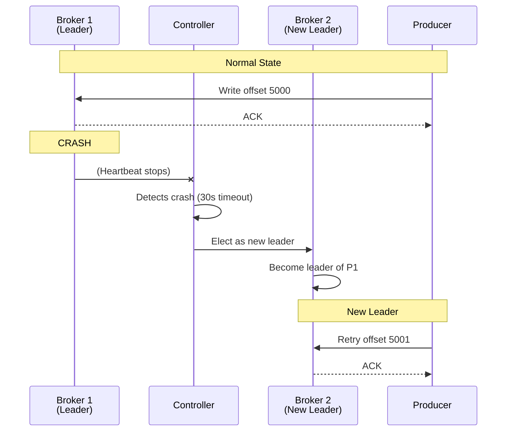
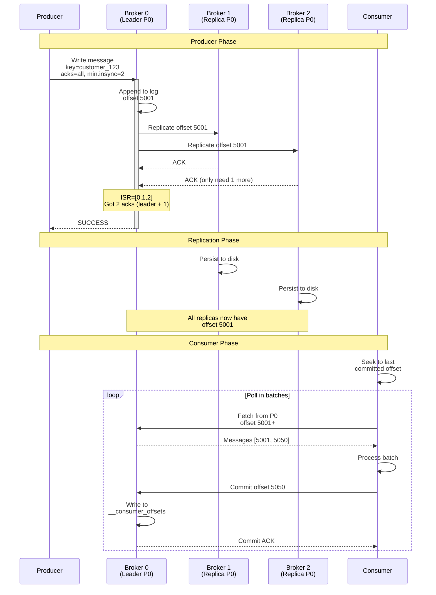

# Kafka Internals: Architecture That Powers Event-Driven Systems

> *To architect with Kafka confidently, you must understand why each component exists, not just how it works. The answer to "why does ISR exist?" matters more than "what is ISR?"*

[← Back to Event-Driven Design](./README.md) | **Related:** [Messaging Options](./02-messaging-options.md) · [Kafka Configs](./04-kafka-configs.md)

---

## Quick Revision Mind Map



---

## Building the Mental Model

To architect systems with Kafka, you need to understand five interconnected concepts and how they form a coherent system for durable, scalable, ordered message distribution. Each builds on the last.

Imagine you're designing an order processing system handling thousands of orders per second. You need **throughput** (many orders processed in parallel), **ordering** (orders from the same customer in sequence), and **durability** (no lost orders, even if servers crash). Kafka solves all three simultaneously, but only if you understand the architectural decisions that make this possible.

Here's the fundamental insight: a single ordered log on a single machine is simple but not scalable. So Kafka splits the log horizontally into **partitions** (independent logs), then **replicates** each partition across brokers, then tracks which replicas are synchronized (**ISR**), then **coordinates** all of this with a distributed consensus system. No external dependencies required (in KRaft mode). Each layer solves a specific problem, and together they create a system that's both fast and durable.

This section walks through that system piece by piece, building from the data model up to the operational concerns you'll face in production.

---

## Topics and Partitions: The Scalability Foundation

Think of a **topic** as a logical channel—all orders flow here. A topic is an abstraction: it's durable, immutable once written, and respects retention policies you define. But a single ordered log is a fundamental bottleneck. A single machine writing sequentially can handle maybe 100 MB/sec. If you need 1 GB/sec throughput, you need to parallelize.

The innovation is **partitions**. A topic with N partitions is really N independent logs, each ordered internally but not globally. This unlocks parallelism: your order service sends orders to partition 0, 1, 2... and *ten consumers* can read simultaneously—one per partition, or multiple reading the same partition at different offsets.

### The Scalability Unit

Each partition is a totally ordered log stored on a single broker at any given moment. That broker is the **leader** for that partition. When a producer sends a message with a key (e.g., customer_123), Kafka hashes the key and uses modulo arithmetic to route it to a specific partition. This guarantees that all messages for customer_123 arrive at the same partition, preserving order.

Why only one leader per partition? Because ordering requires a single source of truth. If two brokers could simultaneously accept writes to the same partition, there would be no way to impose a global order—messages could arrive out of sequence depending on network timing. Kafka chose simplicity: one leader, strict ordering within the partition, parallelism across partitions.

### Partition Key Design and Hash-Based Assignment

The producer runs this logic:

```
if (key provided):
    partition = hash(key) % num_partitions
else:
    partition = sticky_round_robin()
```

If a key is present, it's deterministic—same key always goes to the same partition. This is how you preserve ordering for a specific customer, account, or order ID. If there's no key, the producer uses sticky round-robin, distributing messages across partitions to balance load.

This creates an architectural trade-off you'll encounter constantly. Keyed messages preserve customer-level ordering but can create hot partitions if one customer sends far more messages than others. Keyless messages distribute load evenly but sacrifice global ordering. In a typical architecture, you start with keys (ordering is usually required), then shard by key to avoid hotspots.

### The Hot Partition Problem

I've seen production incidents where one customer sent 10,000 orders per second while others sent 10. With 100 partitions, that customer's orders all mapped to partition 42, maxing it out. The other 99 partitions had capacity to spare. This is the hot partition problem, and it's architectural, not operational.

Solutions: (1) Pre-hash the key with a salt to distribute a single customer across multiple partitions, accepting weaker ordering guarantees. (2) Redesign the topic to partition by something with better distribution. (3) Acknowledge that partition 42 is your limit, and scale vertically instead.

### Sizing Partitions

Here's the rule I use in practice: **Partition count should be roughly `(target_throughput_MB_per_sec) / (single_consumer_throughput_MB_per_sec)`**.

If one consumer can handle 10 MB/sec and you want 100 MB/sec total, you need ten partitions. Overprovision slightly for growth—maybe 12-15. The key insight: *more partitions = more parallelism, but also more metadata, more rebalancing overhead, and more operational complexity.*

Too many partitions leads to:
- **Cluster metadata explosion** — the controller tracks every partition's leadership, ISR, and replica list. With 100,000 partitions, metadata changes become expensive and propagation delays lengthen.
- **Rebalancing storms** — when a consumer crashes or joins, the group rebalances, pausing all processing briefly. More partitions = longer rebalances. In Kafka 4.0 with KIP-848, this is partially mitigated.
- **Producer routing overhead** — the producer maintains an in-memory map of partition leaders. More partitions = more memory, more cache invalidation when brokers fail.

I've seen teams provision 100 partitions for a topic with two consumers, then six months later wonder why cluster metadata propagation takes seconds instead of milliseconds. Then they wonder why the rebalance takes 30 seconds when a single consumer restarts. Revisit partition count quarterly as your throughput profile changes.

---

## Log Segments and Storage: How Kafka Persists Data

Kafka's speed comes from understanding how it actually stores messages on disk. This section covers the storage layer that enables durability without sacrificing latency.

### How Kafka Stores Data on Disk

A **broker** is a single Kafka server. It stores partition data on local disk, organized into immutable **segment files**. When a producer writes, the broker appends to the current segment, then flushes to disk (depending on `log.flush.interval.ms`, but this is usually OS-managed via the page cache).

Each partition directory contains:

- **`.log` file** — The actual records, stored sequentially by offset. Offset 0-999 might be in segment `00000000000000000000.log`, offsets 1000-1999 in the next segment. Immutable after the segment rolls over.
- **`.index` file** — A sparse index mapping offset → byte position in the log. Kafka doesn't need to scan the log sequentially; it can jump directly to a given offset by consulting the index.
- **`.timeindex` file** — Maps timestamp → offset, enabling time-based seeks (e.g., "give me messages from last Tuesday").
- **`.leader-epoch` file** — Tracks which leader epoch corresponds to which offset range, critical for handling leader failover correctly.

### The Append-Only Design

Kafka's log is **append-only and immutable**. This is a deliberate design choice with profound implications:

1. **Sequential writes are fast** — Modern SSDs and disk arrays are optimized for sequential I/O. A 1 TB SSD can sustain 500 MB/sec+ sequential writes. Append-only means Kafka writes sequentially, leveraging hardware effectively.

2. **No read-write locks required** — Since messages are immutable after writing, readers don't contend with writers. This is why Kafka scales to millions of consumers per topic; each consumer just maintains its own position (offset).

3. **Durability without special ops** — Kafka leverages the OS page cache and explicit fsync() calls. After a broker crashes, it restarts and replays from disk. No transaction log, no write-ahead logging overhead.

### Log Compaction: Beyond Time-Based Retention

For some topics, retaining all historical messages is wasteful. Example: a "user_profile" topic with messages like `{user_id: 123, status: "gold"}` at offset 100, then `{user_id: 123, status: "platinum"}` at offset 5000. The first message is obsolete; only the latest status matters.

**Log compaction** is a background process that removes older messages with the same key, keeping only the latest value per key. This allows you to use Kafka as a durable state store, not just an event stream.



How it works: (1) Kafka scans "dirty" (uncompacted) segments and builds a hash table of the latest offset for each key. (2) Cleanup threads scan the entire log and copy only the offsets present in the hash table into a new segment. (3) The old segment is deleted. (4) Reads and writes continue unaffected (non-blocking).

Configuration: Set `cleanup.policy=compact` on the topic, then tune `min.cleanable.dirty.ratio` (default 0.5 = compaction triggers when 50% of the log is "dirty") and `delete.retention.ms` (how long to keep a deletion tombstone).

### Retention Strategies

Choose based on your use case:

- **Time-based retention** (`log.retention.hours=168`, default 7 days) — Messages older than 7 days are deleted. Good for event streams where you need to replay recent events.
- **Size-based retention** (`log.retention.bytes=1GB`) — Once the partition reaches 1 GB, old segments are deleted. Good for controlling disk usage.
- **Log compaction** (`cleanup.policy=compact`) — Retain only the latest value per key. Good for state topics (user profiles, account balances).

Most production systems use time-based retention with a generous window (7-30 days), allowing consumers to reprocess if needed. Log compaction is essential for topics that serve as state stores.

### Zero-Copy Transfer: Why Kafka Is Fast

When a consumer fetches messages, Kafka doesn't deserialize and serialize the data. Instead, the broker performs a "zero-copy" transfer: it sends the bytes directly from the log file to the network socket via the kernel's `sendfile()` system call. The data never touches the application layer. This is a 10x throughput improvement compared to deserialization-based approaches.

This is why Kafka can handle gigabytes per second on modest hardware. The trade-off: the data format must be fixed and self-describing in the log file.

---

## Brokers and the Cluster: The Infrastructure Layer

A **Kafka cluster** is a set of brokers (servers) working together with no shared storage, no shared coordination service (in KRaft mode). Each broker independently stores partition data and coordinates with others via a distributed consensus system.

### Broker Roles and Responsibilities

Every broker has multiple responsibilities:

1. **Write absorption** — If the broker is a partition leader, it accepts writes from producers, writes to disk, and coordinates replication.
2. **Replication sourcing** — If the broker is a replica (follower), it fetches from the partition leader and writes to its own disk.
3. **Consumer serving** — Any broker can serve reads from any partition (leaders or followers). Reads are always local.
4. **Heartbeat participation** — Each broker sends a heartbeat to the controller every few seconds, proving it's alive.
5. **Group coordination** — Some brokers are designated as "group coordinators" for consumer groups, managing rebalances and offset commits.

### Leader Election and Controller Role

When a broker crashes, the cluster must elect a new leader for partitions where that broker was the leader. This is coordinated by the **controller**, a designated broker.

The controller is responsible for:
- Detecting broker deaths via heartbeat loss (default 30 seconds)
- Removing failed brokers from ISRs
- Electing new leaders (from the remaining ISR)
- Broadcasting metadata changes to all brokers

#### ZooKeeper-Based Controller (Legacy)

For years, Kafka delegated cluster state to an external **ZooKeeper cluster** (usually 3-5 nodes). The controller used ZooKeeper as the source of truth:

- **Broker membership** — Stored as ephemeral znodes. If a broker crashes, the znode disappears.
- **Topic metadata** — Partition count, replication factor, leader assignments.
- **ISR state** — Which replicas are in-sync for each partition.
- **Consumer offsets** — (In older versions) tracked in ZooKeeper.

This worked, but had fundamental limitations: metadata changes are bursty, and ZooKeeper is optimized for low-frequency updates. When a broker crashed and ISRs needed recomputation, ZooKeeper became a bottleneck. Metadata propagation in large clusters could take seconds.

#### KRaft Controller (Kafka 3.3+)

Around Kafka 2.8, the Confluent team introduced **KRaft** (Kafka Raft): Raft consensus built *into* Kafka, eliminating ZooKeeper.

In KRaft mode:
- A subset of brokers (usually 3-5) form a **Quorum Controller** cluster
- Cluster metadata is stored in a compacted internal topic `__cluster_metadata`
- This topic is replicated across quorum controllers using the Raft algorithm
- Any broker can read metadata; quorum controllers can write it
- When metadata changes, the quorum reaches consensus and updates the log
- All brokers read this log and update their in-memory metadata cache



The implications are transformative:

- **Speed** — Raft consensus is optimized for low-latency decisions. Leader election happens in milliseconds, not seconds. Metadata propagation is sub-100ms.
- **Simplicity** — No external ZooKeeper cluster. One deployment model. One set of operational concerns.
- **Scalability** — Tested with 100,000+ partitions. Metadata updates don't bottleneck.
- **Reliability** — The quorum controller model is more resilient. If 1 of 3 controllers dies, the other 2 can still reach consensus.

### ZooKeeper vs. KRaft Comparison

| Aspect | ZooKeeper | KRaft |
|--------|-----------|-------|
| External dependency | Yes (3-5 ZK nodes) | No |
| Metadata latency | High (1-5 seconds typical) | Low (< 100ms) |
| Leader election time | Slow (watch fires, then broker detection) | Fast (Raft election in milliseconds) |
| Partition scalability | Tested to ~50,000 | Tested to 100,000+ |
| Operational complexity | Manage two separate clusters | Single cluster |
| Maturity | Stable since 2011 | Production ready since 3.3 (Kafka 3.3.1) |
| Current status | Maintenance mode, deprecated | Future direction, recommended for new clusters |

**Timeline:** Kafka 3.3 (Feb 2022) marked KRaft production-ready. Kafka 3.9 (Nov 2024) is the last version to support ZooKeeper. **Kafka 4.0+ requires KRaft.** If you're operating a ZooKeeper cluster, migration is on the horizon.

### Migration Path

ZooKeeper to KRaft migration is a phased process, not a flag flip. Confluent documentation outlines a five-phase migration:

1. **Phase 1 (ZK-only)** — Current state: brokers use ZooKeeper controller.
2. **Phase 2 (Provision KRaft)** — Provision quorum controllers alongside ZK cluster.
3. **Phase 3 (Hybrid mode)** — KRaft controller takes over metadata; brokers configured to read from KRaft.
4. **Phase 4 (Dual write)** — All brokers use KRaft, but controller also writes to ZooKeeper for safety.
5. **Phase 5 (KRaft-only)** — Decommission ZooKeeper, run KRaft-only.

**Important:** Migration is irreversible. Once you move to KRaft, you cannot revert to ZooKeeper. As of 2025, ZooKeeper to KRaft migration is still marked "Early Access" for production clusters, so coordinate with your infrastructure team carefully. Most teams run both in parallel for a transition period.

---

## Replication and ISR: The Heart of Durability

Replication is how Kafka survives broker failures. A single partition is replicated to N brokers, providing N-way redundancy. But not all replicas are equal—only **in-sync replicas (ISR)** are safe to read from.

### The Replication Model

When you create a topic with replication factor 3, Kafka automatically chooses 3 brokers to hold each partition. One is the **leader**, the others are **followers** (replicas). The producer writes *only* to the leader. The followers fetch from the leader asynchronously, trying to keep up.

This is fundamentally different from write-write replication (where every replica accepts writes). In Kafka's leader-only model, order is preserved: a producer writes offset 1000 to the leader. The followers fetch offset 1000 and replicate it. There's a single source of truth.

### ISR: In-Sync Replicas Deep Dive

**ISR** stands for "in-sync replica set," but let's be precise about what "in-sync" actually means, because it's not what intuition suggests.

A replica is in the ISR if:
1. It is actively replicating from the leader
2. The time since its last fetch request is less than `replica.lag.time.max.ms` (default: 30 seconds)

That second bullet is critical. The leader doesn't measure disk lag directly, and it doesn't measure message lag in offsets. It just tracks: "Did this replica send me a fetch request in the last 30 seconds?" If yes, it's in sync. If no, it's out of sync.

Why 30 seconds? It's a heuristic. The assumption is: if a replica is healthy and the network is healthy, it will fetch every few seconds. If it hasn't fetched in 30 seconds, something is wrong—the replica crashed, the network partitioned, or the disk is so slow it can't keep up.

### The Timeline of a Replica Falling Behind

1. **T=0** — Your broker is healthy, fully replicated. ISR = [0, 1, 2]
2. **T=0+** — Disk on broker 2 starts experiencing latency (e.g., a garbage collection pause or a background table scan)
3. **T=0+5 seconds** — Broker 2 is still fetching, but slower. Last fetch was 5 seconds ago. Still in ISR.
4. **T=0+35 seconds** — Broker 2 hasn't sent a fetch request in the last 30 seconds. The leader notices. ISR shrinks to [0, 1]. Broker 2 is now a **replica** (not in-sync), but it's still replicating in the background.
5. **T=0+45 seconds** — The disk latency clears. Broker 2 sends a fetch request. The leader checks—broker 2 is caught up. ISR expands back to [0, 1, 2].

During step 4, what happens to durability guarantees?

**If `acks=all` is set** — The producer waits for acknowledgment from the leader (broker 0) *and all replicas in the ISR* (now only brokers 1, not 2). Broker 2's acknowledgment is not required. Why? Because broker 2 is lagging; we cannot guarantee it won't lose messages if it crashes.

**If `min.insync.replicas=2` is set** — The producer waits for acks from at least 2 replicas in the ISR. Right now, ISR=[0, 1], so the producer waits for both. If broker 1 crashes, ISR=[0] only, and the producer *cannot write anymore* (only 1 replica in ISR, but min is 2). This is the safety valve—you're saying "I don't care if you're slow, but I need at least 2 replicas available, or I reject writes."

### Failure Scenarios: The Real-World Troubles

Real failures are messier than ideal scenarios. Here are the scenarios that keep ops engineers awake.

#### Scenario 1: Replica Lag (Slow Disk)

```
Broker 0 (Leader, partition 5): offset 5000 (just wrote message 5000)
Broker 1 (Replica, partition 5): offset 4950 (lagging behind)
Broker 2 (Replica, partition 5): offset 5000 (in sync)

ISR = [0, 2]  (broker 1 is not in sync; hasn't fetched in 30+ sec)

Producer sends with acks=all, min.insync.replicas=2:
  - Broker 0 acknowledges (leader, always acks)
  - Broker 2 acknowledges (in ISR)
  - Broker 1 doesn't acknowledge (not in ISR)
  - Producer gets success once 2 replicas ack

Meanwhile, broker 1 continues replicating in background, catching up.
When it sends a fetch request after catching up, it re-enters ISR.
```

#### Scenario 2: Leader Crashes

```
Before crash:
  ISR[P1] = [1, 2, 0]  (broker 1 is leader)

After crash detected (30 seconds later):
  1. Controller removes broker 1 from all ISRs
  2. ISR[P1] = [2, 0]
  3. Controller elects broker 2 (first in remaining ISR) as new leader
  4. Metadata is updated: broker 2 is now leader of P1
  5. Consumers are notified via metadata update
  6. Producers are notified and retry writes to new leader
  7. All new writes go to broker 2

If min.insync.replicas=2:
  ISR[P1] now has 2 members ([2, 0]), so acks=all can still succeed.
  If another broker crashes, ISR shrinks to 1, and writes are rejected.
```



#### Scenario 3: Network Partition (The Scary One)

```
Cluster: brokers 0, 1, 2
Controller is on broker 0.
Network partition: brokers 0 and 1 can reach each other.
                   Broker 2 is isolated (can't reach 0 or 1).

Broker 2's perspective (isolated):
  - Lost contact with controller
  - Can't verify leadership or replica assignments
  - Can serve reads (cached data is still valid)
  - Cannot serve writes (must verify with controller)
  - Keeps trying to send heartbeats (fails silently)

Brokers 0 and 1's perspective (majority):
  - Broker 2 stopped sending heartbeats
  - After 30 seconds, controller removes broker 2 from ISRs
  - Partitions with broker 2 as leader get new leaders from [0, 1]
  - Write quorum shrinks, availability is restored for the majority

When the partition heals:
  - Broker 2 re-joins the cluster
  - If it was a leader before, it's now a follower
    (the new leader is authoritative)
  - It replays all missed messages from new leader
  - It re-enters ISRs once caught up
```

#### Scenario 4: Full Broker Failure

When a broker is completely down (not restarting), it's the same as a network partition from the cluster's perspective: heartbeats stop, the broker is removed from ISRs, and new leaders are elected. However, if all replicas of a partition are down simultaneously, the cluster cannot elect a new leader from the ISR (it's empty). The partition becomes unavailable.

Options: (1) Wait for a broker to come back (high availability). (2) Set `unclean.leader.election.enable=true` to allow out-of-sync replicas to become leaders (risks data loss). Kafka defaults to option 1, which is safer.

### min.insync.replicas: The Durability Knob

This is the most important configuration for durability. It sets the minimum number of replicas required to be in-sync before a producer can receive an acknowledgment.

```
min.insync.replicas=1 (default, but risky):
  ISR=[0, 1, 2] required? No.
  Producer waits for any 1 replica.
  If 2 brokers crash simultaneously, writes might be durable on only 1 broker.
  If that broker crashes next, you lose data.

min.insync.replicas=2:
  ISR must have at least 2 replicas.
  If broker crashes, ISR shrinks. If it shrinks to 1, writes are rejected.
  You can lose 1 broker and still be safe. Recommended minimum.

min.insync.replicas=3:
  ISR must have at least 3 replicas.
  You can lose 2 brokers and still be safe. Maximum safety.
  But one broker failure stops writes entirely (ISR=[3 replicas] - 1 crashed).
```

My recommendation: **`min.insync.replicas = (replication_factor // 2) + 1`**

- RF=3 → min=2 (you can lose 1 broker and still write)
- RF=5 → min=3 (you can lose 2 brokers and still write)

I've operated clusters with `min.insync.replicas=1` and `unclean.leader.election.enable=true`. When a network partition happened, ISRs shrunk, out-of-sync replicas became leaders, and we had split-brain scenarios with divergent message histories. Recovery took six hours and required data loss. **I never allow `min.insync.replicas=1` in production anymore.** It's non-negotiable in architecture reviews.

### Under-Replicated Partitions: The Red Flag

When a partition's ISR size is less than its replication factor, it's **under-replicated**. Example: replication factor is 3, but ISR=[0, 1] (broker 2 is missing).

This is not a failure (the partition is still operational), but it's a warning. You've lost redundancy. If one more broker crashes, the partition loses a replica, and the next crash might affect ISR. This is why monitoring under-replicated partitions is critical.

---

## Consumer Groups and Coordination: Distributed Consumption

A **consumer group** is a set of consumers subscribing to the same topic. Kafka's job is to distribute partitions among consumers so that:
- Each partition is consumed by at most one consumer (no duplicate processing)
- Partitions are spread evenly (load balanced)
- If a consumer crashes, partitions are reassigned (auto-scaling)

### How Consumer Groups Work

When consumers in a group subscribe to a topic, they send a `JoinGroup` request to the **group coordinator** (a broker designated to manage this group). The coordinator collects all subscriptions, picks one consumer to be the **group leader**, and tells the leader to compute the partition assignment.

The group leader uses a **partition assignment strategy** (pluggable algorithm) to decide which consumer gets which partitions. The assignment is sent back to the coordinator, and all consumers are notified of their new assignments.

If a consumer crashes or is too slow (heartbeat timeout), the coordinator detects this and triggers a **rebalance**: all consumers pause, receive new assignments, and resume. During rebalance, no messages are processed. This pause is measured in seconds and is a significant operational cost in high-throughput systems.

### Partition Assignment Strategies

Kafka provides four built-in strategies. You choose the one that minimizes rebalance overhead and latency.

#### RangeAssignor

**Algorithm:** Sort partitions and consumers. Assign range chunks.

```
Consumers: [C1, C2, C3]
Partitions: [P0, P1, P2, P3, P4, P5]

Assignments:
  C1 → [P0, P1]
  C2 → [P2, P3]
  C3 → [P4, P5]
```

**Pros:** Simple, predictable.
**Cons:** Imbalanced if partition count doesn't divide evenly. With 3 consumers and 10 partitions: C1 gets [0-3], C2 gets [4-6], C3 gets [7-9]. C1 has 4 partitions, C3 has 3.

#### RoundRobinAssignor

**Algorithm:** Assign partitions to consumers in round-robin order across all topics subscribed.

```
Consumers: [C1, C2, C3]
Partitions: [P0, P1, P2, P3, P4, P5]

Assignments:
  C1 → [P0, P3]
  C2 → [P1, P4]
  C3 → [P2, P5]
```

**Pros:** More balanced than Range. Maximizes parallelism.
**Cons:** Cannot minimize partition movement during rebalances. If C2 crashes, C1 and C3 might gain partitions they didn't have before.

#### StickyAssignor

**Algorithm:** Assign partitions to minimize movement during rebalances. Keeps existing assignments as much as possible.

```
Current assignments:
  C1 → [P0, P3]
  C2 → [P1, P4]
  C3 → [P2, P5]

If C2 crashes:
  C1 → [P0, P3] (no change, local state stays hot)
  C3 → [P2, P5, P1, P4] (gains C2's partitions, but C1 and C3 state unaffected)
```

**Pros:** Minimizes partition movement, keeping local caches/state hot. Reduces rebalance latency.
**Cons:** Requires two rebalances internally (revoke, then assign). Still pauses processing.

#### CooperativeStickyAssignor

**Algorithm:** Like StickyAssignor, but the rebalance is **incremental and non-blocking**. Consumers only yield partitions they're told to yield, and others continue processing.

```
Current assignments:
  C1 → [P0, P3]
  C2 → [P1, P4]
  C3 → [P2, P5]

If C2 crashes (using CooperativeStickyAssignor):
  Rebalance phase 1: Revoke only affected partitions
    C2 → [] (revoked [P1, P4])
    (C1 and C3 continue processing)

  Rebalance phase 2: Assign to new consumers
    C1 → [P0, P3] (no change)
    C3 → [P2, P5, P1, P4] (assigned new partitions while C1 and C3 kept processing)

Total stop time: milliseconds (only long enough for rebalance logic)
```

This is a game changer. In Kafka 2.4+, CooperativeStickyAssignor allows zero-downtime rebalancing—other consumers keep processing while one consumer rebalances. This dramatically reduces tail latency and improves SLAs.

### Partition Assignment Strategies Comparison

| Strategy | Rebalance Type | Movement | Latency | Best For |
|----------|---|---|---|---|
| Range | Eager (stop-all) | High | Seconds | Simple topologies, few topics |
| RoundRobin | Eager (stop-all) | High | Seconds | Balanced load, but high rebalance cost |
| Sticky | Eager (stop-all) | Low | Seconds | Minimizing state loss, medium overhead |
| CooperativeSticky | Cooperative (incremental) | Low | <100ms | Modern systems, high throughput, zero-downtime requirement |

For new systems, **always use CooperativeStickyAssignor**. It's been stable since Kafka 2.4 (released 2019) and is the future direction.

### The Rebalance Protocol

Kafka 4.0 introduces **KIP-848**, a next-generation rebalance protocol that shifts coordination logic from clients to the broker. Instead of a group leader computing assignments, the broker coordinator drives rebalances incrementally by issuing revoke/assign commands via heartbeat responses.

In KIP-848 (available in Kafka 4.0+):
- No group-wide stop-the-world pause
- Broker incrementally compares current state with target, issuing commands to individual consumers
- Consumers react asynchronously, reducing rebalance latency by orders of magnitude

This is a fundamental shift toward server-driven coordination and is a major operational improvement.

### Consumer Offset Management

When a consumer reads messages and finishes processing, it **commits its offset**—the position it has consumed up to. This allows the consumer to resume from the same position after a crash.

#### The `__consumer_offsets` Topic

Offsets are stored in a special internal topic called `__consumer_offsets`. This topic is:

- **Compacted** — Only the latest offset per consumer group per partition is retained. Old offset commits are cleaned up.
- **Replicated** — Default RF=3. Offset commits are durable.
- **Partitioned** — Offsets for different groups are spread across partitions: `partition = hash(group_id) % __consumer_offsets_partitions`.

When your consumer calls `commitSync()`:
1. Consumer sends offset commit request to the group coordinator
2. Coordinator appends to `__consumer_offsets`: `{group: "order_processor", topic: "orders", partition: 0, offset: 5001, timestamp: now}`
3. Coordinator waits for replicas to acknowledge (waits for ISR by default)
4. Consumer receives confirmation
5. On restart, consumer fetches the latest offset from the coordinator and resumes from offset 5001

#### Commit Strategies

- **Auto-commit** (risky) — Consumer automatically commits every 5 seconds. If the consumer crashes between processing a message and the auto-commit, the offset is not committed. On restart, the message is reprocessed. If the consumer commits but crashes before persisting results, the message is lost.
- **Manual synchronous commit** (safe) — You call `commitSync()` explicitly after processing and persisting results. Blocks until confirmed. Predictable semantics.
- **Manual asynchronous commit** (performance) — You call `commitAsync()`. Non-blocking, but requires careful error handling. Best for high-throughput scenarios with idempotent processing.

Best practice: **Synchronous manual commit after results are persisted.**

```
for message in consumer.poll():
    order_data = parse(message.value)
    write_to_database(order_data)  # Blocking, persisted
    consumer.commitSync()           # Block until offset is committed
    # Now it's safe to continue
```

If your application crashes between database write and offset commit, the consumer reprocesses that message on restart. This is idempotent reprocessing, not data loss. If you flip the order (commit first, write second), a crash between commit and write silently loses the order. Unacceptable.

---

## The Journey of a Message: From Producer to Consumer

Understanding the full flow is critical for diagnosing issues and making trade-offs. Here's the end-to-end path.



**Phase 1: Producer writes**
1. Producer hashes key="customer_123", maps to partition 0
2. Producer connects to broker 0 (leader of P0)
3. Broker 0 writes to disk (offset 5001)
4. Broker 0 replicates to brokers 1 and 2
5. Brokers 1 and 2 acknowledge
6. Broker 0 collects acks: leader (always ack) + broker 1 (ISR) = 2 total
7. min.insync.replicas=2 is satisfied, so broker 0 acks the producer
8. Producer moves to next message

**Phase 2: Replication**
1. Brokers 1 and 2 persist the replicated message to disk
2. Eventually all three replicas have offset 5001
3. ISR = [0, 1, 2] is fully in-sync

**Phase 3: Consumer reads**
1. Consumer polls for messages from partition 0 starting at last committed offset
2. Consumer gets a batch of messages
3. Consumer processes each message and persists results
4. Consumer commits offset (synchronously)
5. Consumer moves to next batch

**Where things can go wrong:**

- **Producer acks before replicas write** — If you set `acks=1`, broker 0 acks immediately after writing to its own disk, before waiting for replicas. If broker 0 crashes before replication completes, messages are lost. Rarely acceptable.
- **Consumer commits before processing** — If you commit before persisting results, a crash loses processed data.
- **Hot partition** — All messages for customer_123 go to partition 0. If partition 0's broker is slow, the producer blocks on acks even though other partitions are idle.
- **Network partition** — Producer and consumer are split from the broker. Writes hang, consumers can't fetch. Requires timeout-based recovery.

---

## Common Mistakes and How to Avoid Them

| Mistake | Impact | Root Cause | Fix |
|---------|--------|-----------|-----|
| `min.insync.replicas=1` | Data loss on broker failure | Misunderstanding ISR semantics | Set to 2+ (ceil(RF/2) + 1) |
| `unclean.leader.election.enable=true` | Split-brain, data divergence | Prioritizing availability over safety | Keep false (default) |
| Too many partitions (100+ for 2 consumers) | Rebalance storms, metadata bloat | Over-provisioning | Use formula: target_throughput / consumer_throughput |
| No monitoring of under-replicated partitions | Silent data loss risk | Lack of observability | Alert on ISR shrinkage, monitor broker health |
| Committing offsets before persisting results | Silent message loss | Misunderstanding commit semantics | Commit only after database write succeeds |
| No partition key on high-cardinality data | Hot partitions, bottleneck | Poor data modeling | Use customer_id, order_id, account_id as keys |
| `auto.offset.reset=latest` on new consumers | Skipping historical data | Incorrect default for catch-up scenarios | Use `earliest` if you need to replay, but be explicit |
| Not tuning `fetch.min.bytes` and `fetch.max.wait.ms` | Low latency, high CPU | Default values optimized for throughput, not latency | For low-latency use cases, set `fetch.min.bytes=1` and low wait |

---

## Interview Tip

**How to answer "Explain Kafka's durability model and the role of ISR":**

> "Kafka's durability comes from replication and the in-sync replica set (ISR). Each partition has one leader and N-1 replicas. The ISR dynamically tracks replicas that are caught up with the leader—fetching at least once every `replica.lag.time.max.ms` (default 30 seconds).
>
> When a producer sends with `acks=all`, it waits for the leader and all ISR members to acknowledge. This guarantees durability: if the leader fails, a new leader is elected from the ISR, and no committed messages are lost.
>
> The trade-off is latency: waiting for all ISR members to acknowledge is slower than waiting for just the leader. This is why `min.insync.replicas` exists—it enforces a minimum safety floor without requiring all replicas.
>
> I always set `min.insync.replicas = (replication_factor // 2) + 1`. For RF=3, this is 2: you can lose 1 broker and still write. This is the sweet spot between safety and availability.
>
> A critical mistake is setting `min.insync.replicas=1` combined with `unclean.leader.election.enable=true`. This allows out-of-sync replicas to become leaders, causing data loss and divergence. I would never allow this in production.
>
> In KRaft (Kafka 3.3+), cluster coordination moved from external ZooKeeper into Kafka itself using Raft consensus. This improves metadata latency from seconds to <100ms and eliminates the operational burden of managing two systems."

---

## Related Topics

- [Messaging Options](./02-messaging-options.md) — Trade-offs between Kafka, RabbitMQ, and other brokers
- [Delivery Semantics](./05-delivery-semantics.md) — How idempotent producers and transactional writes prevent duplicates
- [Kafka Configs](./04-kafka-configs.md) — Production configuration tuning for brokers, producers, and consumers
- [Kafka Performance](./06-kafka-performance.md) — Throughput optimization, lag monitoring, and incident response

---

**Navigation:** [← 02 Messaging Options](./02-messaging-options.md) | [04 Kafka Configs →](./04-kafka-configs.md)
