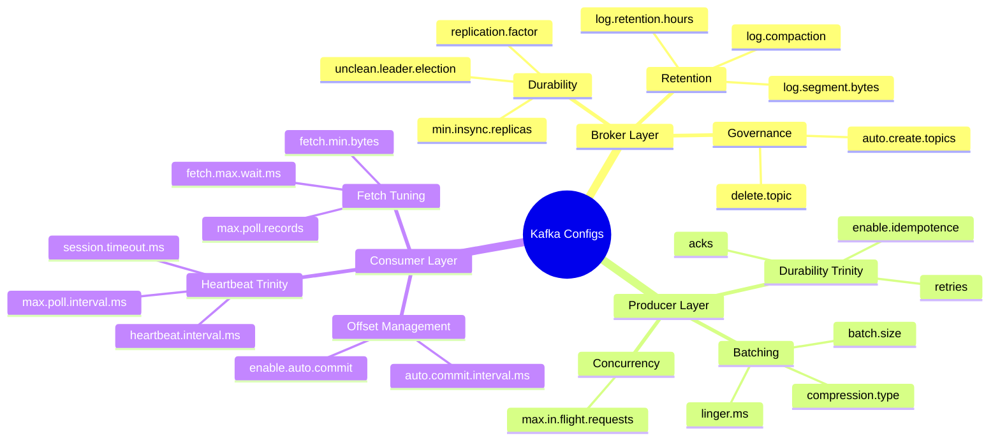
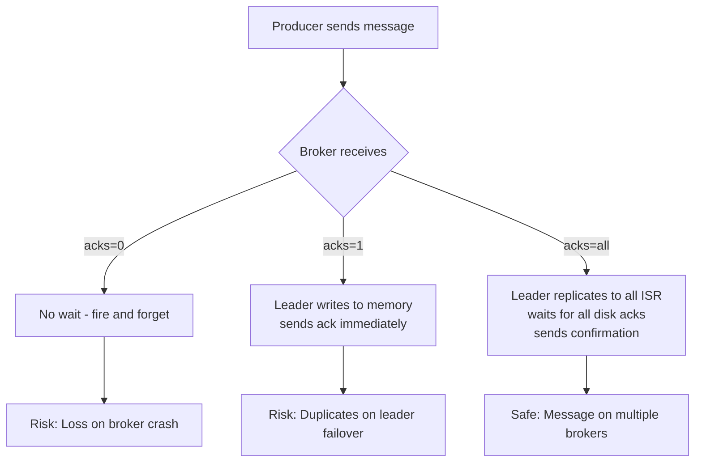
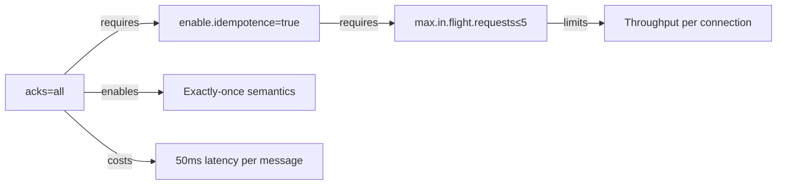
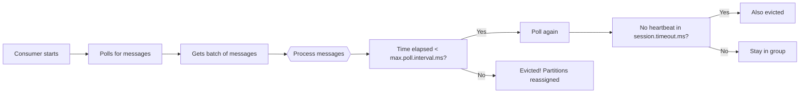

# Kafka Configurations: An Architect's Field Guide

> "The difference between a system that barely limps along and one that handles millions of events per second without losing a single message often comes down to a handful of configuration decisions."

[← Back to Event-Driven Design](./README.md) | **Related:** [03 Kafka Internals](./03-kafka-internals.md) · [05 Delivery Semantics](./05-delivery-semantics.md)

---

## Quick Revision Mind Map



---

## The Config Philosophy

### Every Config Is a Trade-Off

Kafka's defaults are optimized for *getting started*, not for production. An architect's job is knowing which knobs to turn and why—the difference between a system that barely limps along and one that handles millions of events per second without losing a single message.

Every Kafka configuration presents a fundamental tradeoff across three axes:

**Durability vs. Throughput**: Waiting for all replicas to acknowledge writes (safe) slows you down. Fire-and-forget (fast) loses data. Where you land on this spectrum depends entirely on your domain. A financial payment system has zero tolerance for data loss but can accept 100ms latency. A real-time notification system is the opposite: losing an analytics event is fine, but 2-second delays are unacceptable.

**Latency vs. Efficiency**: Sending small batches immediately (low latency) hammers the network. Batching larger chunks (efficient) adds delay. A 100ms batch in a payment system is invisible to users but lets you batch 100–1000 messages together, dramatically improving throughput.

**Consistency vs. Availability**: Strict offset management catches failures but slows down. Loose management is faster but forgives loss. In a critical system, you commit offsets only after successful processing. In a non-critical system, you auto-commit and accept occasional gaps.

### The Three Axes in Practice

The trick is knowing *which* tradeoff matters for *your* system. We once ran a payment service at a fintech company where the team set `default.replication.factor=1` to save storage costs. Six months in, we lost a broker in a lightning strike, and every message since the last backup—gone. The compliance audit was brutal. That's when we learned: durability isn't optional, it's table stakes.

Contrast that with an analytics pipeline ingesting clickstream data at 500K events/sec. Losing 0.01% of events still leaves you with 99.99% accuracy for your insights. The team optimized for throughput, set `acks=1`, enabled huge batches, and could run on two-thirds the hardware.

### How to Read This Guide

This guide walks through three layers: broker configurations (the guardians of data), producer configurations (how messages enter the system), and consumer configurations (how messages leave the system). For each layer, we'll examine the critical knobs, explain the tradeoffs, and show you real-world recipes.

By the end, you'll understand not just *what* to configure, but *why*—and how to make decisions that match your system's constraints.

---

## Broker Configurations: The Foundation

Your brokers are the guardians of your data. Every decision here ripples through your entire ecosystem. The broker configurations cover three domains: durability (how safely data is persisted), retention (how long data lives), and governance (who can create and delete topics).

### Durability: Protecting Data at Rest

When a producer sends a message, it doesn't disappear into thin air—it gets written to *replicas*. The question is: how many, and how synchronized must they be?

**default.replication.factor** tells Kafka how many copies of each partition to maintain across the cluster. The default is `1`: one copy on one broker. If that broker dies, the data dies with it. For production systems, you want `3`: one leader (handling reads and writes), two followers (receiving copies asynchronously). If the leader dies, a follower takes over and continues serving. If a *different* broker dies, you still have two copies of the data.

The math is simple: with a replication factor of 3, you can tolerate exactly one simultaneous broker failure. All other failures (single disk, network partition to one broker) don't lose data. With a factor of 2, you can only tolerate zero simultaneous failures—if one broker dies, you have one copy left, and if that copy dies before healing, you've lost everything.

**min.insync.replicas** is the critical safety valve that ties broker configuration to producer acknowledgment. When a producer sends a message with `acks=all`, the broker waits for this many replicas to acknowledge *before* confirming to the producer.

Here's the trap: if you set `min.insync.replicas=1` with `replication.factor=3`, you have three copies on disk but only one needs to acknowledge. Consider this scenario: the leader receives and acknowledges the message, but it crashes before sending the message to followers. The message is acknowledged to the producer but exists only in the leader's in-memory buffer. When the leader dies and a follower becomes the new leader, that message never existed. Data loss.

The formula: **set `min.insync.replicas = replication.factor - 1`**. This means you can tolerate one broker failure without losing *acknowledged* data. For a 3-replica setup, use `min.insync.replicas=2`. The producer must wait for at least 2 brokers to persist the message to disk before getting confirmation.

**unclean.leader.election.enable** is a trap door marked "Use at your own risk." When the current leader dies, Kafka elects a new leader from the in-sync replicas (replicas that are caught up to the leader). But what if *all* in-sync replicas are down and an out-of-sync replica is still up? Normally, Kafka blocks leadership and waits for an in-sync replica to recover. If you set `unclean.leader.election=true`, it promotes the out-of-sync replica anyway, regaining availability.

But you lose durability. The out-of-sync replica might be missing messages that the old leader had already acknowledged to producers. Messages that the producer thought were safely persisted are now gone. Customers see transactions as complete, databases show no record. For anything remotely important—payments, orders, user data—leave this `false`. For non-critical metrics and logs, you *might* tolerate it.

#### The Durability Formula

To achieve durability guarantees in Kafka, these three configs work together:

```
Durability = replication.factor - (simultaneous failures tolerated)
Acknowledged safety = min.insync.replicas (messages sent to this many replicas before ack)
Election safety = unclean.leader.election (never promote out-of-sync replicas)
```

A production payment system uses: `default.replication.factor=3`, `min.insync.replicas=2`, `unclean.leader.election=false`. This guarantees that any message acknowledged to a producer is safely stored on at least 2 brokers, and even if one broker dies, you have another copy.

| Config | Default | Recommended | Reasoning |
|--------|---------|-------------|-----------|
| `default.replication.factor` | `1` | `3` | One copy means one failure kills your data. Three copies tolerate one simultaneous broker failure. Standard HA setup. |
| `min.insync.replicas` | `1` | `2` (when RF=3) | Set to `replication.factor - 1`. Ensures acknowledged messages exist on multiple brokers. |
| `unclean.leader.election.enable` | `true` | `false` | Disables promoting out-of-sync replicas. Sacrifices availability (brief outage on complete cluster failure) for durability. |

### Retention and Cleanup: Managing the Data Lifecycle

Kafka doesn't delete messages by default. They sit on disk, accumulating until you explicitly set a retention policy. For event sourcing systems (where you replay events to rebuild state), that's intentional—you want 10 years of history. For analytics, 2 days might be wasteful. For GDPR compliance, you might need to delete customer data after 90 days.

Retention can work two ways: **time-based** (keep messages for N days) or **size-based** (keep the last N GB). In practice, time-based is more predictable—you know the cost: if retention is 7 days and you ingest 1TB/day, your total cluster storage is roughly 7TB. With size-based, a traffic spike suddenly triggers aggressive deletion.

We ran an analytics pipeline that didn't set any retention policy. After three months, the broker filled up and crashed. The team didn't even realize retention defaults to *infinite*. Now we ask upfront: "How long do you need this data?" and "What's the cost per GB for your infrastructure?"

**log.retention.hours** is the main time-based retention dial. The default is 7 days (168 hours). For an order event stream, 7 days might not be enough if you batch reconcile reports weekly—set it to 30 days and pay the storage cost. For analytics clickstream data, you might want 1-2 days to save disk. For event sourcing (replaying your entire domain from events), you want years—2160 hours (90 days) is a common floor, but we've seen 87600 (10 years).

**log.segment.bytes** controls how large a single log file grows before rolling over. Default is 1 GB. This affects how frequently Kafka checks for retention. The retention cleanup runs at the *segment level*, not per message: if a segment crosses the retention boundary, the whole segment is deleted. If you set segment size too large (e.g., 10 GB), retention cleanup runs infrequently, and old data sits around longer than intended. If you set it too small (e.g., 1 MB), you have thousands of tiny files and disk I/O overhead spikes. 1 GB is reasonable for most workloads.

**log.cleanup.policy** defaults to `delete` (time-based or size-based retention). For certain use cases, you want `compact` instead: log compaction removes old versions of the same key, keeping only the latest value. This is critical for event sourcing with snapshots, or for change data capture (CDC) where you need the latest value of each row but don't need the full history.

| Config | Default | Recommended | Use Case |
|--------|---------|-------------|----------|
| `log.retention.hours` | `168` (7 days) | Depends on use case | 7 days for transient data. 30+ days for audit/compliance. 2160+ (90 days) for event sourcing. |
| `log.segment.bytes` | `1073741824` (1 GB) | `1073741824` | 1 GB is solid; balances file overhead and cleanup frequency. Increase for very high throughput topics. |
| `log.retention.check.interval.ms` | `300000` (5 min) | `300000` | How often broker checks for expired segments. Default is fine. |
| `log.cleanup.policy` | `delete` | `delete` or `compact` | `delete` for time-series (events). `compact` for state tables (CDC, snapshots). |

### Topic Governance: Managing the Sprawl

By default, Kafka auto-creates topics when a producer or consumer tries to use one that doesn't exist. Sounds convenient. In production, it's chaos.

A junior engineer misconfigured a service and it started publishing to topics named `events`, `event`, `Events`, and `EVENTS` (Kafka is case-sensitive). Now the cluster had 47 topics instead of 3, all but 3 were garbage, and debugging took hours. Nobody had visibility into which topics were intentional and which were accidents.

**auto.create.topics.enable** should be `false` in production. Force teams to explicitly create topics through a centralized API or config management system. This ensures naming conventions are enforced (snake_case, domain-prefixed), proper replication factors are set upfront (not relying on defaults), and partition counts are planned (not just "use the default").

**delete.topic.enable** should usually stay `true`, but pair it with governance: only cluster admins have permission to delete topics (via RBAC), and you maintain a change log. This prevents accidents where a developer deletes a production topic thinking they're cleaning up a dev topic.

| Config | Default | Recommended | Reasoning |
|--------|---------|-------------|-----------|
| `auto.create.topics.enable` | `true` | `false` | Auto-creation is convenient during development but a governance nightmare in production. |
| `delete.topic.enable` | `true` | `true` (with RBAC) | Enable deletion but restrict via role-based access control. |

---

## Producer Configurations: Sending Messages Safely

When you call `producer.send()`, a chain of decisions fires: Is this message idempotent? How many replicas must acknowledge? Should this batch be compressed? Can it wait for other messages to batch, or does it send immediately?

Get these wrong and you'll lose data silently, duplicate data silently, or destroy throughput. The producer layer has three critical domains: the durability trinity (acks, idempotence, retries), batching (the throughput multiplier), and ordering (when order matters).

### The Durability Trinity: acks, idempotence, and retries

**acks** controls how the producer defines "sent"—what level of acknowledgment signals success.

**acks=0** (fire-and-forget): The producer sends the message to the broker and doesn't wait for any acknowledgment. Did the broker receive it? Did it write to disk? Producer doesn't know and doesn't care. If the broker crashes immediately, the message is lost. Use this only for metrics and telemetry where losing 0.1% is acceptable. Throughput is highest, latency is lowest, but durability is zero.

**acks=1** (leader ack): The leader writes to its in-memory buffer (not yet disk) and tells the producer "got it." Latency is better than `acks=all` (no waiting for replicas), but there's a trap: if the leader crashes before flushing to disk, the message is lost. If a follower that's out-of-sync becomes the new leader, you might see *duplicates* (the old leader had messages the new leader doesn't, so a retry sends them again). This is the default and it's misleading—it feels safe but isn't.

We ran a payment service with `acks=1`. In six months, we had 47 transactions that the customer saw as "paid" but never actually cleared. The payment processor thought they were retries, the merchant thought they were missing. The investigation cost more than the payments were worth.

**acks=all** (all in-sync replicas ack): The producer waits until all in-sync replicas have written to disk *and* the leader has confirmed. Latency goes up (typically 10-50ms added per message), but data loss is nearly impossible unless the entire cluster fails. For anything a user can ask about, this is the right choice.



**enable.idempotence** prevents duplicate messages on retry. Here's the scenario: you send a message with `acks=all`. The broker writes it to all replicas and sends back confirmation. But the confirmation packet gets lost in the network. The producer times out, assumes failure, and retries. The message is sent *twice*, but the producer thought it was a failure and retry—you've duplicated the message.

With `enable.idempotence=true`, Kafka assigns each producer a unique Producer ID (PID) and tracks sequence numbers per partition. If the broker sees the same producer ID and sequence number twice, it deduplicates—the message is written once, and the producer doesn't know about the duplicate attempt. Exactly-once delivery within a producer session.

There's a constraint: idempotence requires `acks=all` (the producer must wait for replicas to confirm) and `max.in.flight.requests <= 5` (to prevent out-of-order issues with retries). The tradeoff is minimal—idempotence has negligible overhead, and ordering is preserved automatically.

**retries** tells the producer how many times to retry a failed send before giving up. Modern Java clients default to `Integer.MAX_VALUE` (retry forever with exponential backoff). If the broker is temporarily down (maintenance, network blip), retry. If it's down for 5 minutes, you'll have a backlog, but no lost messages. If you set `retries=0`, a temporary network glitch loses the message. If you set `retries=3` with a quick timeout, you lose messages when the cluster is under load.

Set `retries=Integer.MAX_VALUE` and pair it with `delivery.timeout.ms` (default 2 minutes). The producer will retry with exponential backoff until 2 minutes have elapsed, then fail. This means temporary issues are retried, but permanent issues fail quickly.

#### The Durability Trinity Interaction



| Config | Default | Recommended | Reasoning |
|--------|---------|-------------|-----------|
| `acks` | `1` | `all` for critical data; `1` for high-throughput non-critical | `acks=1` feels safe but allows silent loss if leader crashes. Use `all` for payments/orders. Use `1` for analytics/metrics. |
| `enable.idempotence` | `false` | `true` | Enables exactly-once semantics within producer session. No downside—turn it on. |
| `retries` | `2147483647` (forever) | `2147483647` | Retry forever with exponential backoff. Temporary issues won't lose messages. |
| `delivery.timeout.ms` | `120000` (2 min) | `120000` to `300000` | How long total to keep retrying. 2 minutes is standard. Increase only if recovery takes longer. |

### Batching: The Throughput Multiplier

Sending one message at a time is slow. Each message = one network packet = latency impact. If you batch 100 messages together, you make one network packet and get 100x better throughput. Batching is often where the biggest throughput gains come from.

The producer batches messages based on **batch.size** (accumulate N bytes) and **linger.ms** (wait up to N milliseconds for more messages).

**batch.size=16KB** (default): Accumulate 16 KB of messages, then send the batch. If you're sending 1 KB messages, that's 16 messages per batch. If batch fills before the linger timeout, send immediately.

**linger.ms=0** (default): Don't wait. Send as soon as the buffer has *anything*. This is the throughput killer. With default settings, you send a 1 KB message immediately without batching. Network is hammered, throughput is terrible.

The fix: **increase `linger.ms` to 10–100 ms**. This tells the producer: "If a batch isn't full, wait up to 100 ms for more messages to arrive before sending." In a typical system where events arrive continuously, 100 ms of wait is invisible to users (the client doesn't block—it batches in the background), but lets you batch 100–1000 messages together.

We ran a real-time analytics dashboard. The producer was misconfigured with `linger.ms=0`, and each event created a network packet. The NIC on the broker was saturated at 1000 events/sec. When we changed to `linger.ms=100`, we hit 50,000 events/sec on the same hardware. That's a 50x throughput improvement from a single config change.

**compression.type** trades CPU for network I/O. The producer compresses a full batch before sending (not individual messages).

- `none`: No compression. Fast, but uses more network bandwidth. Use if network is cheap and CPU is expensive.
- `snappy`: Fast compression, good ratio (typically 50–70% reduction). Sweet spot for most use cases.
- `gzip`: Best compression ratio, slower. Use if bandwidth is the bottleneck and CPU is plentiful.
- `lz4`: Fastest compression. Use if CPU is the bottleneck.

In most cloud environments, network bandwidth is the constraint, so snappy or gzip are good choices.

#### The Batching Timeline

When you call `producer.send()`, this sequence happens:

1. Message arrives at producer buffer (in-memory queue).
2. Producer checks: is batch full (batch.size bytes) or has linger timeout expired?
3. If yes, compress the batch and send to broker.
4. If no, wait for more messages (up to linger.ms).
5. Broker receives, replicates, sends ack.
6. Producer callback fires (success or failure).

With `linger.ms=0`, step 2 almost always triggers immediately, and every message is its own batch. With `linger.ms=100`, step 4 waits, letting messages from multiple threads accumulate. Step 3 happens once every 100ms (or when batch is full), dramatically improving throughput.

| Config | Default | Recommended | Reasoning |
|--------|---------|-------------|-----------|
| `batch.size` | `16384` (16 KB) | `16384` to `32768` | 16 KB is solid. Increase to 32 KB for large messages or max throughput. |
| `linger.ms` | `0` | `10` to `100` | Default sends immediately, destroying batching. Set to 10–100 ms. Hidden cost: 100 ms latency in worst case (single message). |
| `compression.type` | `none` | `snappy` or `gzip` | Snappy balances speed and compression. Saves 50–70% bandwidth with minimal CPU cost. |

### Ordering and Concurrency: max.in.flight.requests

Here's a tricky situation: you send message A (to partition P0), then message B (also to P0). Message A fails (timeout), so the producer retries it. While the retry is in flight, message B is also in flight. What if message B hits the broker first, then message A arrives? You have them out of order.

For most systems, order doesn't matter. But for an order service event stream (Order Created, Payment Captured, Shipment Initiated), order is critical. If "Payment Captured" arrives before "Order Created," the downstream system is confused.

**max.in.flight.requests** controls how many messages the producer can have "in flight" (sent to broker, waiting for ack) before it blocks and waits for an ack.

- `max.in.flight.requests=1`: Only one message in flight at a time per connection. If it fails and retries, no other messages sneak by. Order is guaranteed per partition. But throughput is 1/Nth where N is the number of partitions (you're waiting for each message to be acked before sending the next).
- `max.in.flight.requests=5` (default): Up to 5 messages in flight. Higher throughput, but if message 1 fails and retries, messages 2–5 might already be acked and on disk. Messages could arrive out of order.

**The key constraint**: If you enable idempotence (`enable.idempotence=true`), you *must* keep `max.in.flight.requests <= 5`. This is a protocol limit—Kafka can't track message ordering if you have more than 5 requests in flight. If you need both idempotence and strict ordering, you're forced to use `max.in.flight.requests=1` and accept the throughput hit (usually 1/5 of max throughput).

| Config | Default | Recommended | Reasoning |
|--------|---------|-------------|-----------|
| `max.in.flight.requests.per.connection` | `5` | `1` (if order matters) or `5` (if throughput matters) | 1 = strict per-partition ordering but lower throughput. 5 = higher throughput but possible reordering on retry. Use 1 for orders/payments. |

### Buffer and Timeout Management

**buffer.memory** is the total buffer the producer keeps in memory for all pending batches. Default is 32 MB. If the broker is slow or down, batches pile up here. When the buffer fills, `send()` blocks and waits for space to open up (as batches get acked).

In a bursty system (lots of events suddenly, then quiet), 32 MB might be too small—batches will fill up and block producers, creating backpressure. In a steady-state system, 32 MB is fine. On a high-throughput server (millions of events/sec), increase to 64–128 MB.

**request.timeout.ms** is how long the producer waits for an ack before giving up and retrying. Default is 30 seconds. If you set it too low (e.g., 5 seconds), network jitter will cause spurious timeouts and retries. Too high (e.g., 120 seconds) means a broker failure takes 2 minutes to detect.

| Config | Default | Recommended | Reasoning |
|--------|---------|-------------|-----------|
| `buffer.memory` | `33554432` (32 MB) | `33554432` to `67108864` | 32 MB for steady state. 64 MB for bursty traffic. |
| `request.timeout.ms` | `30000` | `30000` to `60000` | 30 seconds is standard. Increase only if brokers are genuinely slow. |

---

## Consumer Configurations: The Flip Side

A consumer is born, joins a group, gets partitions assigned, polls for messages, processes them, and (if configured right) commits the offset so it can resume from the same place if it crashes.

Every step of this lifecycle is governed by configs. Consumer configuration is often where mistakes happen—an overly aggressive timeout causes rebalances, or auto-commit causes silent data loss.

### The Consumer Lifecycle

When a consumer starts:

1. **It joins the consumer group** with a `group.id` (e.g., `order-service-consumer-v1`). The group coordinator (a Kafka broker) assigns partitions to this consumer based on the partitioning strategy.

2. **It sends heartbeats** every `heartbeat.interval.ms` (default 3 seconds) to prove it's alive. If the broker doesn't hear a heartbeat for `session.timeout.ms` (default 45 seconds), it removes the consumer from the group and reassigns its partitions to others.

3. **It calls `poll()`** in a loop, which fetches messages from the broker. Between polls, the consumer must send heartbeats, or it will be considered dead.

4. **If the processing time between polls exceeds `max.poll.interval.ms`** (default 5 minutes), the broker thinks the consumer crashed, even if it's sending heartbeats. It removes it and reassigns partitions.

5. **It commits the offset**, telling Kafka, "I've processed messages up to offset X. If I crash, start me from X+1 next time."

The tricky part is step 4. If you're processing a message for 10 seconds, and `max.poll.interval.ms` is 5 seconds, Kafka will kick you out and reassign your partitions. The fix: either increase `max.poll.interval.ms` or increase concurrency (process multiple messages in parallel) so you poll more frequently.

### Offset Management: Manual vs. Auto

When a consumer processes a message, it doesn't automatically tell Kafka "I'm done." You have to commit the offset.

With `enable.auto.commit=true` (default), the consumer automatically commits the offset of the last message polled every `auto.commit.interval.ms` (default 5 seconds). Sounds convenient. But what if the consumer crashes after polling message X but before processing it? On restart, it skips to message X+1 and message X is never processed again. Silent data loss.

With `enable.auto.commit=false`, you manually commit after you've successfully processed a message. This adds latency (a network round-trip per commit), but guarantees no skipped messages.

In Spring Kafka, the pattern is:

```java
@KafkaListener(topics = "orders", groupId = "order-service")
public void listen(String message, Acknowledgment ack) {
    try {
        processOrder(message);
        ack.acknowledge(); // Only commit if processing succeeded
    } catch (Exception e) {
        // Don't commit; consumer will be evicted and message replayed
        throw e;
    }
}
```

If `processOrder()` fails (database timeout, validation error), the exception is thrown, the offset is not committed, and on rebalance this message will be replayed. If processing succeeds, `acknowledge()` commits and moves forward.

We ran an order processing service with auto-commit. A database connection pool exhaustion caused 0.3% of messages to fail processing. But since they were auto-committed, the orders never got retried. Payments came in, orders didn't—we lost $40K in a morning before someone noticed.

| Config | Default | Recommended | Reasoning |
|--------|---------|-------------|-----------|
| `enable.auto.commit` | `true` | `false` | Auto-commit loses messages on crash. Manual commit is explicit: process, then commit. Use manual for anything important. |
| `auto.commit.interval.ms` | `5000` | N/A (use manual) | If you must use auto-commit, set to 1000. But really, don't. |

### The Heartbeat and Session Trinity

**heartbeat.interval.ms** (default 3 seconds): How often the consumer sends "I'm alive" signals to the broker. A heartbeat is a lightweight background signal; calling it doesn't block processing. Must be less than `session.timeout.ms`.

**session.timeout.ms** (default 45 seconds, or 10 seconds in older Kafka versions): If the broker doesn't hear a heartbeat for this long, it assumes the consumer crashed and reassigns its partitions. This timeout is critical: too low and normal GC pauses cause false evictions (rebalances happen unnecessarily), too high and real crashes take a long time to detect (partitions sit idle).

**max.poll.interval.ms** (default 5 minutes): If the consumer doesn't call `poll()` within this time, it's considered dead, even if it's sending heartbeats. This is separate from session timeout because it measures processing time. If you're processing a batch of 500 messages and it takes 10 minutes, and `max.poll.interval.ms=5` minutes, you'll be evicted mid-processing.

The rule: **`heartbeat.interval.ms` should be about 1/3 of `session.timeout.ms`**. If `session.timeout.ms=45s`, set `heartbeat.interval.ms=15s` (or the default 3s, which is fine for most setups).

And **`max.poll.interval.ms` should be as large as your longest message processing can take**. If processing messages takes 2 minutes on average and you're processing them one at a time, set `max.poll.interval.ms=180000` (3 minutes). If you're processing in parallel with `concurrency=5`, you can process 5 messages at once, so the longest single-threaded processing is much faster.

#### The Heartbeat and Timeout Timeline



A common mistake: set `session.timeout.ms` too high (e.g., 5 minutes) to avoid rebalances. Now if a consumer crashes, it takes 5 minutes to detect, during which its partitions aren't being processed. Better to set `session.timeout.ms=30000` (30 seconds) and detect failures quickly. The rebalance overhead is worth it.

| Config | Default | Recommended | Reasoning |
|--------|---------|-------------|-----------|
| `heartbeat.interval.ms` | `3000` | `3000` | Send heartbeats every 3 seconds. Increase only if network is very unreliable. |
| `session.timeout.ms` | `45000` | `30000` to `60000` | 45 seconds is reasonable. Too low (10s) = false evictions on GC. Too high (5m) = slow failure detection. |
| `max.poll.interval.ms` | `300000` (5 min) | Depends on processing time | If processing takes 30 seconds per message, set to 60000 (1 minute). If 2 minutes, set to 240000 (4 minutes). Account for GC pauses. |

### Fetch Tuning: Controlling Message Flow

**max.poll.records** (default 500): How many messages are returned per `poll()` call. This is where you control memory usage and processing batching.

Lower values (e.g., 10) = more frequent polls, less memory per batch, easier timeout management. You poll every second instead of every 5 seconds, so if processing gets slow, you detect it faster and still stay within `max.poll.interval.ms`.

Higher values (e.g., 500+) = fewer polls, more messages to hold in memory, easier to hit timeout. If you process 100 messages/second and `max.poll.records=500`, you're polling every 5 seconds. With `max.poll.interval.ms=5000`, you're right at the edge—any GC pause causes a rebalance.

The tradeoff: if you process 100 messages/second and set `max.poll.records=500`, you poll every 5 seconds. Your 500 messages sit in memory. If processing crashes, all 500 are replayed (no commits). If you drop to `max.poll.records=100`, you poll every 1 second, only 100 messages in memory, and you have plenty of buffer for timeout.

**fetch.min.bytes** (default 1): The broker waits to accumulate this many bytes before responding to a fetch. Higher values = fewer fetch requests, more efficient, but higher latency if the broker doesn't have many messages waiting. Rarely needs changing from default.

**fetch.max.wait.ms** (default 500): If `fetch.min.bytes` is 1 KB but only 100 bytes are available, wait up to 500 ms for more to arrive. This balances latency and efficiency. Default is fine.

**auto.offset.reset** (default `latest`): If the consumer's offset is invalid (e.g., the offset doesn't exist anymore because messages were deleted due to retention), what do you do?

- `latest`: Skip to the latest offset. New messages will be processed, old ones ignored. Use this for non-critical data (metrics, logs) where losing history is acceptable.
- `earliest`: Start from the beginning. Use this if you want to replay all history.
- `none`: Throw an exception. Use this if you want to explicitly handle the error (maybe it's a bug in your code, not a normal condition).

| Config | Default | Recommended | Reasoning |
|--------|---------|-------------|-----------|
| `max.poll.records` | `500` | `100` to `500` | High = fewer polls but more memory. Low = more polls but easier timeout management. For 50-100KB messages, use 100. |
| `fetch.min.bytes` | `1` | `1` | Rarely needs changing. Broker waits for at least 1 byte before responding. |
| `fetch.max.wait.ms` | `500` | `500` | Balanced default. Increase to 1000 if optimizing for efficiency over latency. |
| `auto.offset.reset` | `latest` | `earliest` or `none` | `latest` = skip unknown offsets. Use for non-critical data. `earliest` = replay. `none` = fail explicitly. |

### Spring Kafka Specifics

Spring Kafka wraps the Kafka consumer library and adds an application layer on top. Understanding the Spring configurations is critical because they interact with the underlying Kafka configs in non-obvious ways.

**spring.kafka.listener.ack-mode**: How to commit offsets. This is where you control the durability of message processing.

- `BATCH` (default): After processing a batch of messages (up to `max.poll.records`), commit the offset of the last message. Fast, but if processing fails mid-batch, some messages are lost (they were committed even though processing failed).
- `RECORD`: After each message, commit. Safe, but one network round-trip per message adds significant latency (30-50ms per message in most networks). Not recommended.
- `MANUAL`: The application calls `acknowledgment.acknowledge()` to commit. You control exactly when and if to commit. Processing succeeds, you call acknowledge. Processing fails, you don't. On rebalance, the message is replayed. This is the production pattern.
- `MANUAL_IMMEDIATE`: Like `MANUAL`, but commit synchronously (wait for the broker to confirm immediately). Even slower, rarely needed.

For most production systems, use `MANUAL` and commit only after successful processing.

**spring.kafka.listener.concurrency**: How many threads to use for polling and processing. Each thread processes messages from assigned partitions in parallel. Max concurrency = number of partitions (you can't have more threads than partitions—some will be idle).

If you have 10 partitions and `concurrency=3`, the consumer has 3 listener threads. Each thread gets assigned some partitions (e.g., thread 1 gets partitions 0–2, thread 2 gets 3–6, thread 3 gets 7–9). This parallelizes message processing across your consumer group.

Higher concurrency = more messages processed in parallel = higher throughput and lower end-to-end latency. But each thread needs its own database connections, thread-local state, etc. Too much concurrency and you'll exhaust connection pools or hit contention.

**spring.kafka.consumer.enable-auto-commit**: Must be `false` if using manual ack mode. If true, Spring overrides your manual acknowledgments and auto-commits anyway (confusing behavior).

| Config (Spring) | Default | Recommended | Reasoning |
|-----------------|---------|-------------|-----------|
| `spring.kafka.listener.ack-mode` | `BATCH` | `MANUAL` | `BATCH` loses messages on failure. `MANUAL` lets you commit only after success. Use `MANUAL` for anything important. |
| `spring.kafka.listener.concurrency` | `1` | `min(3, partition_count)` | 1 thread = 1 partition at a time. 3 threads = 3 partitions in parallel. More threads = higher throughput but more resource contention. |
| `spring.kafka.consumer.enable-auto-commit` | `true` | `false` | Must be `false` if using manual ack mode. |
| `spring.kafka.listener.poll-timeout` | `3000` | `3000` | Timeout when polling for messages. Default is fine. |

---

## Config Recipes: Complete Architectures

Now that you know the knobs, here's how to set them for four real-world scenarios. These recipes are *starting points*—you'll measure under your actual load and adjust.

### Recipe 1: High-Throughput Analytics Pipeline

**Use case**: You're ingesting clickstream events at 500K events/sec, each 500 bytes. Durability isn't critical (if you lose 0.01%, analytics is still accurate). Latency doesn't matter (batch analytics runs hourly). You want to maximize throughput and minimize infrastructure cost.

**The requirements**: High throughput, acceptable message loss, tolerant to latency.

**Broker Config:**
```properties
# We can afford to lose a few events; analytics is statistical
default.replication.factor=2              # 2 replicas; if one broker dies, no data loss
min.insync.replicas=1                     # Only leader ack required; follower can lag
unclean.leader.election.enable=false      # Stay durable for safety

# Retention: keep events for 2 days for replays/debugging
log.retention.hours=48
log.segment.bytes=1073741824               # 1 GB
```

**Why these settings**: With 2 replicas and min.insync.replicas=1, we get high availability—if one broker dies, the other continues serving. The follower doesn't need to ack every message (adds latency), so producer gets faster acks. We can tolerate occasional loss because it's analytics.

**Producer Config:**
```properties
# Durability: acks=1 trades some safety for speed
acks=1                                    # Leader ack; some loss acceptable
enable.idempotence=false                  # Idempotence has overhead; not needed for analytics
batch.size=32768                          # 32 KB; bigger batches for throughput
linger.ms=100                             # Wait 100ms for full batch
compression.type=snappy                   # Compress batches; saves bandwidth

# Ordering: max throughput
max.in.flight.requests=10                 # High concurrency; order doesn't matter
retry.backoff.ms=100
retries=2147483647                        # Retry forever
delivery.timeout.ms=120000
```

**Why these settings**: With `acks=1` and no idempotence, we get maximum speed. We're not worried about duplicates (analytics dedupes anyway) or ordering (events are independent). Batching is aggressive: 32 KB batch size, 100ms linger, and snappy compression. This lets us push 500K events/sec through a modest cluster.

**Consumer Config:**
```properties
# Offset management: we can lose a few events
enable.auto.commit=true                   # Auto-commit; we can lose a few events
auto.commit.interval.ms=1000              # Commit every 1 second
max.poll.records=1000                     # Batch large; we have memory
max.poll.interval.ms=300000               # 5 minutes; processing is bursty

# Timeouts: keep detection quick but not too aggressive
session.timeout.ms=45000
heartbeat.interval.ms=3000
auto.offset.reset=latest                  # Skip unknown offsets; we don't care about history
```

**Why these settings**: Auto-commit is fine here—we're not worried about losing a few events (0.1% loss is in the noise). Large batch size (1000 records) and 100ms linger on producer side means we're batching heavily. Consumer auto-commits every second, so in a crash, we lose at most a few seconds of events.

**Spring Config:**
```yaml
spring:
  kafka:
    listener:
      ack-mode: BATCH
      concurrency: 8                      # 8 threads; parallelized processing
    consumer:
      max-poll-records: 1000
      enable-auto-commit: true
```

**Why these settings**: BATCH ack mode is fine for analytics (auto-commits every batch). 8 threads let us process messages in parallel across 8 partitions (or fewer if the topic has fewer partitions). Total throughput: easily 100K–1M events/sec per consumer instance, depending on processing time.

#### Recipe 1 Summary
- **Broker**: 2 replicas, min.insync.replicas=1 (some loss acceptable)
- **Producer**: acks=1, aggressive batching (32KB, 100ms linger), compression
- **Consumer**: Auto-commit, large batches (1000 records), 8 concurrent threads
- **Result**: 500K+ events/sec, <2% cluster utilization for analytics processing

---

### Recipe 2: Financial Payment System (Maximum Safety)

**Use case**: You're processing payments. Every message must be durably stored and processed exactly once. Data loss is unacceptable (regulatory nightmare). Latency is acceptable (payments take minutes anyway).

**The requirements**: Guaranteed durability, exactly-once processing, zero data loss.

**Broker Config:**
```properties
# Durability: maximize redundancy
default.replication.factor=3              # 3 replicas; tolerate 1 broker failure
min.insync.replicas=2                     # At least 2 replicas ack; 1 can fail silently
unclean.leader.election.enable=false      # Never promote out-of-sync; lose data

# Retention: keep 30 days for audit trail and debugging
log.retention.hours=730
log.segment.bytes=1073741824               # 1 GB; standard segment size
```

**Why these settings**: 3 replicas means we tolerate one broker failure. `min.insync.replicas=2` ensures any acknowledged message exists on at least 2 brokers. If one broker dies, we still have two copies. `unclean.leader.election=false` prevents data loss if all replicas temporarily go down (we'd rather be unavailable than lose data).

**Producer Config:**
```properties
# Durability: maximum safety
acks=all                                  # Wait for all replicas; safe
enable.idempotence=true                   # Exactly-once; deduplicates retries
batch.size=16384                          # Standard batching (16 KB)
linger.ms=50                              # 50ms wait for batch; balances safety and throughput
compression.type=gzip                     # Best compression; bandwidth expensive

# Ordering: strict per-partition ordering for payments
max.in.flight.requests=1                  # Strict ordering; required for payments
retry.backoff.ms=1000                     # Exponential backoff; don't hammer broker
retries=2147483647                        # Retry forever until timeout
delivery.timeout.ms=300000                # 5 minutes total retry window
```

**Why these settings**: `acks=all` waits for all replicas to write to disk before confirming. `enable.idempotence=true` deduplicates retries—if a payment is retried, it's written once. `max.in.flight.requests=1` guarantees ordering per partition (payments must be processed in order). With a 3-replica setup and these producer settings, every payment is durably stored on multiple brokers before the producer gets confirmation.

**Consumer Config:**
```properties
# Offset management: explicit control
enable.auto.commit=false                  # Manual commit; explicit control
max.poll.records=10                       # Small batches; easier to handle failures
max.poll.interval.ms=600000               # 10 minutes; payment processing is slow
session.timeout.ms=60000
heartbeat.interval.ms=10000
auto.offset.reset=none                    # Fail if offset is invalid; debug it
```

**Why these settings**: Auto-commit is disabled—we commit only after successful processing. Small batch size (10 records) makes it easier to handle failures (if processing fails, only 10 records are affected). `max.poll.interval.ms=10` minutes gives plenty of time for payment processing (which might involve external calls to payment processors, database lookups, etc.).

**Spring Config:**
```yaml
spring:
  kafka:
    listener:
      ack-mode: MANUAL                    # Commit only after successful processing
      concurrency: 3
      poll-timeout: 3000
    consumer:
      enable-auto-commit: false
      max-poll-records: 10
```

**Why these settings**: `MANUAL` ack mode means we control commits—after `processPayment()` succeeds, we call `acknowledgment.acknowledge()`. If it fails, we don't commit and the message is replayed on next consumer start. 3 threads allow some parallelization (processing payment A while verifying payment B), but not so much that we lose control.

#### Recipe 2 Summary
- **Broker**: 3 replicas, min.insync.replicas=2, 30-day retention
- **Producer**: acks=all, enable.idempotence=true, max.in.flight.requests=1 (strict ordering), 50ms linger
- **Consumer**: Manual commit, small batches (10 records), 10-minute processing timeout
- **Result**: Zero data loss (every payment on disk before ack), exactly-once delivery, auditable 30-day history

---

### Recipe 3: Real-Time Notification System (Low Latency)

**Use case**: You're sending push notifications to mobile users. 100ms end-to-end latency is acceptable. 2-second latency is unacceptable and users notice. Losing 0.1% of notifications is fine (users won't sue). You optimize for latency.

**The requirements**: Low latency, acceptable message loss, fast processing.

**Broker Config:**
```properties
# Durability: balance safety and performance
default.replication.factor=2              # 2 replicas is enough
min.insync.replicas=1
unclean.leader.election.enable=true       # Promote out-of-sync to stay available

# Retention: notifs don't need long history
log.retention.hours=24
log.segment.bytes=536870912                # 512 MB; smaller segments for faster cleanup
```

**Why these settings**: With `unclean.leader.election=true`, we stay available even if all in-sync replicas go down (losing a few notifications is better than system downtime). Smaller segment size (512 MB) means cleanup is faster, reducing disk I/O impact.

**Producer Config:**
```properties
# Durability: acks=1 for speed
acks=1                                    # Leader ack only; faster
enable.idempotence=false                  # Skip the overhead
batch.size=8192                           # 8 KB; smaller for low latency
linger.ms=5                               # 5ms wait; fast batching
compression.type=lz4                      # Fastest compression

# Concurrency: high throughput
max.in.flight.requests=10                 # High concurrency
```

**Why these settings**: `acks=1` is fast (no waiting for replicas). Smaller batch size (8 KB) and shorter linger (5 ms) minimize latency—we don't batch long, so notifications get to consumers quickly. LZ4 compression is fastest. `max.in.flight.requests=10` allows pipelining.

**Consumer Config:**
```properties
# Offset management: speed over safety
enable.auto.commit=true
auto.commit.interval.ms=500               # Frequent commits
max.poll.records=100                      # Small batches; low latency per message
max.poll.interval.ms=60000                # 1 minute; notif processing is fast
session.timeout.ms=20000                  # Detect failures quickly
heartbeat.interval.ms=5000
fetch.min.bytes=1
fetch.max.wait.ms=100                     # Shorter wait = lower latency
```

**Why these settings**: Auto-commit is fine (notifications aren't critical). Small batch (100 records) keeps memory footprint low and processing time short. Shorter timeouts (20s session, 60s poll) detect failures quickly. Shorter fetch wait (100 ms) reduces end-to-end latency.

**Spring Config:**
```yaml
spring:
  kafka:
    listener:
      ack-mode: BATCH
      concurrency: 2
      poll-timeout: 1000
    consumer:
      max-poll-records: 100
      enable-auto-commit: true
```

**Why these settings**: BATCH ack mode, small batches, and short timeouts keep latency low. 2 threads allow some parallelization without overcomplicating. Total end-to-end latency: typically 50–200ms from producer to consumer.

#### Recipe 3 Summary
- **Broker**: 2 replicas, allow unclean election (availability over durability), 1-day retention
- **Producer**: acks=1, small batch (8KB), 5ms linger, LZ4 compression
- **Consumer**: Auto-commit, small batches (100), short timeouts, high frequency commits
- **Result**: 50–200ms end-to-end latency, 100K+ notifications/sec per consumer

---

### Recipe 4: Event Sourcing with Long Retention

**Use case**: You're building an event store. The entire state of your domain is reconstructed from replaying events. You never delete events (retention can be 10 years), and you replay from the start often. Durability is critical (you can't replay if you don't have the events).

**The requirements**: Perfect durability, very long retention, occasional full replays.

**Broker Config:**
```properties
# Durability: maximum redundancy
default.replication.factor=3
min.insync.replicas=2
unclean.leader.election.enable=false

# Retention: 10 years; we never delete events
log.retention.hours=87600
log.segment.bytes=536870912               # 512 MB; fewer tiny files, easier to manage
log.retention.check.interval.ms=600000    # Check every 10 minutes; heavy retention cleanup
log.cleanup.policy=delete                 # Time-based deletion; keep all events until expiry
```

**Why these settings**: 10 years of retention (87600 hours) means we can replay the entire event history. 3 replicas and min.insync.replicas=2 ensure durability. 512 MB segments reduce the number of files on disk (huge advantage when you have 10 years of data). Less frequent retention checks (10 min) reduce cleanup overhead.

**Producer Config:**
```properties
# Durability: maximum safety
acks=all
enable.idempotence=true
batch.size=32768                          # Larger batches; we have time to batch
linger.ms=100                             # 100ms linger; events arrive asynchronously
compression.type=snappy                   # Good compression; saves disk space

# Throughput: moderate
max.in.flight.requests=5                  # Good balance of ordering and throughput
retry.backoff.ms=1000
retries=2147483647
delivery.timeout.ms=300000
```

**Why these settings**: `acks=all` ensures events are on disk before ack. `enable.idempotence=true` prevents duplicate events. Larger batch size (32 KB) and 100ms linger balance throughput and safety. Snappy compression saves disk space (important for 10-year retention).

**Consumer Config:**
```properties
# Offset management: explicit control
enable.auto.commit=false
max.poll.records=500                      # Larger batches; processing is fast (just storing)
max.poll.interval.ms=600000               # 10 minutes; account for disk write latency
session.timeout.ms=60000
heartbeat.interval.ms=10000
auto.offset.reset=earliest                # Always replay from the start if offset is missing
```

**Why these settings**: Manual commit (explicit control). Large batch (500 records) because event processing is typically fast (store to event store, emit derived events). `auto.offset.reset=earliest` ensures we always start from the beginning (critical for event sourcing—missing events breaks rebuilding). 10-minute timeout accounts for potential disk write latency on huge batches.

**Spring Config:**
```yaml
spring:
  kafka:
    listener:
      ack-mode: MANUAL
      concurrency: 2
    consumer:
      enable-auto-commit: false
      max-poll-records: 500
```

**Why these settings**: Manual ack mode with explicit commits after storing to event store. Moderate concurrency (2 threads) to parallelize writes without overwhelming the event store.

#### Recipe 4 Summary
- **Broker**: 3 replicas, min.insync.replicas=2, 10-year retention, 512MB segments
- **Producer**: acks=all, enable.idempotence=true, max.in.flight.requests=5, snappy compression
- **Consumer**: Manual commit, large batches (500), auto.offset.reset=earliest, replay-from-start
- **Result**: Perfect durability, 10-year event history, ability to replay entire domain state

---

## Recipe Comparison Matrix

| Attribute | Analytics | Payment System | Notifications | Event Sourcing |
|-----------|-----------|-----------------|---|---|
| **Durability Requirement** | Low | Critical | Low | Critical |
| **Latency Requirement** | High (hours) | Moderate (seconds) | Low (100ms) | Moderate (seconds) |
| **Message Loss Acceptable** | Yes (0.01%) | No | Yes (0.1%) | No |
| **replication.factor** | 2 | 3 | 2 | 3 |
| **min.insync.replicas** | 1 | 2 | 1 | 2 |
| **Producer acks** | 1 | all | 1 | all |
| **enable.idempotence** | false | true | false | true |
| **batch.size** | 32KB | 16KB | 8KB | 32KB |
| **linger.ms** | 100 | 50 | 5 | 100 |
| **max.in.flight.requests** | 10 | 1 | 10 | 5 |
| **Consumer auto-commit** | true | false | true | false |
| **max.poll.records** | 1000 | 10 | 100 | 500 |
| **Retention** | 2 days | 30 days | 1 day | 10 years |
| **Throughput Target** | 500K evt/sec | 1000 evt/sec | 100K evt/sec | 10K evt/sec |
| **Typical E2E Latency** | Hours | <1 sec | 50–200ms | <5 sec |

---

## How to Tune Incrementally

### Start Conservative (Payment System Recipe)

When you deploy a new system, start with Recipe 2 (payment system) settings. This is the "safe by default" configuration:

- `acks=all`, `enable.idempotence=true` (zero data loss)
- Manual commit, small batches (explicit control)
- `max.poll.interval.ms` generous (no timeout surprises)
- 3 replicas, `min.insync.replicas=2`

Yes, it's slower. Throughput is ~1000 messages/sec per producer. Latency is 50–200ms per message. But zero data loss and exact-once delivery.

### Measure Under Load

Deploy to production and run your actual workload:

1. **Measure throughput**: `producer.metrics().get("records-sent-total").value()` and similar consumer metrics.
2. **Measure latency**: Time from producer call to broker ack.
3. **Measure resource usage**: CPU, memory, network I/O on brokers and consumers.
4. **Measure error rates**: Timeouts, failed retries, rebalances.

If you're getting 100 messages/sec but the application needs 10K/sec, you need to tune.

### Loosen for Throughput

If throughput is the bottleneck:

1. **Increase batch size**: 16KB → 32KB (batches compress better, fewer packets).
2. **Increase linger.ms**: 50ms → 100ms (wait longer for full batch).
3. **Increase max.in.flight.requests**: 1 → 5 (pipeline more messages).
4. **Switch to auto-commit**: false → true (faster, lose durability of unprocessed messages).
5. **Increase batch sizes on consumer**: 10 → 100+ records.
6. **Increase concurrency**: 1 → 3–5 threads.

Measure again. If you hit 10K/sec, stop. If CPU becomes the bottleneck, add compression.

If latency is the bottleneck:

1. **Decrease linger.ms**: 100ms → 10ms (send batches faster).
2. **Decrease batch.size**: 32KB → 8KB (smaller batches send sooner).
3. **Increase max.poll.records**: 100 → 10 (poll more often, process less at once).
4. **Decrease auto.commit.interval.ms**: 5s → 500ms (commit sooner).

### The Tuning Loop

```
Measure → Identify bottleneck → Adjust knob → Measure → Repeat
```

The key is understanding the bottleneck:

- **CPU high, throughput low**: Compression might be too aggressive (switch to lz4). Or processing is slow (parallelism). Or message size is large (consider batching on client side before sending).
- **Network I/O high, throughput low**: Compression is off or ineffective (add snappy). Or batch size is too small (increase linger). Or too many small packets (increase batch.size).
- **Memory high, throughput low**: Batch size is too large (decrease max.poll.records or buffer.memory).
- **Latency high**: Linger too long (decrease linger.ms). Or batching too aggressive (decrease batch.size). Or consumer slow (increase concurrency).
- **Rebalances happening too often**: Timeouts too aggressive (increase session.timeout.ms, max.poll.interval.ms). Or processing is slow (increase max.poll.interval.ms).

---

## Common Mistakes

| Mistake | What Happens | Why It's Wrong | Fix |
|---------|---|---|---|
| `default.replication.factor=1` in production | One broker failure = total data loss | No redundancy. Single broker is single point of failure. | Set to 3. Accept 3x storage cost for HA. |
| `enable.auto.commit=true` with slow processing | Messages are committed but not processed; crash loses them | If processing takes 5 seconds and auto-commit happens every 5 seconds, message might be committed before processing starts. Crash = lost message. | Use manual commit. Commit only after `processPayment()` succeeds. |
| `acks=1` for payment/order systems | Duplicate transactions or silent loss | `acks=1` doesn't wait for followers to replicate. Leader crash means message is lost. Follower failover means duplicates. | Use `acks=all` with `enable.idempotence=true`. |
| `linger.ms=0` (default) | Throughput is 10x lower than it could be | Each message is its own batch; network is hammered with tiny packets. | Set to 10–100ms. Invisible latency improvement, 10x throughput gain. |
| `session.timeout.ms=5 minutes` | Consumer crash takes 5 minutes to detect; partitions idle | High timeout = low rebalance frequency, but slow failure detection. While waiting, partitions aren't being processed. | Set to 30–60 seconds. Rebalance happens quickly, partitions get reassigned. |
| `max.poll.interval.ms=5 minutes` with slow processing | Consumer gets evicted mid-processing | If processing a batch takes 10 minutes and `max.poll.interval.ms=5` minutes, consumer is kicked out and message is replayed. | Estimate longest processing time and set accordingly. Or increase concurrency so threads poll more frequently. |
| `max.in.flight.requests > 5` with `enable.idempotence=true` | Configuration is rejected | Kafka can't track ordering with >5 requests in flight. | Keep `max.in.flight.requests <= 5` or disable idempotence. |
| Infinite retries without timeout | Producer hangs forever on broker failure | `retries=Integer.MAX_VALUE` with no `delivery.timeout.ms` means hang forever. | Always set `delivery.timeout.ms` (default 2 minutes). Retry with backoff until timeout. |
| `min.insync.replicas=1` with `replication.factor=3` | Data loss on leader crash | Setting says "only 1 replica needs to ack" but you have 3. Leader gets ack, crashes before followers replicate, data is lost. | Set `min.insync.replicas = replication.factor - 1`. For RF=3, use MIR=2. |
| Manual ack but committing at wrong time | Messages are processed twice (or lost) | If you commit before processing finishes, crash = message is lost. If you commit before processing starts, crash = message is reprocessed. | Commit *after* processing succeeds. Use try/catch: process in try, acknowledge in finally-if-success. |

---

## Interview Tip: Walking Through a Real Scenario

**Interviewer**: "Walk me through how you'd configure Kafka for a payment processing system."

**Your answer** (showing you understand tradeoffs):

"First, I'd ensure durability at the broker level: `default.replication.factor=3` so losing one broker doesn't lose data, and `min.insync.replicas=2` so the producer only gets confirmation when the message is safely on at least 2 brokers. I'd disable `unclean.leader.election` to prevent data loss if all in-sync replicas are temporarily down.

For the producer, I'd set `acks=all` to wait for all replicas to acknowledge, and `enable.idempotence=true` for exactly-once semantics—payments can't be duplicated. I'd set `max.in.flight.requests=1` to preserve per-partition ordering (payments must process in order). Idempotence requires all replicas to ack anyway, so ordering is tight.

For batching, `batch.size=16KB` and `linger.ms=50` let me batch efficiently without huge latency spikes—50ms is invisible to a user's payment experience, but lets me batch 10–100 messages together.

For the consumer, I'd disable `enable.auto.commit` and use manual acknowledgment. After processing a payment successfully (updating the ledger, sending confirmations), the consumer calls `acknowledge()` to commit. If processing fails (DB timeout, validation error), the message isn't committed and gets replayed on restart. No duplicates (idempotence catches them), no losses.

I'd set `max.poll.records=10` because payment processing is slow (external API calls, database transactions), and I don't want the polling thread to be starved waiting for batch completion. I'd set `max.poll.interval.ms=600000` (10 minutes) to give processing plenty of time—if a payment takes 5 minutes to process (checking fraud systems, waiting for payment processor response), I have buffer.

With Spring Kafka, I'd use `ack-mode=MANUAL` and `concurrency=3` to process messages from multiple partitions in parallel while maintaining explicit control over commits.

The tradeoff: this setup is slower than a fire-and-forget system (maybe 50–200ms added latency per message due to waiting for replicas), but every payment is durably stored and processed exactly once. For payments, that tradeoff is non-negotiable."

**Why this impresses:**

- You're not just reciting config values; you're explaining the tradeoffs (speed vs. safety).
- You're linking configs together (idempotence requires acks=all, which affects latency).
- You're grounded in a real domain (payments) and addressing its constraints.
- You're distinguishing between what's safe (acks=all) and what's merely convenient (auto-commit).
- You understand that an architect's job is choosing constraints that match the system's requirements, not optimizing for a single metric (throughput).

**Interviewer**: "What if the payment processor's API is very slow—sometimes takes 30 seconds? How would you adjust?"

"I'd increase `max.poll.interval.ms` to 480000 (8 minutes) to account for slow processing. I might also increase `concurrency` from 3 to 5–10 to parallelize processing across more threads, so while one thread is waiting for the payment processor, other threads are processing other messages. This keeps poll() getting called frequently enough to stay within the timeout.

If concurrency alone isn't enough and we're still timing out, I'd refactor processing: extract the slow API call into an async step that happens after message commit. The consumer commits the offset (says 'I've received this payment'), then asynchronously calls the payment processor. If that call fails, we have a dead-letter queue to retry. This way, slow API calls don't block the consumer's polling loop."

**Why this is even better:**

- You're not blindly cranking a knob; you're thinking about the root cause (slow API).
- You're considering architectural refactoring (async processing) as a solution.
- You understand that timeouts are a symptom, not the disease.

---

**Navigation:** [← 03 Kafka Internals](./03-kafka-internals.md) | [05 Delivery Semantics →](./05-delivery-semantics.md)
