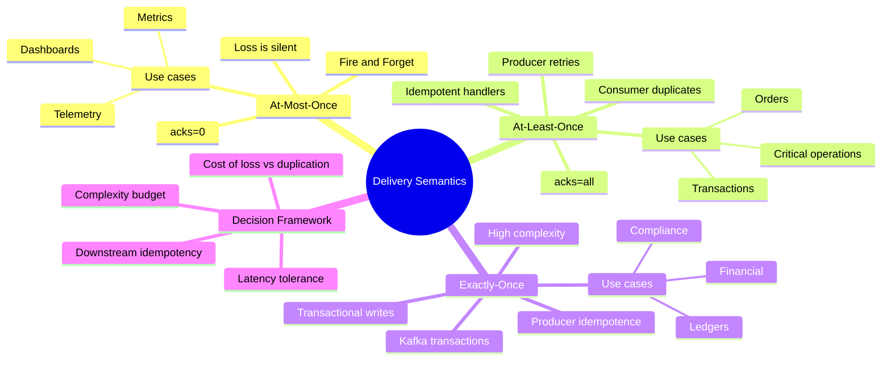
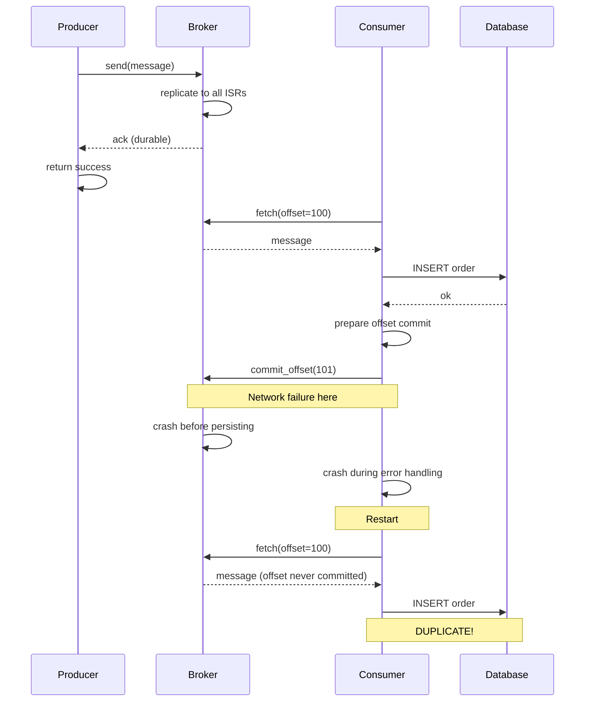
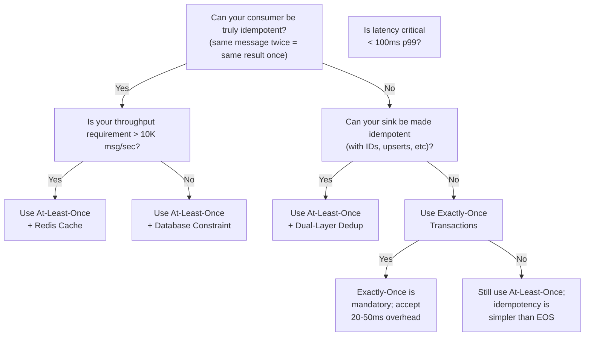

# Event Delivery Semantics: Getting the Guarantees Right

> "The question isn't whether duplicates or losses will happen—it's which one breaks your business more. Architecture is choosing the right failure mode."

[← Back to Event-Driven Design](./README.md) | **Related:** [Kafka Configs](./04-kafka-configs.md) · [Outbox Pattern](./07-outbox-pattern.md)

---

## Quick Revision Mind Map



---

## Why Delivery Semantics Are the First Architectural Decision

I once deployed an order service with at-most-once delivery believing we were building "fast analytics." Three weeks later, reconciliation revealed 0.3% of orders had vanished from Kafka entirely while sitting in the database. Customer support had to manually refund customers for orders the system could never prove existed. That single incident cost $40K and shattered trust in the analytics layer for months.

Delivery semantics isn't a configuration you inherit from broker defaults. It's a fundamental architectural choice that trades off between availability, durability, performance, and complexity. Different systems need different answers, and the wrong answer reveals itself only in production, at scale, when you're reconciling data at 3am.

### The Cost of Getting It Wrong

The costs of poor semantic selection manifest in different ways:

**At-most-once failures** arrive silently. You don't know data is missing until you compare counts between systems weeks later. By then, the lost data is gone, customers are confused, and your audit trail is broken.

**At-least-once failures** cause duplicate processing—two fulfillments for one order, double inventory reservation, duplicate charges. These are visible and loud, and they're easier to debug because the message is in Kafka for replay. The cost is operational complexity in handling duplicates gracefully.

**Exactly-once over-engineering** wastes latency and throughput on guarantees you don't need. Financial systems require it. Most don't. The overhead ranges from 5-50ms per message and can reduce throughput by 30-40% depending on configuration.

### The Three Guarantees at a Glance

| Semantic | Guarantee | What Can Happen | Risk | Typical Overhead |
|----------|-----------|-----------------|------|------------------|
| **At-Most-Once** | Message delivered 0 or 1 times | Messages lost silently if broker crashes before replication | Silent data loss, broken audit trails, reconciliation gaps | None—fastest |
| **At-Least-Once** | Message delivered 1+ times | Duplicates if consumer crashes before offset commit | Duplicate processing, requires idempotent consumers | 5-10% latency/throughput |
| **Exactly-Once** | Message delivered and processed exactly 1 time | None—duplicates prevented by transactions | Complexity, operational burden, latency hit | 20-50% latency, 30-40% throughput |

---

## At-Most-Once: Fire and Forget

### How It Works

The producer sends a message and immediately returns control without waiting for acknowledgment. The broker receives the event, adds it to memory, and returns "success." If the broker crashes before flushing to disk, the event is lost permanently. No retry, no exception, no visible failure.

The consumer subscribes with auto-commit enabled and processes messages as they arrive. If the consumer crashes during processing, the offset has already been committed, so the message is never redelivered. Loss is permanent but invisible.

### The Story of a Lost Message

Follow this analogy: You mail a postcard to a friend without tracking. The postal worker accepts it, puts it on a cart, and tells you "delivered." But that cart is hit by a bus before it leaves the depot. The postcard never arrived, you never found out, and your friend never knows you tried to contact them.

In Kafka terms:

1. Your mobile app publishes a page-view event with `acks=0` (no acknowledgment required).
2. The broker receives it, holds it in memory, and immediately returns "OK."
3. At that moment, the broker's power supply fails. The machine goes dark.
4. The event never writes to disk, never replicates to another broker, simply evaporates.
5. Your analytics dashboard counts are mysteriously off, but you won't discover this for days during reconciliation.

### When At-Most-Once Makes Sense

This semantic is correct precisely when duplicates are **worse** than losses:

**Metrics and analytics:** A page-view count of 999 instead of 1000 is acceptable noise. A count appearing twice simultaneously is a data quality disaster that breaks dashboards.

**Non-critical notifications:** "Here's a summary of your activity" notifications don't require guaranteed delivery. If one is lost, the user gets another tomorrow.

**High-frequency sensor data:** Real-time monitoring systems generating millions of data points per second can afford to lose individual readings. The aggregate patterns matter, not completeness.

**Telemetry and observability:** Log aggregation and APM tools collect data for pattern detection. Individual lost entries don't affect trend analysis.

### The Configuration

- **Producer:** `acks=0`, no retries
- **Consumer:** `enable.auto.commit=true`, no manual acknowledgment
- **Broker:** Default replication factor (usually 1)

At-most-once is the only semantic where you truly get "fire and forget" performance.

### Why Most Teams Think They Want This (But Don't)

The latency seduction is real: "At-most-once is fastest, so let's use it everywhere." But here's the architect's truth—at scale, this fails at your first outage. Why?

Because you discover data loss when something breaks downstream. The Order Service reports $100K in daily revenue. Analytics shows $99.7K. Is the $300 difference a rounding error or a real problem? Now you're auditing. Now you're correlating logs. Now you're debugging.

The latency advantage over at-least-once is negligible in practice (5-10ms at most). The debugging cost is enormous. Start with at-least-once. Only drop to at-most-once when you've measured that the latency matters and duplicates don't.

---

## At-Least-Once: The Production Default

### How It Works

The producer waits for acknowledgment from all in-sync replicas before returning success (`acks=all`). This ensures the message is durable across the cluster. The consumer manually commits its offset only after successfully processing the message. If the consumer crashes during processing, the offset commit never happens, and the message is redelivered when the consumer restarts.

The result: durability is guaranteed, but duplicates are possible. That's a feature, not a bug.

### The Story of a Duplicate

Follow an order through the system:

1. Order Service publishes "OrderCreated" with `acks=all`. It waits for three replicas to confirm. The producer's `send()` call returns successfully.
2. Fulfillment Service consumes the event: reserves inventory, writes a fulfillment record to its database, prepares to commit the offset.
3. At that moment—network hiccup. The offset commit request never reaches the broker.
4. The Fulfillment Service crashes.
5. When it restarts, Kafka has no record that this message was processed (the offset commit was never acknowledged).
6. The message is redelivered.
7. The Fulfillment Service processes it again: reserves inventory a second time.
8. Now inventory is overbooked.

This is at-least-once delivery: the message was delivered at least once and possibly more than once. The message stayed in Kafka, allowing replay and recovery. But the consumer had to handle the duplicate gracefully.

### Why This Is the Right Default for 90% of Systems

At-least-once + idempotent consumer is the Goldilocks zone:

- **Durability:** Messages survive broker crashes, network partitions, and producer failures.
- **Availability:** You don't need distributed transactions or complex coordination protocols.
- **Replay-ability:** Every message stays in Kafka, allowing you to reprocess the entire topic from any point in time.
- **Operability:** When something goes wrong, you have complete visibility into every event that flowed through the system.
- **Performance:** Minimal latency overhead compared to at-most-once.

The trade-off is straightforward: your consumers must be idempotent. They must handle duplicates correctly.

### The Duplicate Problem: Where and Why It Happens



Duplicates happen in three scenarios:

1. **Consumer crash before offset commit:** The message is processed, the database write succeeds, but the offset commit fails. On restart, the broker redelivers the message.

2. **Rebalancing:** When a consumer joins or leaves the group, a rebalance occurs. During rebalancing, the most-recently-committed offset may lag behind the most-recently-processed offset, causing redelivery after rebalance completes.

3. **Producer retries:** If a producer's first send fails with a network error and it retries, the message might be duplicated if the first send actually succeeded but the ack was lost.

The impact of duplicates is business logic dependent. For payment processing, a duplicate is catastrophic. For inventory reservations, it's visible (you can detect and refund). For event sourcing, duplicates are benign if handled correctly.

### Making At-Least-Once Safe: The Idempotent Consumer

When duplicates arrive, your consumer must recognize and skip them. Three approaches exist, each with different trade-offs.

#### Approach 1: Database Unique Constraint (The Simple Path)

**Implementation:** Store a message identifier in your database with a unique constraint. When a duplicate arrives, the constraint violation tells you it's already processed.

```java
// Spring Boot + JPA
@Entity
@Table(name = "orders")
public class Order {
    @Id
    private String orderId;

    @Column(unique = true, nullable = false)
    private String messageId;  // Unique constraint on message ID

    private BigDecimal amount;
    private String customerId;

    // ... getters, setters
}

@Service
public class OrderConsumer {
    @Autowired
    private OrderRepository orderRepository;

    @KafkaListener(topics = "orders", groupId = "order-group")
    public void consumeOrder(OrderEvent event) {
        try {
            Order order = new Order();
            order.setOrderId(event.getOrderId());
            order.setMessageId(event.getMessageId()); // Kafka record key or header
            order.setAmount(event.getAmount());
            order.setCustomerId(event.getCustomerId());

            orderRepository.save(order); // Unique constraint enforced here

        } catch (DataIntegrityViolationException e) {
            // Duplicate detected; already processed, safe to skip
            log.info("Duplicate message: {}", event.getMessageId());
        }
    }
}
```

**Trade-Offs:**
- **Pros:** Simple, requires no external services, the database constraint is permanent
- **Cons:** Creates extra columns and indexes; slows INSERT; requires handling constraint violation exceptions in application code
- **Best for:** Smaller systems (< 1M events/day), where database write latency isn't the bottleneck

#### Approach 2: Redis Deduplication Cache (The High-Throughput Path)

**Implementation:** Before processing, check a Redis cache for the message ID. If present, skip. If absent, process and add to cache.

```java
@Service
public class OrderConsumerWithRedis {
    @Autowired
    private OrderRepository orderRepository;

    @Autowired
    private StringRedisTemplate redisTemplate;

    private static final String DEDUP_KEY_PREFIX = "dedup:order:";
    private static final long DEDUP_TTL_SECONDS = 86400; // 24 hours

    @KafkaListener(topics = "orders", groupId = "order-group")
    public void consumeOrder(OrderEvent event) {
        String deduplicationKey = DEDUP_KEY_PREFIX + event.getMessageId();

        // Check if already processed
        Boolean alreadyProcessed = redisTemplate.hasKey(deduplicationKey);
        if (alreadyProcessed != null && alreadyProcessed) {
            log.info("Duplicate detected in Redis: {}", event.getMessageId());
            return; // Skip duplicate
        }

        try {
            // Process the order
            Order order = new Order();
            order.setOrderId(event.getOrderId());
            order.setAmount(event.getAmount());
            orderRepository.save(order);

            // Mark as processed in Redis
            redisTemplate.opsForValue().set(
                deduplicationKey,
                "processed",
                Duration.ofSeconds(DEDUP_TTL_SECONDS)
            );

        } catch (Exception e) {
            log.error("Failed to process order: {}", event.getOrderId(), e);
            throw e; // Trigger retry; don't mark as processed
        }
    }
}
```

**TTL Strategy:** Set Redis TTL based on your system's expected recovery time. If a consumer crashes and takes 24 hours to come back online, use 24+ hour TTL. If it's 1 minute, use 1 hour.

**Trade-Offs:**
- **Pros:** Faster than database checks; scales to millions of events/second; doesn't slow database writes
- **Cons:** Redis is an additional service to operate; cache misses during crashes allow duplicates; eventual consistency (brief window where duplicates possible)
- **Best for:** High-throughput systems (> 10K events/second), where database write latency is critical

#### Approach 3: Dual-Layer Deduplication (The Resilient Path)

**When to use:** When your deduplication cache (Redis) can fail, and you need bulletproof dedup. This approach combines both layers: Redis for speed, database constraint for durability.

```java
@Service
public class OrderConsumerDualLayer {
    @Autowired
    private OrderRepository orderRepository;

    @Autowired
    private StringRedisTemplate redisTemplate;

    private static final String DEDUP_KEY_PREFIX = "dedup:order:";
    private static final long DEDUP_TTL_SECONDS = 86400;

    @KafkaListener(topics = "orders", groupId = "order-group")
    @Transactional
    public void consumeOrder(OrderEvent event) {
        String deduplicationKey = DEDUP_KEY_PREFIX + event.getMessageId();

        // Layer 1: Fast path - check Redis cache
        try {
            Boolean inCache = redisTemplate.hasKey(deduplicationKey);
            if (inCache != null && inCache) {
                log.info("Duplicate detected in cache: {}", event.getMessageId());
                return;
            }
        } catch (Exception redisException) {
            // Redis is down; fall through to Layer 2
            log.warn("Redis unavailable; falling back to database dedup", redisException);
        }

        try {
            // Layer 2: Durable path - database unique constraint
            Order order = new Order();
            order.setOrderId(event.getOrderId());
            order.setMessageId(event.getMessageId());
            order.setAmount(event.getAmount());

            orderRepository.save(order);

            // If successful, mark in Redis for future requests
            try {
                redisTemplate.opsForValue().set(
                    deduplicationKey,
                    "processed",
                    Duration.ofSeconds(DEDUP_TTL_SECONDS)
                );
            } catch (Exception redisException) {
                // Acceptable to fail silently; database constraint is the safety net
                log.warn("Failed to update Redis cache; database is authoritative");
            }

        } catch (DataIntegrityViolationException e) {
            // Database constraint triggered; duplicate detected and safely skipped
            log.info("Duplicate detected by database constraint: {}", event.getMessageId());
        }
    }
}
```

**When you need both layers:** Your deduplication service (Redis/cache) can fail or be unavailable. A crash in your cache service means a brief window where duplicates can slip through. By also putting a unique constraint in the database, you have a permanent fallback.

#### Comparison Matrix

| Approach | Latency | Throughput | Operational Complexity | Dedup Accuracy | Best Use Case |
|----------|---------|-----------|----------------------|----------------|---------------|
| **Database Constraint** | High (DB write for every message) | Low (<1K msg/sec) | Low (single service) | 100% durable | Financial systems, small scale |
| **Redis Cache** | Low (in-memory check) | Very High (>100K msg/sec) | Medium (Redis ops required) | ~99.9% (Redis failures expose duplicates) | High-throughput analytics, > 10K msg/sec |
| **Dual-Layer** | Low (cache hit path) | Very High (>100K msg/sec) | High (two services to operate) | 99.99% (falls back to database) | Mission-critical high-throughput systems |

### Spring Kafka: Production Idempotent Consumer

The complete pattern in Spring Kafka requires explicit offset management and error handling:

```java
@Configuration
@EnableKafka
public class KafkaConsumerConfig {

    @Bean
    public ConcurrentKafkaListenerContainerFactory<String, OrderEvent> kafkaListenerContainerFactory(
            ConsumerFactory<String, OrderEvent> consumerFactory) {
        ConcurrentKafkaListenerContainerFactory<String, OrderEvent> factory =
                new ConcurrentKafkaListenerContainerFactory<>();

        factory.setConsumerFactory(consumerFactory);

        // Manual acknowledgment: offset commits only after successful processing
        factory.getContainerProperties().setAckMode(ContainerProperties.AckMode.MANUAL);

        return factory;
    }

    @Bean
    public ConsumerFactory<String, OrderEvent> consumerFactory() {
        Map<String, Object> props = new HashMap<>();
        props.put(ConsumerConfig.BOOTSTRAP_SERVERS_CONFIG, "localhost:9092");
        props.put(ConsumerConfig.GROUP_ID_CONFIG, "order-group");
        props.put(ConsumerConfig.AUTO_OFFSET_RESET_CONFIG, "earliest");
        props.put(ConsumerConfig.ENABLE_AUTO_COMMIT_CONFIG, false); // Manual commit
        props.put(ConsumerConfig.MAX_POLL_RECORDS_CONFIG, 10); // Process in batches

        return new DefaultConsumerFactory<>(props);
    }
}

@Service
public class OrderConsumerWithDLQ {

    @Autowired
    private OrderRepository orderRepository;

    @Autowired
    private KafkaTemplate<String, OrderEvent> kafkaTemplate;

    private static final String DLQ_TOPIC = "orders-dlq";

    @KafkaListener(topics = "orders", groupId = "order-group",
                   containerFactory = "kafkaListenerContainerFactory")
    @Transactional
    public void consumeOrder(OrderEvent event, Acknowledgment ack) {
        try {
            // Idempotent processing logic
            Order order = new Order();
            order.setOrderId(event.getOrderId());
            order.setMessageId(event.getMessageId());
            order.setAmount(event.getAmount());

            orderRepository.save(order); // Unique constraint on messageId

            // Commit offset only after successful processing
            ack.acknowledge();

        } catch (DataIntegrityViolationException e) {
            // Duplicate detected; safe to acknowledge
            log.info("Duplicate order detected: {}", event.getMessageId());
            ack.acknowledge();

        } catch (Exception e) {
            // Unrecoverable error; send to DLQ
            log.error("Failed to process order: {}", event.getOrderId(), e);

            // Don't acknowledge; will be retried
            sendToDLQ(event, e);
            throw e;
        }
    }

    private void sendToDLQ(OrderEvent event, Exception error) {
        try {
            kafkaTemplate.send(DLQ_TOPIC,
                event.getOrderId(),
                new OrderEventWithError(event, error.getMessage()));
        } catch (Exception dlqError) {
            log.error("Failed to send to DLQ", dlqError);
        }
    }
}
```

**Key points:**
1. **Manual acknowledgment:** `MANUAL` mode ensures offset commits only after successful processing
2. **Unique constraint:** The database enforces dedup; duplicate inserts fail gracefully
3. **Error handling:** Exceptions prevent offset commit, triggering retry
4. **DLQ pattern:** Unrecoverable errors move to a dead-letter queue for human review

### When Your Dedup Store Goes Down: Graceful Degradation

What happens when your Redis cache fails or your database is unavailable? Production systems need graceful degradation:

**Redis unavailable:** The dual-layer approach falls back to database dedup. Latency increases temporarily, but correctness is maintained. DLQ errors should spike during the outage; monitor for this.

**Database unavailable:** This is catastrophic in the dual-layer approach because both layers depend on it. Solution: implement circuit breaker logic that stops consuming until the database is healthy.

```java
@Service
public class OrderConsumerWithCircuitBreaker {

    @Autowired
    private OrderRepository orderRepository;

    @Autowired
    private StringRedisTemplate redisTemplate;

    private final CircuitBreaker circuitBreaker = CircuitBreaker.ofDefaults("order-consumer");

    @KafkaListener(topics = "orders", groupId = "order-group")
    public void consumeOrder(OrderEvent event, Acknowledgment ack) {
        try {
            // Attempt to process; if circuit open, throw exception (no offset commit)
            circuitBreaker.executeCallable(() -> {
                processOrder(event);
                ack.acknowledge();
                return null;
            });
        } catch (Exception e) {
            log.error("Processing failed or circuit open; not acknowledging", e);
            // Exception prevents offset commit; Kafka will retry
        }
    }

    private void processOrder(OrderEvent event) {
        // Implementation from above
    }
}
```

---

## Exactly-Once Semantics: The Holy Grail

### What "Exactly-Once" Actually Means

Exactly-once is not a single feature. It's three independent features working in concert:

1. **Producer idempotence:** Kafka guarantees that no duplicate messages are written to the broker, even if the producer retries.
2. **Transactional writes:** Multiple writes to different partitions either all succeed or all fail atomically.
3. **Consumer read-committed isolation:** Consumers read only committed messages, never uncommitted ones.

Together, these three properties create exactly-once processing semantics. But achieving this requires careful orchestration on both producer and consumer sides.

### How Kafka Transactions Work

```mermaid
sequenceDiagram
    participant P as Producer
    participant TC as Transaction Coordinator
    participant B as Broker
    participant C as Consumer

    P->>TC: InitProducerId (get producer ID)
    TC-->>P: producer_id, epoch

    P->>B: AddPartitionsToTxn (topics to write)
    B->>B: mark partitions in transaction

    P->>B: Produce(message, seq_num)
    Note over B: message buffered; NOT visible to consumers

    P->>B: Produce(message, seq_num)
    P->>B: EndTxn(COMMIT)

    B->>B: write __transaction_state record
    B->>B: mark messages as committed

    C->>B: fetch(isolation=read_committed)
    B-->>C: messages (only committed ones)
```

**Producer-side idempotence:** Each producer has a unique ID and an epoch. For each topic-partition, the producer includes a sequence number. If a message arrives with sequence_num N and we've already received N, it's discarded as a duplicate. If N < previous_seq, it's rejected as out-of-order.

**Transactional writes:** The producer buffers all messages within a transaction. They're not visible to consumers until the transaction commits. If the producer fails mid-transaction, the transaction coordinator aborts the transaction, and consumers never see partial results.

**Consumer read-committed isolation:** The consumer only reads messages marked as committed by the transaction coordinator. Uncommitted messages are invisible.

The result: end-to-end exactly-once processing. But this coordination has a cost.

### The Performance Cost

#### Latency Impact

Transactional producers require the producer to wait for the transaction coordinator to acknowledge the commit. This introduces 5-20ms of latency per message in typical configurations, depending on network distance to the broker and transaction coordinator load.

For batch producers, the overhead per-message is amortized: sending 100 messages in one transaction adds overhead of 10ms / 100 = 0.1ms per message. For real-time, low-latency applications, this is significant.

#### Throughput Impact

Transactions serialize message writes for a given producer. A single producer can only have one active transaction at a time. Throughput is reduced by 20-40% compared to at-least-once depending on message batch size and broker configuration.

A cluster that could ingest 100K events/second with at-least-once might handle only 60K-80K events/second with exactly-once.

#### Operational Complexity

Exactly-once requires additional broker resources: the transaction coordinator must track the state of every active transaction. Under high concurrency, the coordinator can become a bottleneck. Monitoring is more complex because you now have transaction-level metrics in addition to consumer lag.

Recent improvements in Apache Kafka 4.0+ include Transactions Server Side Defense (KIP-890), which bumps the producer epoch on every transaction to prevent duplicates across transaction boundaries. This strengthens the protocol but adds minimal performance overhead.

### When Exactly-Once Is Worth the Cost

**Financial transactions:** Payment processing, fund transfers, accounting ledgers. A duplicate charge is unacceptable. Exactly-once is mandatory.

**Compliance and regulated systems:** Healthcare records, audit logs, legal documents. Duplicates violate compliance requirements. Exactly-once is required.

**Systems without idempotent sinks:** If your downstream system (third-party API, legacy database) can't handle duplicates, you must guarantee exactly-once on the Kafka side.

**High-stakes analytics:** Fraud detection systems where duplicates degrade model quality. Exactly-once improves signal-to-noise ratio.

### When At-Least-Once + Idempotency Wins

In practice, most systems that claim to need exactly-once are better served by at-least-once + idempotent consumers. Here's why:

**Idempotency is cheaper:** A database unique constraint or Redis check is faster than a full transactional pipeline. You pay the cost only for duplicates (rare) rather than for every message (common).

**Operational simplicity:** At-least-once + idempotency is easier to troubleshoot. Every message stays in Kafka for replay. Transactional systems hide messages from consumers during processing.

**Flexibility:** With idempotent consumers, different downstream systems can handle duplicates differently. Some might deduplicate, others might be truly idempotent. Transactions force a single strategy.

**Scalability:** Idempotent consumers scale linearly. Exactly-once transactions can bottleneck on the transaction coordinator, especially in large clusters.

The industry consensus (circa 2024-2026) has shifted toward at-least-once + idempotency for most systems. Netflix, Stripe, and LinkedIn all rely on this pattern rather than end-to-end exactly-once.

---

## The Decision Framework

### Decision Tree



### Semantic by Use Case

| Use Case | Semantic | Rationale | Example |
|----------|----------|-----------|---------|
| **Payment Processing** | Exactly-Once | Duplicates are illegal; compliance requirement | Stripe, PayPal |
| **Order Management** | At-Least-Once + Dedup | Orders have IDs; can detect duplicates easily | E-commerce, marketplaces |
| **Financial Ledgers** | Exactly-Once | Accounting requires perfect accuracy | Banks, trading systems |
| **User Analytics** | At-Most-Once | Duplicates break dashboard; loss is acceptable | Google Analytics, mixpanel |
| **Inventory Tracking** | At-Least-Once + DB Constraint | Duplicates cause overselling; must be prevented | Warehouse systems |
| **Real-time Dashboards** | At-Most-Once | Latency matters; 1% data loss is acceptable | Monitoring, APM |
| **Event Sourcing** | At-Least-Once + Dedup | Duplicates don't change final state if idempotent | CQRS architectures |
| **Compliance Audit Logs** | Exactly-Once | Regulatory requirement; no gaps or duplicates | Healthcare, financial audit |

### The Hybrid Approach: Different Semantics for Different Topics

Advanced systems don't pick one semantic and use it everywhere. Instead, they segment by importance:

- **Critical topics** (payments, compliance): Exactly-once with transactional producers
- **Important topics** (orders, inventory): At-least-once with dual-layer deduplication
- **Nice-to-have topics** (analytics, metrics): At-most-once (acks=0)

This hybrid approach optimizes each part of the system for its actual requirements rather than over-engineering everything to the highest standard.

---

## Common Mistakes

| Mistake | What Happens | Fix |
|---------|-------------|-----|
| **Using at-most-once for "speed"** | Data loss discovered too late; reconciliation gaps | Start with at-least-once; measure before optimizing |
| **Forgetting to make consumer idempotent** | Duplicate processing causes duplicate inventory, charges, or records | Implement database unique constraint or dedup cache |
| **Not handling dedup cache failures** | When Redis/cache goes down, duplicates slip through | Implement dual-layer approach with database fallback |
| **Committing offset before processing completes** | Process crashes during write; message lost and never retried | Use manual acknowledgment; commit only after successful processing |
| **Using exactly-once when at-least-once suffices** | Unnecessary latency/throughput loss; operational complexity | Audit actual requirements; at-least-once + idempotency is usually better |
| **Assuming Kafka transactions work end-to-end** | Transactions only guarantee within Kafka; external systems still need idempotency | Combine Kafka transactions with idempotent external sinks |
| **Not monitoring consumer lag and dedup rates** | Silent duplicates and reprocessing go unnoticed | Track: consumer lag, dedup cache hits, DLQ volume |
| **DLQ without human process** | Messages rot in DLQ forever; data loss persists | Build alerting and manual review workflow for DLQ |

---

## Who Uses What in Production

### Stripe: At-Least-Once + Idempotency Keys

Stripe processes billions of events per day with at-least-once semantics. Every API request includes an idempotency key (UUID); if a duplicate arrives, the system returns the cached result instead of reprocessing. This approach scales to extreme throughput because:

- No expensive distributed transactions
- Idempotency keys are stored in a simple cache (Redis or similar)
- Duplicates are detected and resolved in milliseconds

Stripe's philosophy: idempotency is an API contract, not a Kafka feature. Clients are responsible for providing idempotency keys.

### LinkedIn: Exactly-Once for Kafka Streams

LinkedIn uses Kafka Streams with `processing.guarantee=exactly_once_v2` for critical data pipelines. They accept the latency and complexity trade-off because:

- Exact counts matter for ranking and recommendation models
- The downstream ML systems are sensitive to duplicates
- They run large clusters where coordinator overhead is manageable

However, even LinkedIn uses at-least-once + idempotency for non-critical pipelines.

### Netflix: At-Least-Once with Dedup Service

Netflix runs at-least-once delivery with a centralized deduplication service. All messages pass through a dedup layer (Redis with distributed fallback) before processing. This approach:

- Handles millions of events per second
- Catches duplicates before expensive processing
- Provides visibility into dedup rates across the organization

Netflix's philosophy: separate deduplication concerns from message processing.

---

## Interview Tip

When asked "What delivery semantics should we use?" in an interview, avoid the trap of suggesting exactly-once universally. Instead, ask clarifying questions:

1. What's the impact of a duplicate message? (broken transactions vs. idempotent operations)
2. What's the throughput requirement? (millions/sec vs. thousands/sec)
3. What's the acceptable latency? (real-time vs. eventual consistency)
4. Is the downstream sink idempotent? (can it handle duplicates safely?)
5. What's the team's operational maturity? (distributed systems experience?)

Then recommend: **Start with at-least-once + idempotent consumers for 90% of systems.** Only escalate to exactly-once when you've measured that duplicates cause real harm that can't be handled idempotently, and you've accepted the performance trade-off.

The architects who sound smartest aren't the ones who default to the strongest guarantees—they're the ones who choose the weakest guarantees that still solve the business problem.

---

**Navigation:** [← 04 Kafka Configs](./04-kafka-configs.md) | [06 Kafka Performance →](./06-kafka-performance.md)

---

## Sources

- [Exactly-once Semantics is Possible: Here's How Apache Kafka Does it](https://www.confluent.io/blog/exactly-once-semantics-are-possible-heres-how-apache-kafka-does-it/)
- [Build Idempotent Kafka Consumers: Patterns That Actually Work](https://www.conduktor.io/blog/building-idempotent-consumers)
- [Exactly-Once vs At-Least-Once: Choosing Delivery Guarantees](https://streamkap.com/resources-and-guides/exactly-once-vs-at-least-once)
- [Spring Kafka Exactly-Once Documentation](https://docs.spring.io/spring-kafka/reference/kafka/exactly-once.html)
- [Idempotent Consumer Pattern](https://www.lydtechconsulting.com/blog-kafka-idempotent-consumer.html)
- [Kafka Transactions and Transactional Producers](https://www.confluent.io/blog/transactions-apache-kafka/)
- [Message Delivery Guarantees for Apache Kafka](https://docs.confluent.io/kafka/design/delivery-semantics.html)
