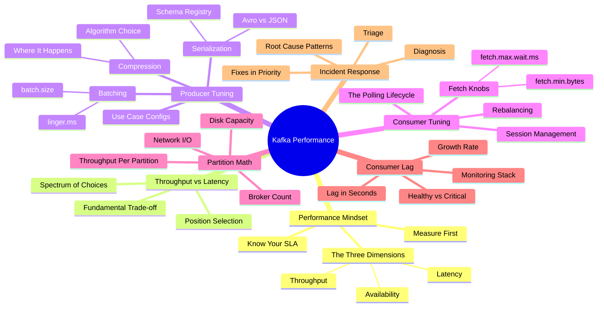
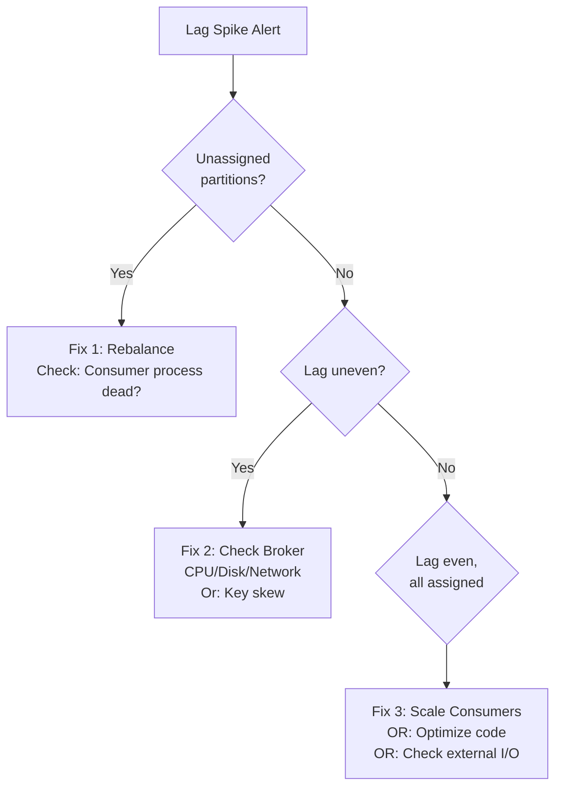
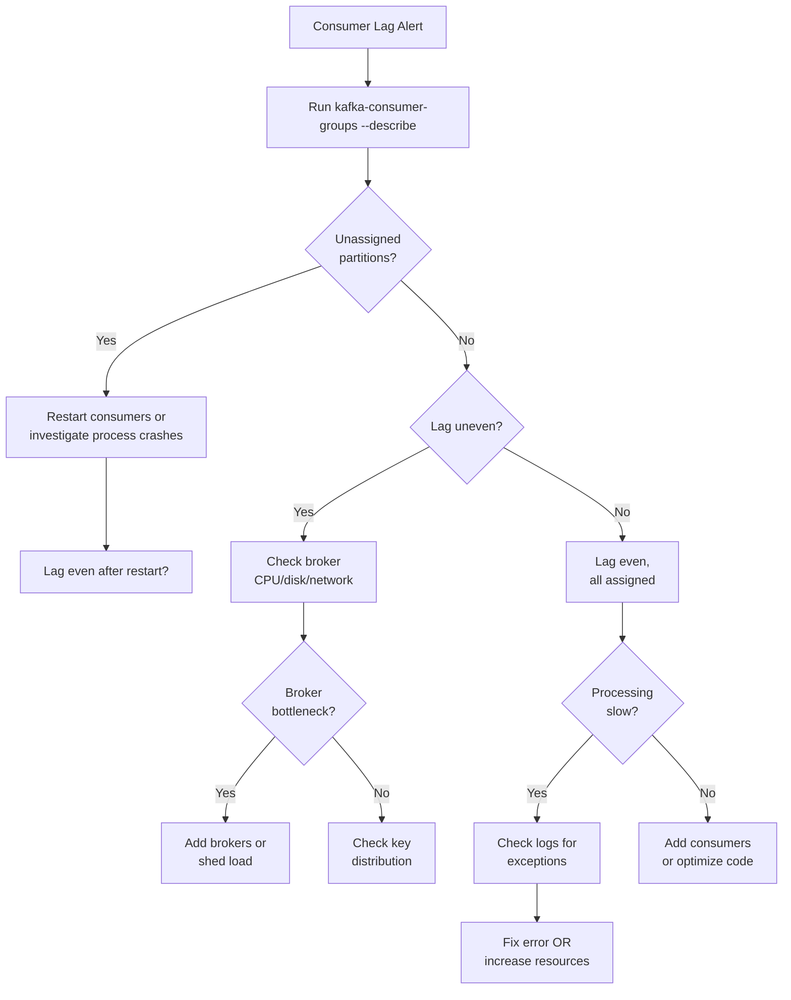

# Kafka Performance Tuning: An Architect's Incident Guide

> Performance isn't about speed—it's about understanding your constraint and tuning accordingly. Most Kafka incidents follow predictable patterns; the ones who stay calm have dashboards already running.

[← Back to Event-Driven Design](./README.md) | **Related:** [Kafka Configs](./04-kafka-configs.md) · [Kafka Internals](./03-kafka-internals.md) · [Delivery Semantics](./05-delivery-semantics.md)

---

## Quick Revision Mind Map



---

## The Performance Mindset: Beyond the Myths

Kafka performance conversations often begin with a false premise: "make it faster." Faster at what? For whom? An architect's job is to answer these questions before touching a single configuration parameter.

I've responded to dozens of production incidents—lag spikes at 3 AM, sustained throughput drops that bleed revenue, rebalance storms that lock up entire consumer groups. The teams that handled them calmly had something in common: they understood their baseline. They had dashboards running before the crisis. They knew what "normal" looked like, so they could spot "abnormal" immediately.

### Know Your SLA First

Every Kafka tuning decision flows from the Service Level Agreement. This isn't a guess; it's a contract between you and your business.

**Real-world examples:**

- **Payment fraud alerts**: End-to-end latency SLA of 100 milliseconds. A 10-minute delay means fraud goes undetected. Latency dominates all other concerns.
- **Analytics pipeline**: Daily ETL ingests 2 billion events. End-to-end latency SLA is "within 24 hours." Throughput per dollar dominates. You'll optimize for cost and batch size.
- **User activity stream**: Real-time dashboard needs < 5-second freshness. You're in the middle—throughput-optimized with latency bounds.

Until you know your SLA, you're flying blind.

### The Three Performance Dimensions

Performance isn't one number. It's a triangle.

**Throughput**: How many messages per second can your system process end-to-end? Measured in msgs/sec or MB/sec. For analytics and logging, this is your north star.

**Latency**: How long does a single message spend in the system from producer to consumer commit? Measured in milliseconds or seconds. For real-time systems, this is critical. For batch systems, irrelevant.

**Availability**: What percentage of time is your system operational? Can you absorb a broker failure without data loss? Availability is achieved through replication and careful orchestration, not tuning configs.

Most teams try to maximize all three simultaneously. You can't. The fundamental physics of distributed systems makes this impossible. Your job is to understand your SLA, pick your position on the spectrum, and tune accordingly.

### Measure Before You Tune

Here's the hardest discipline: don't change anything until you have baseline metrics.

Set up monitoring (Prometheus + Grafana) for at least one week before you touch any configs. Capture:
- Consumer lag in seconds (not messages)
- Rebalance frequency and duration
- Offset commit failures
- Broker CPU, disk I/O, network
- GC pause duration and frequency
- Processing time per message

Once you have baseline, change one thing. Wait 24 hours. Measure again. Did it improve? Move on. If not, revert.

---

## Throughput vs. Latency: The Fundamental Architect's Trade-Off

This is where most engineers get stuck. They see "Kafka" and think "fast." But fast at what costs?

### Why You Can't Maximize Both

Batching is the core technique for improving throughput. You collect messages in a buffer, compress them, and send them as one chunk to the broker. Batching reduces network overhead dramatically—you might compress 32 messages into one network round-trip instead of 32.

But batching has a latency cost. The first message in a batch has to wait for the batch to fill or for a timeout to expire. If your batch.size is 32KB and linger.ms is 100ms, that first message waits up to 100ms just to accumulate batch-mates. For a payment alert, that's unacceptable. For an analytics pipeline, it's invisible.

Similarly, on the consumer side, fetching in large chunks (fetch.min.bytes=100KB) improves throughput because you process more messages per poll. But if messages arrive slowly, the poll() blocks waiting for 100KB to accumulate, adding latency.

### The Spectrum: Configuration Scenarios and Results

Here's how these choices cascade through your system:

| Scenario | Philosophy | Producer Config | Consumer Config | Result |
|----------|-----------|-----------------|-----------------|--------|
| **Payment alerts (latency obsessed)** | Minimize queuing, sacrifice throughput | batch.size=16KB, linger.ms=0, acks=all, compression=none | fetch.min.bytes=1KB, fetch.max.wait.ms=100ms, max.poll.records=100 | ~50-100ms E2E latency, ~500-1K msgs/sec per consumer, very durable |
| **Analytics pipeline (throughput obsessed)** | Maximize messages/sec, latency immaterial | batch.size=64KB, linger.ms=100ms, acks=1, compression=snappy | fetch.min.bytes=100KB, fetch.max.wait.ms=500ms, max.poll.records=1000 | ~5-10K msgs/sec per consumer, 5-10s latency acceptable, moderate durability |
| **Real-time dashboard (balanced)** | Handle volume responsibly | batch.size=32KB, linger.ms=10ms, acks=1, compression=lz4 | fetch.min.bytes=10KB, fetch.max.wait.ms=200ms, max.poll.records=500 | ~2-3K msgs/sec per consumer, 200-500ms latency, good durability |

### Choosing Your Position on the Spectrum

Start with these questions:

1. **What percentage of your system is latency-sensitive?** If only 5% of traffic has tight SLAs (payments, fraud alerts), consider separate topics with separate consumer groups tuned differently.

2. **Can you afford to drop throughput for safety?** Low latency usually means acks=all, smaller batches, more network round-trips. This might halve your throughput. Is that acceptable for your volume?

3. **What's your replication factor?** If RF=3 and acks=all, you're waiting for all 3 replicas to write to disk before returning. That's durable but slow. acks=1 (leader write only) is much faster and still safe if your replication is working.

In interviews, the key is asking these questions and explaining your trade-off reasoning. "I would use acks=all for payment systems because durability is non-negotiable, but acks=1 for analytics because we can tolerate reprocessing if a broker fails."

---

## Producer Tuning: The Batching Story

Let me walk you through what happens when your application calls `producer.send(record)`.

The record doesn't immediately fly to Kafka. Instead, the producer places it in a **send buffer**. The producer holds it there, waiting for one of two conditions to become true:

1. **The batch reaches its size limit** (batch.size), OR
2. **The timer expires** (linger.ms)

Whichever comes first triggers compression and transmission. This batching mechanism is why Kafka can achieve 5-10x higher throughput than a naive send-one-message-at-a-time approach.

### The Batching Story: A Timeline

Imagine you configure:
- batch.size = 32KB (32,768 bytes)
- linger.ms = 10 milliseconds
- compression.type = snappy
- Your messages average 1KB each

Here's what happens:

```
t=0ms:   Message 1 arrives (1KB). Buffer: 1KB. Not full. Timer starts.
t=2ms:   Message 2 arrives (1KB). Buffer: 2KB. Still waiting.
t=4ms:   Message 3 arrives (1KB). Buffer: 3KB. Still waiting.
...
t=9ms:   Message 31 arrives (1KB). Buffer: 31KB. Still not full. Timer ticking.
t=10ms:  Timer fires. 32 messages accumulated (32KB).
         Compress with snappy (32KB → 8KB, ~75% reduction).
         Send one network request.
```

OR, if messages arrive faster:

```
t=0ms:   Message 1 arrives (1KB). Buffer: 1KB.
...
t=8ms:   Message 32 arrives. Buffer now 32KB. BATCH FULL.
         Don't wait for linger timeout.
         Compress immediately.
         Send.
```

**The outcome**: 32 messages sent in a single network round-trip, with 75% compression. That's 32x more efficient than sending them individually, even accounting for compression CPU cost.

**The latency cost**: The first message in the batch might wait up to 10ms before transmission. If your SLA is 100ms end-to-end and the producer contributes 10ms, that's 10% of your budget. If your SLA is 10ms, you're already in trouble.

### Compression Algorithm Comparison

| Algorithm | Compression Ratio | CPU Cost | Speed | When to Use |
|-----------|-------------------|----------|-------|------------|
| **None** | 0% | None | Instant | Low-latency systems; messages already compressed (video, images) |
| **GZIP** | 50-60% | High | ~50 MB/s compression | Cold storage, archival; rarely for real-time |
| **Snappy** | 40-50% | Low | ~500 MB/s compression | Balanced; good ratio with acceptable CPU cost |
| **LZ4** | 30-40% | Very Low | ~1000+ MB/s compression | High-throughput; fast decompression critical |
| **Zstd** | 50-70% (best) | Medium | ~400 MB/s compression | 2024+ default; best ratio, modern CPU usage |

**Real-world rule**: For systems processing 5K+ msgs/sec, compression saves more in network cost than it costs in CPU. Use snappy or lz4. For 1K msgs/sec or lower, compression overhead might exceed network savings; use none or lz4.

### Where Compression Happens

**Producer side**: Your client compresses the batch before sending. Cost: local CPU.

**Broker side**: Brokers store compressed data on disk. Cost: none (already compressed). Benefit: saves disk space.

**Consumer side**: Brokers send compressed data to consumer. Consumer decompresses. Cost: consumer CPU.

This matters when designing consumer logic. If your consumer is CPU-constrained (e.g., running in AWS Lambda with limited CPU), avoid gzip/zstd; use snappy or lz4which decompress faster.

### Serialization Performance: Avro vs JSON vs Protobuf

Before compression, your message must be serialized. Serialization format affects both speed and size.

| Format | Size | Speed | Schema Evolution | Tooling | When to Use |
|--------|------|-------|------------------|---------|------------|
| **JSON** | Large (3-5KB per object) | Fast (~5-10µs) | Loose; requires app logic | Built-in everywhere | Simple, schema-optional; don't care about size |
| **Protobuf** | Medium (1-2KB per object) | Fast (~2-5µs) | Good; fields addable | Requires codegen | Microservices, internal systems; strong typing required |
| **Avro** | Small (0.5-1KB per object) | Medium (~5-15µs) | Excellent; field evolution handled by schema registry | Requires Schema Registry | Data pipelines, streaming; optimal for size + evolution |

**Performance breakdown for 1KB JSON object**:

```
Original:           1000 bytes (JSON object)
After snappy:       400-500 bytes (50% compression)
Send time (1Mbps):  4-5ms
Network cost:       Moderate

Vs. Avro:
Original:           400 bytes (Avro binary)
After snappy:       150-200 bytes (50-70% compression)
Send time (1Mbps):  1.5-2ms
Network cost:       3x better
```

But there's a Schema Registry cost. Every Avro message includes a schema ID (4 bytes) that references a central Schema Registry. On the consumer side, the consumer must fetch the schema to deserialize. For 100K msgs/sec, this is amortized. For 100 msgs/sec, it's overhead.

**Interview wisdom**: "JSON is fast and flexible for internal systems. Avro is optimal for high-throughput data pipelines with a Schema Registry. Protobuf is best for microservices where type safety matters."

### Producer Tuning Checklist

**For maximum throughput (analytics, events, logging):**
```properties
batch.size=65536                           # 64KB, up from default 16KB
linger.ms=100                              # Wait 100ms for batch to fill
compression.type=snappy                    # CPU-efficient compression
acks=1                                     # Leader write only
buffer.memory=134217728                    # 128MB (up from 32MB)
max.in.flight.requests.per.connection=5    # Allow 5 concurrent batches
retries=2147483647                         # Retry indefinitely
```

Expected throughput: 5-10K msgs/sec per producer thread.

**For low-latency, durability-focused (alerts, payments):**
```properties
batch.size=16384                           # Default batch size
linger.ms=0                                # No waiting
compression.type=none                      # CPU cycles > network savings at low volume
acks=all                                   # All replicas must write
in.sync.replicas=2                         # Or use quorum
buffer.memory=33554432                     # Default 32MB
max.in.flight.requests.per.connection=1    # One at a time, enforces ordering
retries=3                                  # Limited retries
```

Expected throughput: 500-2K msgs/sec per producer thread, but with microsecond-level durability guarantees.

---

## Consumer Tuning: The Polling Dance

The consumer lifecycle has three distinct phases. Understanding them is the difference between smooth production and chaotic incident response.

### Phase 1: Join and Rebalance

Consumer starts. Calls `subscribe(topic)`. Sends join message to broker. Broker coordinates a rebalance—partitions are reassigned across all consumers in the group. During rebalancing, no consumption happens. For a group of 3 consumers, a rebalance takes 10-30 seconds depending on rebalance protocol (cooperative vs. eager).

During this 10-30 seconds, you're not consuming. Lag grows. If you're near your SLA, this might breach it.

### Phase 2: The Polling Loop

```java
while (running) {
  ConsumerRecords<String, String> records = consumer.poll(Duration.ofMillis(300));
  for (ConsumerRecord record : records) {
    processRecord(record);
  }
  consumer.commitAsync();
}
```

This loop repeats. The speed of this loop—how many messages it processes per iteration, how much CPU each message consumes—determines your throughput. If each iteration takes 10ms, you can do at most 100 iterations/sec. If you fetch 100 messages per iteration, that's 10K msgs/sec max, regardless of Kafka's capacity.

### Phase 3: Session Management

Every heartbeat.interval.ms, the consumer sends a heartbeat to the broker: "I'm alive." If the broker doesn't hear a heartbeat for session.timeout.ms milliseconds, it assumes the consumer crashed and triggers a rebalance.

If the polling loop gets stuck (e.g., processing a message takes 60 seconds), the heartbeat doesn't get sent. The broker assumes the consumer is dead. Rebalance happens. Your partitions get revoked mid-processing. Offset commits fail. Lag spikes. You're in an incident.

### The Knobs That Matter

**fetch.min.bytes** (default 1 byte)
- The broker won't return from poll() until it has at least this many bytes of data.
- Low value (100 bytes): Many small fetches, low latency, but high CPU on broker (many context switches).
- High value (100KB): Fewer large fetches, better throughput, but higher latency (poll() waits for 100KB to accumulate).

For 1KB messages, fetch.min.bytes=10KB means batch at least 10 messages. That's efficient. But it also means poll() might wait 100-200ms for those 10 messages to arrive if traffic is light.

**fetch.max.wait.ms** (default 500ms)
- If the broker has fewer than fetch.min.bytes, wait this long anyway before returning.
- This is your "give up and send what we have" knob.
- High value (500ms): Good throughput, but higher latency if traffic is light.
- Low value (100ms): Lower latency, but more frequent polls, more CPU.

**max.poll.records** (default 500)
- Don't return more than this many records per poll().
- This is a circuit breaker. If you set this to 10,000 and process them serially, a single poll loop might take 100+ seconds. The broker assumes you're dead. Rebalance.
- For high-throughput batch processing: 500-1000.
- For low-latency processing: 100-200.

### The Session Timeout Trinity

These three work together as a system:

1. **session.timeout.ms** (default 10s): "How long can the consumer be silent before I assume it's dead?"
2. **heartbeat.interval.ms** (default 3s): "How often does the consumer send a heartbeat?"
3. **max.poll.interval.ms** (default 5 minutes): "How long can a single poll() + processing take before I assume the consumer is stuck?"

**The mathematical constraint:**

```
heartbeat.interval.ms < session.timeout.ms / 3

Example: heartbeat=3s, session=10s
Validates: 3 < 10/3? No. But practically, you can send 3 heartbeats in 10 seconds. The math says: after 3 heartbeats, if one is missed, your consumer is considered dead.
```

If your processing loop takes 30 seconds (because you're processing 1000 records and doing DB writes), you need:

```
max.poll.interval.ms >= 35 seconds (with headroom for GC pauses, slowness)
```

If you don't set this high enough, here's the incident:

```
t=0s:    poll() returns 1000 records
t=30s:   Still processing record #500. Heartbeat is due but not sent (blocked in processing)
t=35s:   Broker timeout. Rebalances.
t=36s:   Your code finishes processing, calls commitAsync()
         But partitions were revoked. Commit fails. lag_commit_failures spike.
t=40s:   Processing continues. No heartbeat yet. Rebalance fires again.
         You're in a rebalance storm.
```

This is a common production incident.

### Consumer Tuning Checklist

**For throughput-focused systems:**
```properties
fetch.min.bytes=102400                     # 100KB, batch data
fetch.max.wait.ms=500                      # Wait 500ms max
max.poll.records=1000                      # Grab 1000 records per fetch
session.timeout.ms=10000                   # 10s is fine
heartbeat.interval.ms=3000                 # Send heartbeat every 3s
max.poll.interval.ms=300000                # Allow 5 min for processing (large batches)
isolation.level=read_uncommitted           # Skip transactional reads if not needed
```

**For latency-sensitive systems:**
```properties
fetch.min.bytes=1024                       # 1KB, batch minimally
fetch.max.wait.ms=100                      # Return quickly
max.poll.records=100                       # Grab 100 records per fetch
session.timeout.ms=10000                   # 10s is still fine
heartbeat.interval.ms=2000                 # More frequent heartbeats
max.poll.interval.ms=30000                 # 30s max for processing
isolation.level=read_committed             # Transactional reads if using EOS
```

---

## Partition Math: Capacity Planning in the Real World

Your team comes to you: "We need to handle 500K messages per second. Each message is 1KB. What infrastructure do we need?"

This is where architecture differs from engineering. Engineers ask "what can Kafka handle?" Architects ask "what's the minimal set of hardware that meets SLA and survives failure?"

### Step 1: Throughput Per Partition

A single partition is single-threaded at the broker. One consumer thread can read from it at a time. What's the maximum sustained throughput of one partition?

In practice, with modern hardware (10 Gbps NIC, SSD disks):
- 1KB messages: ~80K msgs/sec per partition (~80 MB/sec)
- 100 byte messages: ~800K msgs/sec per partition
- 10KB messages: ~8K msgs/sec per partition

The formula is roughly:

```
Throughput per partition ≈ (NIC bandwidth × network efficiency) / message size
                        ≈ (10 Gbps × 0.85) / (1KB × 8 bits/byte) / 1K msgs/sec
                        ≈ 100 MB/sec / 1.25 MB/sec = 80K msgs/sec
```

For your 500K msgs/sec at 1KB each:

```
Required partitions = 500K msgs/sec / 80K msgs/sec per partition ≈ 6.25 partitions
```

Round up to **7-8 partitions minimum**. But add headroom: **10-12 partitions**.

Why? Because:
- One broker failing shouldn't overload survivors
- Rebalancing capacity. When you add a broker, partitions rebalance. You need headroom during rebalancing.
- Key skew. If your key distribution is uneven, one partition gets more traffic. Headroom absorbs this.

### Step 2: Broker Count

You have 10 partitions. Each partition has a leader and replicas.

With replication factor = 3:
```
Total partition-replicas = 10 partitions × 3 replicas = 30 partition-replicas
Brokers needed = 30 / 3 = 3 brokers (minimum)
```

But minimum isn't safe. You need headroom for:
- A broker failure. If a broker dies, its leadership transfers to survivors. If you had just 3 brokers, the survivors are now overloaded.
- Rack awareness. Kafka should distribute replicas across racks. With 3 brokers in one rack, you have no fault tolerance for a rack failure.

**Recommendation**: 4-5 brokers for 10 partitions with RF=3. This gives you:
- One broker can fail without impacting performance
- Rebalancing capacity during failures
- Room to add partitions later without adding brokers

### Step 3: Disk Space Calculation

```
Disk per broker = (Throughput in MB/s) × (Retention in seconds) × (RF - 1)
```

The formula subtracts 1 from RF because the leader's disk is part of the throughput count. Only replicas add storage.

```
Example:
500K msgs/sec × 1KB = 500 MB/sec cluster-wide
Per broker (5 brokers): 100 MB/sec
7-day retention = 604,800 seconds
Disk = 100 MB/s × 604,800s × (3-1) RF = ~120 TB per broker
```

That's enormous. In practice:

1. **Compress at rest**. Snappy compression on disk saves 40-50%. 120 TB becomes 60-72 TB.
2. **Reduce retention**. 7 days might be overkill. 1 day: 120 TB / 7 ≈ 17 TB per broker (post-compression).
3. **Use tiered storage**. Keep 7 days of cold data on S3 (Confluent Tiered Storage). Keep 1 day hot on brokers.

### Step 4: Network I/O

Replication multiplies network load. Every message written to the leader is replicated to all followers.

```
Replication I/O = Inbound throughput × (RF - 1)
```

With 500 MB/sec inbound and RF=3:
```
Replication I/O = 500 MB/s × 2 = 1000 MB/sec = 1 Gbps
```

A 10 Gbps NIC can handle this, but you're eating 10% of bandwidth just for replication. Add producer and consumer traffic:
```
Total network = 500 MB/s (inbound) + 1000 MB/s (replication) + 500 MB/s (outbound to consumers)
              ≈ 2 Gbps = 16% of 10 Gbps
```

That's healthy. If you're at 80%+, you're network-bound. Time to add brokers or rethink architecture.

### The Complete Sizing Example

**Requirements**: 500K msgs/sec, 1KB avg, 7-day retention, 99.99% availability.

**Infrastructure**:
```
Partitions:               12 (provides headroom above 6.25 minimum)
Brokers:                  4 (resilient to single failure)
Replication Factor:       3 (standard durability)
Disk per broker:          200 TB raw / 60-70 TB post-compression
Network headroom:         4 × 10 Gbps NICs, ~20% utilization
```

**Monitoring to verify capacity**:
```
BytesInPerSec:            ~500 MB/s
ReplicationBytesInPerSec: ~1000 MB/s (should be 2x inbound)
BytesOutPerSec:           ~500 MB/s (consumer fetch)
PartitionCount:           12 (verify all assigned, none unassigned)
UnderReplicatedPartitions: 0 (critical alert if > 0)
```

### Over-Partitioning: The Hidden Cost

Adding more partitions than necessary seems free. It's not.

**Costs of high partition count**:
- ZooKeeper/KRaft metadata grows. Startup time increases.
- Each partition has state: leader, ISR, offsets. More partitions = more broker CPU.
- Consumer group rebalancing time scales with partition count. 10,000 partitions = 30+ second rebalance.
- Per-partition metadata memory on brokers. Each partition uses ~1-10 MB metadata.

Guideline from Confluent and Redpanda: **Don't exceed 4,000 partitions per broker** or **200,000 partitions per cluster**. Most systems live well below this.

---

## Consumer Lag: The Architect's Most Important Metric

Consumer lag is your early warning system. It's not just a number—it's a story about whether your system is healthy.

### What Lag Really Means: Messages vs. Seconds

At any moment:

```
lag_in_messages = log_end_offset - committed_offset_of_consumer_group
```

If the last message written is at offset 1,000,000 and your consumer committed offset 875,000, lag is 125,000 messages.

But **125,000 messages** is not actionable. Is that 5 seconds of delay or 5 hours? Depends on your consumer throughput.

Convert to seconds:

```
lag_in_seconds ≈ lag_in_messages / (throughput_in_messages_per_second)
```

If your consumer processes 1,000 msgs/sec:

```
lag_in_seconds = 125,000 messages / 1,000 msgs/sec = 125 seconds ≈ 2 minutes
```

Now that's actionable. Your SLA might be 5 minutes. You're at 2 minutes. You have 3 minutes of headroom.

### Lag Growth Rate: The Derivative

One metric I obsess over: **is lag growing?**

```
lag_delta = current_lag_seconds - lag_5_minutes_ago_seconds
```

If lag_delta > 0 for 5 consecutive minutes, your consumer is losing the race. Messages arrive faster than you consume.

```
If lag_delta > 100 seconds per minute, you have ~5 minutes before SLA breach.
```

This is the early warning signal. Lag might be 30 seconds (healthy), but if it's growing 100 sec/min, you're in a 5-minute window before crisis.

### Healthy vs. Concerning vs. Critical

| Status | Lag Range | Growth Rate | Action |
|--------|-----------|-------------|--------|
| **Healthy** | < 10% of SLA | Decreasing or flat | Monitor. No action. |
| **Concerning** | 10-50% of SLA | Growing for 3+ min | Investigate. Check consumer health, processing time. Alert on-call if growth continues. |
| **Critical** | > 80% of SLA OR growing 100+ sec/min | Rapid growth | Page on-call immediately. Start incident. Follow playbook. |

Examples:

- **Payment alerts with 5-min SLA**: Healthy lag < 30 sec. Concerning = 30-150 sec. Critical > 240 sec.
- **Analytics pipeline with 1-hour SLA**: Healthy lag < 360 sec (6 min). Concerning = 360-1800 sec. Critical > 2880 sec.

### Monitoring Setup: Prometheus & Grafana

The goal: export metrics that answer three questions:
1. How far behind is the consumer right now?
2. Is lag growing?
3. What's the underlying cause (slow processing, rebalancing, broker issues)?

**Prometheus Exporter Configuration**

Use kafka-lag-exporter (Burrow) or Prometheus Kafka exporter. Here's what to expose:

```yaml
# Metric 1: Lag in messages (raw)
kafka_consumer_lag{
  topic="payment-events",
  partition="0",
  group="payment-events-processor"
} 125000

# Metric 2: Lag in seconds (CRITICAL)
kafka_consumer_lag_seconds{
  topic="payment-events",
  partition="0",
  group="payment-events-processor"
} 125  # Computed: 125000 messages / 1000 msgs/sec per consumer

# Metric 3: Is lag growing?
kafka_consumer_lag_growing{
  topic="payment-events",
  group="payment-events-processor"
} 1  # 1 = yes, 0 = no

# Metric 4: Processing time
kafka_consumer_processing_time_ms{
  topic="payment-events",
  consumer_instance="payment-processor-1"
} 45  # Milliseconds per message

# Metric 5: Rebalance activity (silent killer)
kafka_consumer_rebalance_count{
  group="payment-events-processor"
} 3  # How many rebalances in the last hour?

# Metric 6: Offset commit failures (silent killer #2)
kafka_consumer_commit_failure_rate{
  topic="payment-events",
  group="payment-events-processor"
} 0.02  # 2% of commits fail

# Metric 7: Broker health
kafka_broker_network_in_bytes_total{broker="1"} 500000000
kafka_broker_disk_free_bytes{broker="1"} 2000000000000
kafka_broker_request_time_ms{broker="1"} 45
```

**Grafana Dashboard Design**

Create three dashboard sections:

1. **Lag overview** (top of dashboard)
   - Timeseries of lag_seconds for all partitions
   - Table of current lag per partition
   - Alert status overlay (red if lag > threshold)

2. **Lag growth rate** (middle)
   - Rate-of-change graph
   - Show lag delta over 1min, 5min, 15min windows
   - When delta > 0 for 5min straight, highlight red

3. **Root cause diagnostics** (bottom)
   - Consumer processing time (slow processing?)
   - Rebalance frequency (thrashing?)
   - Commit failure rate (offset issues?)
   - Broker CPU, disk I/O, network (infrastructure bottleneck?)

**Alert Thresholds**

| Alert Name | Condition | Severity | Action |
|------------|-----------|----------|--------|
| **HighConsumerLag** | lag_seconds > SLA × 0.8 | Critical | Page on-call; start incident |
| **GrowingConsumerLag** | lag_delta > 0 for 5 min | Warning | Check consumer health; investigate root cause |
| **FrequentRebalancing** | rebalance_count > 2 in 10 min | Warning | Check for flapping; review session.timeout.ms |
| **CommitFailures** | commit_failure_rate > 0.01 (1%) | Warning | Check offset management; potential data loss |
| **SlowProcessing** | processing_time_ms > SLA / 100 | Info | Profile consumer code; may not need immediate action |
| **UnderReplicatedPartitions** | count > 0 | Critical | Check broker health; ISR may be shrinking |

---

## Incident Response: High Lag Under SLA

It's 2 PM on a Tuesday. PagerDuty fires.

```
Alert: kafka_consumer_lag_seconds{topic=payment-events} = 600
SLA: 300 seconds (5 minutes)
Current time: 14:05
Threshold breach time: ~14:00
```

You're 10 minutes behind. You have maybe 20 minutes of window before executives escalate. Here's the playbook.

### Minute 1: Triage and Initial Assessment

**First command:**
```bash
kafka-consumer-groups --bootstrap-server prod-kafka-1:9092 \
  --group payment-events-processor \
  --describe
```

**Output to analyze:**
```
TOPIC           PARTITION  CURRENT-OFFSET  LOG-END-OFFSET  LAG      CONSUMER-ID
payment-events  0          1000000         1125000         125000   consumer-1
payment-events  1          900000          1125000         225000   consumer-2
payment-events  2          800000          1125000         325000   (none)  <-- RED FLAG
```

**What you're looking for:**

1. **Unassigned partitions** (CONSUMER-ID is empty): That partition is doing zero work. This is your first diagnosis: rebalancing issue or dead consumers.

2. **Uneven lag**: Partition 2 has 325K lag, others have 125K. This suggests key skew (one partition gets more traffic) or one broker is slow.

3. **All assigned, lag even**: All partitions behind equally. Likely all consumers are too slow or there's an external bottleneck.

**Triage decision tree:**



### Minute 3: Broker Health Check

Poll these metrics:

```
Broker CPU:        > 80%? Is one broker at 100%?
Broker Network In: Spiking or flatlined?
Broker Disk I/O:   > 50% utilization?
```

**Command:**
```bash
# Check broker logs for errors
tail -200 /var/log/kafka/server.log | grep -E "ERROR|Exception|timeout|ISR"
```

Look for:
- ISR shrinkage: "Broker 2 removed from ISR for partition payment-events-0"
- Full GC: "GC pause of 5000 ms"
- Disk warnings: "Disk full"

If any broker is at 100% CPU, that's your bottleneck. Immediate fix: add brokers or shed load.

### Minute 5: Consumer Health Check

**Is the consumer process alive?**

```bash
ps aux | grep payment-events-processor
```

If not running, restart it immediately. If running, check logs:

```bash
tail -100 /var/log/app/payment-events-processor.log | grep -E "ERROR|Exception|timeout|FATAL"
```

Look for:

1. **OutOfMemoryError**: Consumer JVM is dying. Increase heap.
2. **Database connection timeout**: Processing is blocked waiting for DB. Scale DB or add cache.
3. **Full GC pauses**: JVM pausing for seconds. Tune GC.
4. **Slow processing**: Each message takes 500ms (should be 1-5ms). Profile the code.

**Check rebalancing**:
```bash
grep -i "rebalance\|rebalancing" /var/log/app/payment-events-processor.log | tail -10
```

If you see multiple rebalances in the last hour, something is wrong. Rebalancing is a stop-the-world event. Frequent rebalancing = lag growth.

### Minute 7: The Decision Tree and Emergency Fixes

**Decision 1: Is lag even across partitions and all assigned?**

Yes → All consumers slow.
→ Fix A: Add consumer instances (10 minutes to redeploy)
→ Fix B: Increase max.poll.records (5 minutes, restart)
→ Fix C: Profile processing code (slow)

**Decision 2: Is one partition way behind others?**

Yes → Key skew or slow broker.
→ Fix A: Check if one broker is at high CPU/disk (add brokers)
→ Fix B: Analyze key distribution (repartition topic)

**Decision 3: Are partitions unassigned?**

Yes → Consumers are dead or rebalancing.
→ Fix A: Restart consumer instances
→ Fix B: Check consumer logs for crash reasons

**The Emergency Fixes in Priority Order**

**Fix #1: Lower fetch.max.wait.ms (takes 2 minutes to deploy)**

Edit consumer config:
```properties
fetch.max.wait.ms=100  # Was 500
```

Push config. Consumers pick it up. They now poll more frequently. Less waiting for batches to fill. Throughput might drop slightly, but lag might decrease if the issue is waiting.

Downside: None, this is almost always safe.

**Fix #2: Increase max.poll.records temporarily (takes 5 minutes)**

```properties
max.poll.records=2000  # Was 500
```

Restart consumers. Each poll() now grabs 2000 records. If processing is parallelizable, you catch up faster.

Downside: If processing fails on one record, you lose 2000 records per retry. Use cautiously.

**Fix #3: Add Consumer Instances (takes 10-15 minutes for rebalance)**

```bash
# Spin up 2 more consumer instances
for i in {3..4}; do
  docker run -d \
    --name payment-processor-$i \
    -e KAFKA_BROKERS=prod-kafka-1:9092 \
    -e CONSUMER_GROUP=payment-events-processor \
    my-payment-processor:latest
done
```

Kafka automatically rebalances. Partitions get redistributed. If you had 2 consumers handling 6 partitions (3 each), now 4 handle 6 (1.5 each). Throughput potentially doubles.

**Warning**: Rebalancing takes 30-60 seconds. During rebalance, lag might spike because no consumption happens. After rebalance completes, lag should decrease quickly.

**Fix #4: Skip Poison Messages (takes 10-20 minutes)**

If a message causes your consumer to hang (bad regex causing ReDoS, external API timeout, bad database query), lag spikes on that partition.

```bash
# Look at processing logs
tail -200 /var/log/app/payment-events-processor.log | grep "Processing message\|took"
```

If you see a message that started processing 10 minutes ago and never finished, you found your poison pill.

**Temporary fix** (for incidents):
```java
try {
  processMessage(record);
} catch (Exception e) {
  logger.error("Failed to process, skipping: " + record.value(), e);
  // Skip this message, don't crash
  continue;
}
```

Deploy. Lag starts decreasing immediately. Then fix the underlying issue (query optimization, regex fix, timeout config).

**Fix #5: Lower linger.ms on producers (takes 10 minutes)**

If lag is due to slow producers (batches waiting to fill), lower linger.ms:

```properties
linger.ms=10  # Was 100
```

Producers send batches faster, lag on brokers decreases. This helps if your consumers are caught up but producers are queuing.

### Incident Response Flowchart



### Root Cause Patterns: Post-Incident

After you've resolved the incident, investigate the root cause. Here are the patterns I've seen repeatedly:

| Pattern | Evidence | Root Cause | Long-Term Fix |
|---------|----------|-----------|---------------|
| **Slow steady growth** | Lag increases 5K msgs/min, consistent | Processing time creeping up, external API getting slow | Profile processing code; cache results; add DB indexes; timeout external calls |
| **Sudden spike, then plateau** | Lag jumps 100K messages, stays there | GC pause or rebalancing storm | Increase JVM heap; tune GC settings; check for rebalance thrashing |
| **Uneven lag across partitions** | One partition 500K behind, others 50K | Key skew (one key heavily trafficked) or one broker slow | Analyze key distribution; add repartitioning if skewed; check broker health |
| **Lag spikes every 30 minutes** | Regular pattern, like clockwork | Hourly batch job consuming producer threads or DB resources | Schedule batch during off-peak; reduce batch concurrency; use separate thread pool |
| **Lag only at peak hours** | Flat during night, climbs during business hours | System underdimensioned for peak load | Capacity planning; add brokers/consumers; implement autoscaling |
| **Lag grows with deploy** | Stable before deploy, growing after | Processing logic regression or new code consuming more CPU | Revert; profile CPU diff; optimize new code; A/B test before deploying |

---

## Common Mistakes: What Every Architect Has Gotten Wrong

| Mistake | Symptom | Impact | Fix |
|---------|---------|--------|-----|
| **Undersizing partitions** | Can't scale past 50K msgs/sec, one partition is bottleneck | Cascading failures when traffic spikes | Pre-calculate partition count; add 30% headroom |
| **Setting acks=all without replication.factor=3** | Durable but slow | High latency without durability benefit | Ensure RF >= 3 before using acks=all; use acks=1 with RF=3 instead |
| **batch.size too small** | Throughput stuck at 500 msgs/sec despite fast processing | Each message sent in separate batch, network overhead kills throughput | Increase batch.size to 32-64KB; add linger.ms=10-100 |
| **Ignoring max.poll.interval.ms** | Periodic rebalance storms during slow processing | Lag spikes every time processing hits slow path | Set max.poll.interval.ms based on max processing time + 50% headroom |
| **Not monitoring lag in seconds** | Alerts fire on message counts that don't correlate with user impact | False positives; lag of 100K messages might be fine if processing is fast | Export lag_seconds = lag_messages / (throughput_msgs/sec) |
| **Over-partitioning without reason** | Cluster startup time > 60s; rebalance time > 60s | Unnecessary operational overhead; slower failure recovery | Keep partition count <= broker_count × 100; monitor partition limits |
| **Missing poison message handling** | One bad message stops consumer progress for hours | Lag breaches SLA; incident escalates | Add try-catch in processing; log and skip failures; alert on skip rate |
| **Not testing rebalancing** | First rebalance in production is a surprise | Lag spikes during deploy because rebalancing wasn't forecasted | Test rebalancing in staging; measure rebalance time; account for it in SLA |
| **Using linger.ms=0 for everything** | Latency is good but throughput is terrible | System can't handle normal load; scaling requires more machines | Use linger.ms=10-50 for production; only linger.ms=0 for real-time alerts |
| **Compression without benchmarking** | Latency increases; throughput doesn't improve | Compression overhead > network savings | Benchmark compression algorithms; use snappy (balanced) or lz4 (fast) |

---

## Interview Tip: How to Answer "Kafka Performance" at Principal Level

This is how senior/principal engineers answer the question.

**Setup**: "Kafka performance depends entirely on your SLA. The question isn't 'make it fast'—it's 'what does fast mean?' Let me walk through my thinking."

**For throughput-optimized systems** (analytics, events):

"I would tune the producer first. Set batch.size=64KB and linger.ms=100ms—that batches messages efficiently and amortizes network cost. Use compression.type=snappy for 40-50% size reduction. Set acks=1; the leader write is durable enough with replication factor 3.

On the consumer side, I'd fetch data in large batches: fetch.min.bytes=100KB, fetch.max.wait.ms=500ms, max.poll.records=1000. This lets consumers process 2-3K msgs/sec per instance.

For a 500K msgs/sec system, I'd size: 12 partitions (with headroom), 4-5 brokers, RF=3. I'd monitor two metrics obsessively: lag_seconds (to know if we're behind) and lag_growth_rate (to know if we're losing the race)."

**For latency-optimized systems** (payments, fraud alerts):

"I flip the tuning. Producer: batch.size=16KB, linger.ms=0, acks=all. Durability is non-negotiable.

Consumer: fetch.min.bytes=1KB, fetch.max.wait.ms=100ms, max.poll.records=100. Lower throughput (500-1K msgs/sec per consumer), but latency is 50-100ms end-to-end.

I'm very careful with max.poll.interval.ms. If processing takes 30 seconds, I set max.poll.interval.ms=60 seconds with headroom. A rebalance while processing is in progress = incident.

I use Prometheus to export lag_seconds and lag_delta (growth rate). If lag is growing, I page on-call immediately—don't wait for absolute threshold breach."

**The monitoring layer**:

"The real skill is observability. Lag in messages is meaningless. Lag in seconds, converted as: lag_seconds = lag_messages / (messages_per_second) is actionable.

I track three metrics:
1. **Lag seconds**: Is the consumer behind? (alert: > 80% of SLA)
2. **Lag growth rate**: Is lag increasing? (alert: growth_rate > 0 for 5+ minutes)
3. **Rebalance frequency**: Is the consumer flapping? (alert: > 2 rebalances per 10 minutes)

From these three metrics, I can diagnose 80% of production issues in minutes."

**The incident response**:

"When lag breaches SLA, I have a 7-minute playbook:
- Minute 1: Are all partitions assigned? (unassigned = rebalancing issue)
- Minute 3: Is lag even or skewed? (skewed = key distribution or broker issue)
- Minute 5: Is processing slow? (check logs for exceptions, slow queries)
- Minute 7: What's the fastest fix? (add consumers, optimize code, add brokers in that order)

In 20 minutes, I can diagnose and fix 90% of consumer lag incidents. The key is understanding the three root causes:
1. Not enough consumers for partition count
2. Consumer processing is slow (code, external I/O, GC)
3. Key skew or broker resource issue

Scale consumers first (10 min). Optimize code second (1+ day). Add brokers third (1+ week)."

---

## Common Interview Mistakes to Avoid

1. **Talking about throughput without mentioning latency trade-offs**: "This system can do 100K msgs/sec" is incomplete. At what latency? With what SLA?

2. **Ignoring monitoring**: Tuning without observability is guessing. "I'd set up Prometheus to export lag_seconds and track growth rate" shows maturity.

3. **Not mentioning rebalancing**: "I'd add 10 consumers" without considering rebalancing time (30-60 seconds) and lag growth during rebalance. Rebalancing is a critical piece of the puzzle.

4. **Over-engineering early**: "I'd use Avro with Schema Registry" without asking about message throughput and schema evolution needs. Simple is better.

5. **Missing the operational piece**: Tuning is 30% of the job. Monitoring, alerting, incident response is 70%. Show that you think operationally.

---

## Key Takeaways for Interviews

- **Kafka performance is about trade-offs, not magic knobs.** Understand your SLA. Measure your baseline. Change one thing. Measure again.
- **The three dimensions are throughput, latency, and availability.** You can't maximize all three. Pick your position on the spectrum based on SLA.
- **Producer tuning is about batching.** batch.size and linger.ms define the throughput/latency trade-off.
- **Consumer tuning is about polling.** fetch.min.bytes, fetch.max.wait.ms, max.poll.records, and max.poll.interval.ms control efficiency and stability.
- **Partition math is about capacity planning, not just dividing throughput.** Account for replication factor, broker failure tolerance, and headroom for growth.
- **Consumer lag in seconds is the metric that matters.** Lag in messages is meaningless without knowing your processing speed.
- **Incident response is a flowchart.** Unassigned partitions → rebalancing issue. Uneven lag → broker or key skew. Even lag → scale consumers or optimize code.

---

**Navigation:** [← 05 Delivery Semantics](./05-delivery-semantics.md) | [07 Outbox Pattern →](./07-outbox-pattern.md)

---

**Sources & References:**

- [Kafka Performance Tuning: Tips & Best Practices](https://www.automq.com/blog/apache-kafka-performance-tuning-tips-best-practices)
- [Redpanda Kafka Performance Tuning Guide](https://www.redpanda.com/guides/kafka-performance-kafka-performance-tuning)
- [AWS Best Practices for Right-Sizing Kafka Clusters](https://aws.amazon.com/blogs/big-data/best-practices-for-right-sizing-your-apache-kafka-clusters-to-optimize-performance-and-cost/)
- [Confluent Kafka Scaling Best Practices](https://www.confluent.io/learn/kafka-scaling-best-practices/)
- [Step-by-Step Guide to Monitoring Kafka Consumer Lag](https://risingwave.com/blog/step-by-step-guide-to-monitoring-kafka-consumer-lag/)
- [Kafka Lag Exporter](https://github.com/seglo/kafka-lag-exporter)
- [Confluent Kafka Partition Sizing](https://docs.confluent.io/platform/current/streams/sizing.html)
- [How to Choose the Number of Partitions](https://www.confluent.io/blog/how-choose-number-topics-partitions-kafka-cluster/)
- [Kafka Producer Configuration Reference](https://docs.confluent.io/platform/current/installation/configuration/producer-configs.html)
- [Strimzi Producer Tuning Guide](https://strimzi.io/blog/2020/10/15/producer-tuning/)
- [Kafka Consumer Lag Troubleshooting](https://www.redpanda.com/guides/kafka-performance-kafka-consumer-lag)
