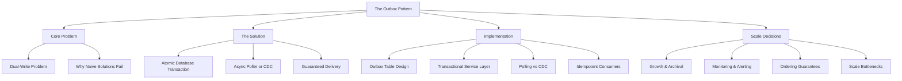
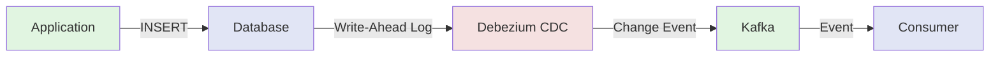

# The Outbox Pattern: Solving the Dual-Write Problem

> "The simplest reliable system is one where consistency is guaranteed by the database engine itself, not by ceremony and hope."

[← Back to Event-Driven Design](./README.md) | **Related:** [Delivery Semantics](./05-delivery-semantics.md) · [Saga Pattern](./08-saga-pattern.md)

---

## Quick Revision Mind Map



---

## Why This Pattern Exists

### The Dual-Write Problem

In event-driven architectures, a fundamental tension emerges: you need both database consistency and event-driven communication. When an order is created, the database must reflect the order, but downstream systems also need to know about it immediately. This seems simple—write the database, then publish the event. But distributed systems have no such luxury.

The problem is that these are two separate systems with two separate failure modes. The database can fail. The message broker can fail. The network between them can fail. When any of these fail between the database write and the event publication, you're in limbo. The order exists in your database, but no one downstream knows about it. Alternatively, if you reverse the order—publish first, then write—the event is published to a phantom order that never makes it into the database.

This isn't a theoretical problem. This is the problem that keeps infrastructure engineers awake at night because it's fundamentally invisible. A missing event doesn't throw an exception. It doesn't trigger an alert. Three days later, your accounting team notices the numbers don't match your sales records, and you're writing emergency data recovery scripts at 3 AM. Or worse: your inventory system never decrements stock, and you oversell products, forcing refunds and customer goodwill recovery.

### A 2 AM War Story

It's 2 AM in production, and an alert fires. Your order service just processed a customer order. The database write succeeded—the order is in your system. The code then tries to publish an event to Kafka, but the Kafka cluster is temporarily unreachable due to a network partition. Your application logs the event (or swallows the exception) and moves on.

Three hours later, Kafka comes back online. The event was never published. Your inventory system never decremented stock. Your warehouse never received a pick list. Your accounting system never recorded the sale. The customer has been charged, but nothing else in your system knows about it. You discover the inconsistency days later when finance reconciliation fails.

Or reverse the sequence. You publish the event first—optimistic ordering! Then the database write fails with a constraint violation. Kafka now has a record of an order that doesn't exist in your database. Your downstream systems begin processing a phantom order. They try to decrement inventory that was never allocated. The audit trail is now permanently inconsistent, and you need to revert transactions across multiple systems.

This is the dual-write problem, and it's the reason many event-driven systems fail in unexpected, subtle ways. The danger isn't obvious because it doesn't fail loudly. A missed event publication isn't an exception that bubbles up. The database rollback doesn't somehow un-publish the event. The systems remain internally consistent—your database has the order, Kafka has the event—they're just not aligned.

---

## Why Naive Solutions Fail

Before explaining the outbox pattern, let me walk you through the approaches teams try first, and exactly where they crack under production pressure.

### Attempt 1: Write DB, Then Publish Event

The intuitive approach: write to the database first because it's more important. Commit your transaction. Then publish the event. It feels safe because your data is persistent before you expose it to external systems.

```
Order Service:
  1. BEGIN TRANSACTION
  2. INSERT INTO orders (id, customer_id, total) VALUES (42, 99, 99.99)
  3. COMMIT
  4. kafka.send("OrderCreated", {orderId: 42})
  5. Return success to API caller
```

The failure window is between steps 3 and 4. The database write succeeds. The application receives confirmation. But then network fails, the Kafka cluster is down, or there's a timeout before the event publishes. Your database now contains an order, but the event sits undelivered. You could retry publishing, but if your application crashes before it retries, that event is gone forever unless you have other mechanisms to detect it—which you probably don't.

The failure mode is persistent, undetectable inconsistency. You won't know orders are being dropped until days later when accounting asks why the numbers don't match. By then, you've probably already shipped products based on orders that never made it to your warehouse system. You'll need to manually reconcile and refund customers.

### Attempt 2: Publish Event, Then Write DB

This flips the problem. Kafka is the source of truth because messages are immutable and durable. Publish first, then commit your database write.

```
Order Service:
  1. kafka.send("OrderCreated", {orderId: 42, customerId: 99})
  2. BEGIN TRANSACTION
  3. INSERT INTO orders (id, customer_id, total) VALUES (42, 99, 99.99)
  4. COMMIT
  5. Return success to API caller
```

The failure window is between steps 1 and 4. Kafka accepts the event (it's published, durable, queued for consumers). Then your database write fails. Maybe there's a constraint violation. Maybe a deadlock that times out. The database transaction rolls back. But the event is already published. Kafka doesn't know. Downstream systems see an `OrderCreated` event for an order that never existed in your system. Your warehouse system processes a phantom order, tries to decrement inventory that was never allocated, and your system state becomes inconsistent in a different dimension.

The failure mode is phantom events driving phantom state changes. This is actually more insidious than the first approach because events are durable and will be retried indefinitely. You can't simply ignore them. You're now running recovery scripts not just to find missing orders, but to find events for orders that don't exist.

### Attempt 3: Use Distributed Transactions (2PC)

"Let's just use a transaction coordinator!" Wrap both the database and Kafka in a two-phase commit protocol. Prepare both systems, then commit both.

```
Coordinator:
  1. Prepare database write (lock resources, validate)
  2. Prepare Kafka publish (reserves partition space, validates)
  3. If both succeed: commit both
  4. If either fails: rollback both
```

This sounds theoretically sound. The problem: **distributed transactions are a tax you don't want to pay**. Two-phase commit is notoriously slow. It introduces multiple round trips. Both systems must maintain locks while coordinating. If the coordinator fails mid-commit, the system can deadlock—either forever or until manual intervention. And most importantly: **not all message brokers support 2PC**. Kafka certainly doesn't. Neither does most cloud-managed message services.

The operational failure mode is complexity and latency that compounds over time. You're adding a third component (the coordinator) that must be monitored, scaled, and operated. You're introducing cross-system locking, which creates contention. You're making failures harder to debug because you're now coordinating across three distributed systems instead of one.

---

## The Outbox Pattern: Core Idea

This is where the Outbox Pattern comes from. It's not a complex pattern, but it's profound. The insight is simple and elegant:

**What if the event wasn't separate from the database write? What if it was part of the same atomic transaction?**

Instead of:
- Writing to database
- Writing to message broker (two separate, coordinated operations)

You do:
- Write to database table A (orders)
- Write to database table B (outbox)
- Commit both in the same transaction (both succeed or both fail)

The event publication is completely decoupled from the order creation in time, but coupled in atomicity through the database engine's transaction support. The database guarantees atomicity. The message broker is only involved later, when the database transaction has already succeeded and the data is safely stored.

### How It Works

Here's the architectural shift from the naive approach to the outbox pattern:

```
Before (Dual Write - Broken):
  Service Code
       │
       ├─ Order Service.createOrder()
       │
       ├─ Attempt: DB write
       │       │
       │       └─→ COMMIT (success)
       │
       ├─ Attempt: Kafka publish
       │       │
       │       └─→ TIMEOUT / NETWORK ERROR
       │
       └─ Result: Inconsistency
           (Order in DB, event not published)

After (Outbox Pattern - Reliable):
  Service Code
       │
       ├─ Order Service.createOrder()
       │
       ├─ SINGLE TRANSACTION:
       │   ├─ INSERT orders (id=42, ...)
       │   ├─ INSERT outbox (id=100, event_type='OrderCreated', ...)
       │   └─ COMMIT (both or neither)
       │
       ├─ Background Poller (independent process)
       │   ├─ SELECT * FROM outbox WHERE published=FALSE
       │   ├─ For each event: kafka.send(...)
       │   └─ UPDATE outbox SET published=TRUE
       │
       └─ Result: Guaranteed delivery
           (If poller crashes, events remain in DB)
```

### The Guarantee: Atomic Consistency

The outbox pattern gives you this guarantee: **either the order and the event are both written to your database, or neither is written**. The database engine handles this atomicity. There is no window of vulnerability between the order write and the event write. They are indivisible.

The poller is a separate component with one responsibility: poll the outbox table for unpublished events and reliably deliver them to Kafka. If Kafka is down, the poller retries. If the poller dies, the events remain in the database, safely persisted, waiting for the poller to come back online. Nothing is lost.

---

## Production Implementation

### Outbox Table Design

The foundation of the pattern is the outbox table itself. This table mirrors the structure that events need, optimized for the polling operation.

#### Schema Design Decisions

```sql
CREATE TABLE outbox (
    -- Surrogate key for ordering and progress tracking
    -- AUTO_INCREMENT gives us a monotonically increasing ID
    -- which makes it easy to track "what did we publish up to?"
    id BIGINT PRIMARY KEY AUTO_INCREMENT,

    -- The event type, used as the Kafka topic name
    -- Examples: 'OrderCreated', 'PaymentProcessed', 'OrderShipped'
    -- Consumers subscribe to specific topics to handle specific events
    event_type VARCHAR(255) NOT NULL,

    -- The aggregate ID (order_id, payment_id, user_id, etc.)
    -- This becomes the Kafka partition key to ensure ordering
    -- All events for the same order always go to the same partition
    aggregate_id VARCHAR(255) NOT NULL,

    -- The full event payload as JSON
    -- Serialized from domain events at the application layer
    -- Deserialized by consumers based on event_type
    payload JSON NOT NULL,

    -- Tracks publication status for the poller's WHERE clause
    -- The poller queries: SELECT * FROM outbox WHERE published = FALSE
    -- This flag is set to TRUE only after Kafka acknowledges receipt
    published BOOLEAN DEFAULT FALSE,

    -- Transaction timestamp (set by database on insert)
    -- Useful for SLA tracking: how long did an event sit before publishing?
    created_at TIMESTAMP DEFAULT CURRENT_TIMESTAMP,

    -- When the event was successfully published to Kafka
    -- Set by the poller after Kafka acknowledgement
    -- Used for retention: "delete events older than 7 days"
    published_at TIMESTAMP NULL,

    -- Indexes for the poller's primary query
    INDEX idx_published (published),
    -- And for data retention queries
    INDEX idx_created_published (created_at, published),
    -- Optional: for debugging
    INDEX idx_aggregate_id (aggregate_id)
);
```

Each field serves a specific purpose. The `aggregate_id` as a Kafka key ensures all events for the same order go to the same partition, preserving ordering guarantees. The `published` flag with an index makes the poller's query trivial: just scan unpublished rows. The `created_at` timestamp allows you to age out old published events (retention policy). The `published_at` gives operations visibility into SLAs: how long did events sit in the queue?

#### Indexing Strategy

The index on `(published)` is critical. It's the first thing the poller queries every cycle:

```sql
SELECT * FROM outbox WHERE published = FALSE ORDER BY id ASC LIMIT 100
```

This query must be fast. With millions of rows in your outbox table, an unindexed scan is death. The index ensures the database quickly identifies unpublished rows, even if published=FALSE represents only a small percentage of the table.

Some teams add a composite index on `(published, id)` to allow the database to use a single index scan. Others partition the table by date or aggregate_id to keep individual partitions smaller. This is a data engineering detail, but it matters at scale.

#### Partitioning for Scale

As your system grows and publishes thousands of events per second, a single outbox table becomes a bottleneck. At 10K events/sec, you're inserting 864 million rows per day. At 100K events/sec, you're at 8.6 billion rows per day. Your database can't keep up with sequential inserts and scans.

Advanced teams partition the outbox table by date or by a hash of aggregate_id. This spreads the write load across multiple partitions and allows the poller to scan partitions in parallel. Kafka exactly mirrors this—you use aggregate_id as the partition key, so logically partitioning by aggregate_id keeps the workflow aligned.

### The Service Layer: Transactional Boundary

The service layer is where the outbox pattern's guarantee is enforced through Spring's `@Transactional` annotation.

#### Spring Boot Implementation

```java
@Service
@Slf4j
public class OrderService {

    @Autowired private OrderRepository orderRepo;
    @Autowired private OutboxEventRepository outboxRepo;
    @Autowired private ObjectMapper objectMapper;

    /**
     * The @Transactional annotation creates a database transaction.
     * Everything in this method succeeds together or fails together.
     * No order is saved unless the event is queued.
     * No event is queued unless the order is saved.
     * This is the atomic boundary.
     */
    @Transactional
    public Order createOrder(CreateOrderRequest request) {
        log.info("Creating order for customer: {}", request.getCustomerId());

        // Step 1: Create and persist the domain entity
        // This executes within the open transaction
        Order order = new Order(
            request.getCustomerId(),
            request.getItems(),
            request.getShippingAddress()
        );
        Order savedOrder = orderRepo.save(order);
        log.info("Order persisted: id={}, total=${}",
            savedOrder.getId(), savedOrder.getTotalAmount());

        // Step 2: Create the domain event
        // This represents "what happened" in the domain
        OrderCreatedEvent domainEvent = new OrderCreatedEvent(
            savedOrder.getId(),
            savedOrder.getCustomerId(),
            savedOrder.getTotalAmount(),
            savedOrder.getItems(),
            savedOrder.getShippingAddress(),
            savedOrder.getCreatedAt()
        );

        // Step 3: Serialize to JSON
        // This happens within the transaction, so serialization failures
        // will rollback the order insert (which is correct)
        String payload;
        try {
            payload = objectMapper.writeValueAsString(domainEvent);
        } catch (JsonProcessingException e) {
            // If we can't serialize the event, don't create the order
            // This prevents orders from existing without publishable events
            log.error("Failed to serialize OrderCreatedEvent", e);
            throw new RuntimeException("Cannot serialize event for order", e);
        }

        // Step 4: Insert the event into the outbox table
        // This is still within the same transaction
        // The database has open locks on the order row we just inserted
        OutboxEvent outboxEvent = new OutboxEvent(
            "OrderCreated",           // event_type
            savedOrder.getId().toString(),  // aggregate_id for partitioning
            payload                   // full event payload
        );
        outboxEvent = outboxRepo.save(outboxEvent);
        log.info("Event queued in outbox: id={}, aggregate_id={}",
            outboxEvent.getId(), outboxEvent.getAggregateId());

        // Step 5: Return from the method
        // Spring commits the transaction here
        // Both the order and the outbox event are now durable in the database
        // They cannot be un-written
        return savedOrder;
    }
}
```

#### Key Design Decisions

The `@Transactional` boundary is the contract. Everything inside this method must succeed together or fail together. If there's a constraint violation, a network timeout, or any other error during method execution, both the order and the event are rolled back. The caller gets an exception. No inconsistency is possible.

This design also means you serialize the event payload within the transaction. Some teams defer serialization until the poller publishes, but that's a mistake. If serialization fails, it's better to fail the order creation immediately rather than create an order that can't be published. The database becomes the single source of truth for which orders exist.

### The Poller: Publishing Events

The poller is a background process that runs independently of the service layer. Its job is simple: find unpublished events and send them to Kafka.

#### Polling Implementation

```java
@Component
@Slf4j
public class OutboxPoller {

    @Autowired private OutboxEventRepository outboxRepo;
    @Autowired private KafkaTemplate<String, String> kafkaTemplate;
    @Autowired private ObjectMapper objectMapper;

    /**
     * Run every 100ms (10 times per second).
     * This is a tunable trade-off:
     * - 50ms:  lower latency, more database stress
     * - 100ms: standard, 50ms average latency
     * - 500ms: higher latency, less database load
     * - 1000ms: minimal load, but events sit 500ms on average
     *
     * Most production systems use 100-200ms as a sweet spot.
     * You want < 200ms event latency (average) without overwhelming the DB.
     */
    @Scheduled(fixedDelay = 100, timeUnit = TimeUnit.MILLISECONDS)
    public void pollAndPublish() {

        // Fetch unpublished events in batches
        // 100 events per batch balances memory usage and throughput
        // Larger batches = more memory, more per-DB-query throughput
        // Smaller batches = less memory, more roundtrips to DB
        List<OutboxEvent> unpublished = outboxRepo.findByPublishedFalse(
            PageRequest.of(0, 100)
        );

        if (unpublished.isEmpty()) {
            return;  // Nothing to do, exit early to avoid log spam
        }

        log.debug("Polling outbox: found {} unpublished events", unpublished.size());

        // Process each event
        for (OutboxEvent event : unpublished) {
            publishEvent(event);
        }
    }

    private void publishEvent(OutboxEvent event) {
        try {
            // Send to Kafka with the aggregate_id as the key
            // This ensures all events for the same order go to the same partition
            // Partitions maintain order, so you get FIFO for each order
            // Topic is the event_type (OrderCreated, PaymentProcessed, etc)
            ListenableFuture<SendResult<String, String>> future = kafkaTemplate.send(
                event.getEventType(),              // Kafka topic
                event.getAggregateId(),            // Partition key (ensures ordering)
                event.getPayload()                 // Event payload (JSON)
            );

            // Wait for Kafka to acknowledge (up to 5 seconds)
            SendResult<String, String> result = future.get(5, TimeUnit.SECONDS);

            // If we get here, Kafka accepted the message
            log.info("Event published: type={}, aggregate_id={}, partition={}, offset={}",
                event.getEventType(),
                event.getAggregateId(),
                result.getRecordMetadata().partition(),
                result.getRecordMetadata().offset()
            );

            // Mark as published
            event.setPublished(true);
            event.setPublishedAt(LocalDateTime.now());
            outboxRepo.save(event);

        } catch (TimeoutException e) {
            // Kafka didn't respond within 5 seconds
            // This is likely a broker issue or network degradation
            log.warn("Timeout publishing event {}: {}. Will retry on next poll.",
                event.getId(), e.getMessage());
            // The event stays in the database with published=FALSE
            // The next polling cycle will retry automatically

        } catch (InterruptedException e) {
            // The poller thread was interrupted
            Thread.currentThread().interrupt();
            log.warn("Poller interrupted while publishing event {}", event.getId());

        } catch (Exception e) {
            // Catch-all for any other failure: network error, broker down,
            // serialization issue on Kafka's side, etc.
            log.warn("Failed to publish event {}: {}. Will retry next cycle.",
                event.getId(), e.getMessage());
            // The event stays in the database. The poller will try again on its next cycle.
            // This automatic retry is the key to the pattern's reliability.
        }
    }
}
```

#### Batch Size and Frequency Tuning

The polling interval and batch size are critical tuning parameters. Poll too frequently and you overwhelm the database with small queries. Poll too infrequently and you introduce unnecessary latency. The batch size must balance memory usage against per-query throughput.

For most systems, 100-200ms polling intervals with 100-1000 event batches work well. At 10K events/second, a 100ms interval means you're batching ~1000 events per poll. At 1K events/second, you're batching ~100 events. The poller adapts naturally to load because it simply processes whatever is in the queue.

If you find the database is becoming a bottleneck, increase the polling interval slightly (200-300ms) and increase the batch size. This reduces query frequency while maintaining throughput. If you need lower latency, decrease the interval (50-100ms) but be prepared to add database replicas to handle the increased query load.

#### Failure Recovery

The poller's fault tolerance is built in. If the poller process crashes, the events remain in the database with published=FALSE. When the poller restarts, it picks up where it left off. No event is ever lost unless you explicitly delete it from the outbox table.

This is why the pattern is so powerful at scale: the database becomes your event buffer. You don't need a separate queue or in-memory buffer. You don't need to worry about the poller crashing and losing in-flight events. The database has your back.

### The Consumer: Idempotent Processing

Idempotency is not optional in this architecture. It's fundamental.

```java
@Component
@Slf4j
public class OrderEventListener {

    @Autowired private OrderProcessingService processingService;
    @Autowired private ObjectMapper objectMapper;

    @KafkaListener(
        topics = "OrderCreated",
        groupId = "order-processing-service",
        containerFactory = "kafkaListenerContainerFactory"
    )
    public void onOrderCreated(@Payload String message) {
        try {
            OrderCreatedEvent event = objectMapper.readValue(
                message,
                OrderCreatedEvent.class
            );

            log.info("Received OrderCreated event: orderId={}", event.getOrderId());

            // CRITICAL: Handle duplicates
            // The poller might publish an event, Kafka acknowledges it,
            // but the poller crashes before marking published=TRUE in the database.
            // When the poller restarts, it will republish the same event.
            // Kafka consumers might also receive duplicates if they crash after
            // processing but before committing their offset.
            // Your processor MUST be idempotent.
            processingService.processOrderWithIdempotency(
                event.getOrderId(),
                event
            );

            log.info("Processed OrderCreated event: orderId={}",
                event.getOrderId());

        } catch (JsonProcessingException e) {
            // Deserialization failed. This is a code bug, not a transient error.
            log.error("Failed to deserialize event: {}", e.getMessage(), e);
            // Could send to a dead-letter queue here for manual investigation

        } catch (Exception e) {
            // Transient error. Throw to trigger Kafka redelivery.
            log.error("Error processing OrderCreated event: {}",
                e.getMessage(), e);
            throw e;  // Kafka will redeliver on the next consumer restart
        }
    }
}

@Service
@Slf4j
public class OrderProcessingService {

    @Autowired private OrderProcessingStateRepository stateRepo;
    @Autowired private InventoryService inventoryService;
    @Autowired private WarehouseService warehouseService;

    /**
     * Idempotent processor: if we've already processed this order,
     * return immediately without side effects.
     *
     * This handles the case where the same event arrives multiple times.
     */
    @Transactional
    public void processOrderWithIdempotency(
            Long orderId,
            OrderCreatedEvent event) {

        // Check: have we already processed this order?
        // This is the idempotency key
        if (stateRepo.existsById(orderId)) {
            log.info("Order already processed (idempotent no-op): {}", orderId);
            return;  // Return immediately without side effects
        }

        log.info("Processing order for the first time: {}", orderId);

        // Process the order (only happens once per order)
        inventoryService.decrementInventory(event.getItems());
        log.info("Inventory decremented for order: {}", orderId);

        warehouseService.createPickList(orderId, event.getItems());
        log.info("Pick list created for order: {}", orderId);

        // Mark as processed
        stateRepo.save(new ProcessedOrder(orderId));
        log.info("Order processing complete: {}", orderId);
    }
}
```

The idempotency key is crucial. You need a way to detect "have I already processed this event?" The simplest approach is to use the aggregate ID (order ID) as the key. Before processing, check if you've already processed this ID. If you have, return early. This ensures that even if the event arrives 10 times, the side effects happen only once.

---

## Polling vs. CDC: The Architectural Choice

The pattern I've shown is **polling-based**. It works well and is simple to understand. But there's a more elegant alternative: **Change Data Capture** using Debezium. Both approaches solve the dual-write problem, but they have different trade-offs.

### Polling: How It Works

The poller is a scheduled background task that repeatedly queries the outbox table for unpublished events. It's conceptually simple: run a query every 100ms, grab whatever events are waiting, publish them, mark them as published.

#### Strengths

Polling is simple. A scheduled task in any framework is easy to understand and debug. If something goes wrong, you look at database logs and application logs. There's no additional infrastructure. Polling works with any database: PostgreSQL, MySQL, Oracle, MongoDB. No special setup required.

Failure recovery is trivial. If your poller crashes, restart it. It picks up where it left off by querying for unpublished events. You don't need to manage checkpoints or recovery state.

The approach is also very testable. You can inject a mock Kafka template and mock repository into the poller and verify it works correctly without spinning up actual infrastructure.

#### Limitations

Polling has inherent latency. There's always a delay between when an event is inserted into the outbox table and when it's actually published. If you poll every 100ms, the average latency is 50ms (halfway through the polling cycle). If you need sub-20ms latency, polling won't cut it.

At very high throughput, polling becomes inefficient. You're executing the same query repeatedly: "SELECT * FROM outbox WHERE published=FALSE". At 100K events/second, this becomes a significant database load. You're not just storing events—you're repeatedly scanning for them.

Polling also doesn't guarantee strict ordering across the entire stream. Each polling cycle is independent. If two events are inserted in the same millisecond into separate partitions, there's no guarantee which will be published first in the polling cycle. If you need strict global ordering, polling makes that harder.

#### When to Choose Polling

Choose polling if your latency requirement is under 500ms. Choose it if you value simplicity and operational ease. Choose it if your outbox volume is modest (< 10K events/second) or if you don't have infrastructure for CDC. Most teams start with polling. It's the right default.

### CDC with Debezium: How It Works

Instead of polling, you use a CDC tool to watch your database's write-ahead log (or binlog, or other change stream). When a row is inserted into the outbox table, the database emits a change event. Debezium captures that change event and publishes it to Kafka almost immediately.



Debezium reads the database's transaction log in real-time. When your application inserts a row into the outbox table, Debezium detects the change within milliseconds (not on the next polling cycle). It captures the row data, converts it to a change event, and publishes it to Kafka. Ordering is preserved because the transaction log is ordered.

#### Architecture

Debezium runs as a connector in Kafka Connect. It requires:
- A Kafka cluster with Kafka Connect deployed
- Debezium connectors for your database (PostgreSQL, MySQL, Oracle, MongoDB, etc.)
- Proper database configuration (logical replication enabled on PostgreSQL, binlog enabled on MySQL)
- Network access from Kafka Connect to your database

The connector maintains state about which changes it has already captured. If it crashes, it picks up from where it left off using this state.

#### Strengths

Latency is extremely low. Events are published within 5-50ms of insertion (depending on database WAL flush settings). For systems that need real-time event propagation, CDC is superior to polling.

Database load is negligible. You're not repeatedly querying the outbox table. The database just emits changes to its WAL, which it's already doing anyway. Debezium reads the WAL asynchronously. No additional database stress.

Ordering is perfectly preserved. The WAL is an ordered sequence of changes. Events flow through Debezium in the exact order they were committed to the database. This is useful for systems where strict ordering across all events (not just per-aggregate) is important.

#### Limitations

CDC introduces operational complexity. You now have an additional component to deploy, monitor, and operate. Debezium needs Kafka Connect, connector configurations, monitoring, alerting. When something goes wrong, you might need to debug Debezium state, WAL positioning, or connector lag.

Database specifics matter. CDC works differently on each database. PostgreSQL uses logical replication slots. MySQL uses binary log position tracking. Oracle uses LogMiner. You need database-specific knowledge to operate CDC reliably.

Debugging is harder. When an event doesn't appear, you need to check: Did the database emit the change? Did Debezium capture it? Is the Debezium connector healthy? What's the connector lag? This is more complex than debugging a simple poller.

Debezium also requires state management. It needs to track which changes it has captured. This state can get out of sync if you're not careful. If you accidentally truncate the outbox table, Debezium might re-emit all historical changes, causing duplicates downstream.

#### When to Choose CDC

Choose CDC if you need sub-100ms latency and polling's overhead is a bottleneck. Choose it if you have tens of thousands of events per second (polling becomes too much DB load). Choose it if you already run Kafka Connect in your infrastructure. Choose it if you're willing to invest in an additional component's operational knowledge.

Most teams start with polling and graduate to CDC as they scale. It's the right evolution.

### Comparison Matrix

| Dimension | Polling | CDC (Debezium) |
|-----------|---------|----------------|
| **Latency** | 50-200ms (avg) | 5-50ms (avg) |
| **Database Load** | Medium to High | Very Low |
| **Operational Complexity** | Low | High |
| **Setup Time** | Days | Weeks |
| **Ordering Guarantee** | Per-Aggregate | Global + Per-Aggregate |
| **Debugging** | Simple (SQL logs) | Complex (WAL, connector state) |
| **Works with Any DB** | Yes | Requires specific support |
| **Failure Recovery** | Trivial | Requires state management |
| **Event Volume Sweet Spot** | < 10K/sec | > 50K/sec |

### Migration Path: Polling → CDC

If you start with polling and need to upgrade to CDC, here's the safe path:

1. **Run Both Simultaneously**: Configure Debezium to consume from the same outbox table. Let it publish to a different Kafka topic (e.g., `OrderCreated-CDC`). Have your consumers subscribe to the polling-based topic first. This way, CDC runs in shadow mode.

2. **Migrate Consumers Gradually**: Start moving consumers from the polling topic to the CDC topic, one consumer group at a time. Monitor for any differences (they should be identical).

3. **Monitor Lag**: Track Debezium connector lag. Ensure it stays close to zero. If lag grows, the connector is struggling and you need to investigate.

4. **Switch Producers**: Once all consumers are on the CDC topic, switch your application to stop using the poller. Debezium is now your only publisher.

5. **Cleanup**: Delete the poller code and schedule. Archive the outbox table polling configuration. You can delete the outbox table retention policy since CDC maintains its own checkpoint.

This dual-publishing approach lets you validate CDC works before committing to it.

---

## Production Realities

Textbooks don't cover the stuff that keeps you up at night. Here are the real-world considerations that distinguish production-grade implementations from toy examples.

### Outbox Table Growth

Your outbox table will grow relentlessly. If you publish 1000 events/second and your events are 1KB each, you're adding 1GB per 1000 seconds (about 17 minutes). Over a day, that's roughly 80GB. Over a month, you're looking at terabytes if you don't have a retention policy.

The solution is straightforward: archive and delete old published events regularly. Don't delete them immediately—keep published events for a retention window (7-30 days, depending on compliance needs). This gives you a window to investigate issues or replay events if necessary.

```sql
-- Batch delete old published events (run daily)
DELETE FROM outbox
WHERE published = TRUE
  AND published_at < DATE_SUB(NOW(), INTERVAL 7 DAYS)
LIMIT 1000000;  -- Delete in chunks to avoid locking
```

Deleting in chunks (with a LIMIT) is important. Deleting millions of rows in a single query will lock the table and block your poller. Using LIMIT ensures you delete in manageable batches that minimize lock contention.

Some teams archive deleted rows to a separate `outbox_archive` table before deleting. This gives you an audit trail and makes compliance audits easier. You can use triggers to automatically move rows:

```sql
CREATE TRIGGER archive_old_outbox
AFTER DELETE ON outbox
FOR EACH ROW
BEGIN
  INSERT INTO outbox_archive VALUES (OLD.*);
END;
```

### Monitoring and Alerting

The most important metric is: **how many unpublished events are sitting in the outbox right now?**

If this number grows over time, something is wrong:
- The poller is slower than events are being produced (scale the poller, increase batch size, or upgrade the database)
- Kafka is unhealthy (broker failures, topic misconfiguration, network issues)
- The database is slow (index fragmentation, query performance degradation)

Set up monitoring:

```java
@Component
@Scheduled(fixedDelay = 60000)  // Check every minute
public class OutboxMonitoring {

    @Autowired private OutboxEventRepository outboxRepo;
    @Autowired private MetricsRegistry metrics;

    public void monitorOutboxLag() {
        long unpublishedCount = outboxRepo.countByPublishedFalse();

        // Record the metric
        metrics.gauge("outbox.unpublished.count", unpublishedCount);

        // Alert on high lag
        if (unpublishedCount > 10000) {
            log.warn("Outbox lag is high: {} unpublished events", unpublishedCount);
            alerting.notify("CRITICAL: Outbox lag > 10K events");
        }

        // Alert on growing lag (trend detection)
        if (unpublishedCount > previousCount * 1.5) {
            log.warn("Outbox lag growing: {} -> {}", previousCount, unpublishedCount);
            alerting.notify("WARNING: Outbox lag growing rapidly");
        }
    }
}
```

Additional metrics to track:
- **P99 event latency**: Time from event insertion to Kafka publication. Should be under 1 second for polling, under 100ms for CDC.
- **Outbox table size**: Number of total rows. Should be stable (growth is published events being deleted).
- **Poller execution time**: How long does each polling cycle take? Should be < 100ms.
- **Kafka publish success rate**: What percentage of publish attempts succeed on the first try?

### Ordering Guarantees

If you want events for the same order to be processed in order, use the `aggregate_id` as the Kafka partition key. Kafka guarantees that messages with the same key go to the same partition, and partitions maintain order. So all events with `aggregate_id=42` go to the same partition, in order.

```java
kafkaTemplate.send(
    "OrderCreated",        // topic
    order.getId().toString(),  // partition key ensures ordering per order
    event.getPayload()     // the event payload
);
```

However: if you publish multiple event types (OrderCreated, PaymentProcessed, OrderShipped) to different topics, they're not guaranteed to be processed in order even if they have the same partition key. Each topic is independent. If strict ordering across all event types is critical, consider using a single topic with different event types in the payload, or ensuring your consumers process events in the correct order.

### What Happens When the Poller Dies

If your poller process crashes and stays down for an hour:

- Events accumulate in the outbox table. They're safe. ✓
- Kafka subscribers wait. They might timeout or trigger circuit breakers. ✗
- The lag metric grows. Operations notice. ✓
- When the poller restarts, it catches up from where it left off. All events publish. ✓

The key: your data is never lost. The lag might be annoying, but nothing is dropped. This is why the pattern is so powerful at scale. You don't need a separate queue. The database is your queue, and it's as durable as your data itself.

### Scale Considerations

How does the pattern perform as you scale? This is the question that separates toy implementations from production systems.

**At 10K events/sec**: A single poller instance with a 100ms polling interval and 1000-event batches works fine. You're executing one query every 100ms against a table that's being inserted into at 10K/sec. Your database handles it easily. Latency averages 50ms.

**At 100K events/sec**: Now you're accumulating 10,000 events between polling cycles (100K events/sec × 100ms). You might increase the polling frequency to 50ms or add a second poller instance. Database load is still manageable, but you should monitor it. You might consider partitioning the outbox table by aggregate_id to spread the write load.

**At 1M events/sec**: You can't scale polling indefinitely. At 1M events/sec, you're inserting 100,000 rows between polling cycles. Database load is significant. Query performance degrades. This is where CDC becomes attractive. Debezium reads the WAL without repeated queries. You scale by adding more Debezium connectors.

Most teams find that polling scales to 50-100K events/sec with one or two poller instances. Beyond that, CDC is worth the operational investment.

---

## Common Mistakes

This table documents the most common implementation mistakes I've seen, what happens when you make them, and how to avoid them.

| Mistake | What Happens | Fix |
|---------|--------------|-----|
| **Forgetting `@Transactional`** | Order is saved but event isn't. Inconsistency on any error. | Always wrap with `@Transactional`. Make it default behavior in your codebase. |
| **Not implementing idempotency in consumers** | Same event processed multiple times. Duplicate charges, double inventory decrements. | Use aggregate_id as dedup key. Check before processing. Accept duplicates as normal. |
| **Polling interval too short** | Database gets hammered with queries. CPU and connection pool exhaustion. | Start at 100-200ms. Monitor database load. Increase if CPU > 50%. |
| **Batch size too large** | OOM errors in the poller. Slow queries that lock the table. | Start at 100-1000 events. Monitor memory and lock times. 95th percentile query time should be < 100ms. |
| **No retention policy** | Outbox table grows unbounded. Eventually query performance degrades catastrophically. | Delete published events older than 7-30 days. Use LIMIT to delete in chunks. Archive to separate table if needed. |
| **Deserializing event payload in producer** | Serialization error rolls back the order. Tight coupling between producer and event schema. | Serialize in producer, store as JSON. Consumers deserialize. Decouples schema evolution. |
| **Not monitoring outbox lag** | Issues go undetected for hours. By the time you notice, events are backed up and consumers are erroring. | Monitor `unpublished_count` every minute. Alert if > 10K or growing. Add to dashboards. |
| **Using events as the source of truth** | Outbox events are the only record. If they're deleted, no recovery. | Database is the source of truth. Outbox is ephemeral. Delete old events. Events are for distribution, not archival. |
| **Same event_type for different event shapes** | Consumers can't deserialize. Classcast exceptions. | Each distinct event type gets its own topic. Use discriminator field in payload if needed. |
| **Not handling Kafka publish failures** | Retries are attempted but never actually succeed. Events accumulate in the outbox forever. | Implement retry with backoff and circuit breaker. Log failures. Alert on sustained failures. |

---

## Who Uses This in Production

### Stripe: Payment Event Reliability

Stripe processes billions of dollars annually through a distributed system. Every payment operation must be idempotent and traceable. They use the outbox pattern to ensure that when a charge is made to the database, an audit event is simultaneously recorded in the outbox. This guarantees that every charge is logged, every refund is auditable, and no payment operation can be lost.

Their implementation treats the database as the source of truth and Kafka as the distribution mechanism for audit and notification events. This architecture allows them to scale audit logging without impacting payment processing latency.

### Uber: Trip State Propagation

In Uber's early microservices era, they encountered the dual-write problem acutely. When a trip is created, the trip service needs to notify the driver app, the rider app, the logistics system, and the billing system. They can't afford to have any of these notifications silently fail.

Uber's solution evolved into using outbox-like patterns to decouple service writes from inter-service notifications. All state changes (trip created, driver accepted, ride started, etc.) are journaled locally first, then propagated asynchronously. This allows each service to be more resilient—if one downstream system is slow, it doesn't impact the core trip state machine.

### Shopify: Order Event Processing

Shopify's order processing system handles millions of orders daily. When an order is created, it needs to notify inventory systems, fulfillment systems, payment processors, and merchants—all asynchronously and reliably.

They use outbox-like mechanisms to ensure that creating an order in the database and queuing its event are atomic. This allows downstream systems (fulfillment, inventory, notifications) to consume the events independently without any risk that the order exists but the event wasn't published.

---

## Decision Framework

### When to Use the Outbox Pattern

Use the outbox pattern when you need **both** atomicity and eventual consistency. You have data that must be persistently stored, and you have downstream systems that need to know about it. The pattern guarantees that both of these happen together or neither happens.

Use it when your system has a clear producer (service that creates the domain event) and multiple consumers (services that react to it). The pattern decouples producers from consumers without sacrificing data consistency.

Use it when you value **simplicity and reliability over latency**. The pattern introduces inherent latency (polling interval), but it's simple to understand, debug, and operate. You don't need distributed transactions, saga coordination, or eventual consistency frameworks.

### When NOT to Use It

Don't use the outbox pattern for real-time, low-latency requirements (< 20ms). Polling introduces inherent latency, and CDC, while faster, adds operational complexity that might not be justified.

Don't use it if you don't have a database as your primary storage. The pattern requires inserting events into a database table. If you're using object stores or caches as primary storage, this pattern doesn't apply.

Don't use it if you only have a single consumer and tight coupling is acceptable. If service A calls service B synchronously and waits for a response, the outbox pattern adds complexity without benefit. Use it when you have multiple asynchronous consumers.

Don't use it if your events are truly optional or informational. If an event is missed, it doesn't matter. The pattern's overhead (extra table, poller process) might not be justified. Just publish events without the outbox and accept occasional loss.

### Alternatives to Consider

**Synchronous RPC** (REST, gRPC) is simpler if you can accept tightly-coupled services and synchronous latency. Use when you need immediate feedback. Use when you have few consumers.

**Saga Pattern** (distributed transactions using choreography or orchestration) when you need cross-service transactions. More complex than outbox but allows multi-step workflows. See [08-saga-pattern.md](./08-saga-pattern.md).

**Event Sourcing** (store all state changes as events) when you need a complete audit trail and temporal queries. More complex than outbox but gives you history and replay capabilities.

**Simple Polling without Outbox** when you accept potential inconsistency. Poll external systems directly without storing intermediate state. Lower latency, higher risk.

---

## Interview Tip

**Setup**: You're interviewing for a senior or principal engineer role. You explain the Outbox Pattern well. The interviewer asks: "But doesn't polling add latency compared to publishing events directly? Why accept that trade-off?"

**Your Answer**:

"Yes, polling does add latency. That's a deliberate trade-off, not a bug. Here's the thing: the alternative—trying to coordinate the database and message broker in real time—is actually more complex and less reliable.

The outbox pattern buys us something more valuable than low latency: it buys us correctness. We get atomic writes. No dual-write inconsistencies. No phantom events. It's simple to understand and operate. A scheduled task, a database table, and basic retry logic. Anyone can understand it and debug it.

Latency depends on the polling interval. If you poll every 100ms, the average latency is 50ms. If you need lower latency—say, under 20ms—then yes, CDC with Debezium makes sense. But that's an optimization you apply after you've validated that polling's latency is actually a bottleneck.

I've seen teams reach for CDC early thinking it's more elegant, and then spend six months debugging Debezium state management issues. I've also seen teams poll their outbox at 50K events/second without issues. The choice depends on your SLAs and operational capacity, not on what sounds more sophisticated."

**If they follow up with: "What if Kafka is down for an extended period?"**

"That's actually a strength of the pattern. Events stay in the database. They're safe. We monitor the `unpublished_count` metric and alert when it grows. When Kafka comes back, the poller catches up automatically. All events publish. No event is lost.

With the naive approach (publish directly), a Kafka outage means events are lost or you need complex retry logic. With the outbox pattern, the database is your safety net. You can tolerate Kafka downtime without losing events."

**If they ask about idempotency**:

"Duplicates are actually expected. The poller might retry publishing if the acknowledgment is slow. Kafka might redeliver if the consumer crashes. Your consumers must be idempotent. I'd implement that using the aggregate ID as a deduplication key—check if you've already processed this ID, and if so, return early. This isn't an edge case; it's the normal operating mode of the system."

---

**Navigation:** [← 06 Kafka Performance](./06-kafka-performance.md) | [08 Saga Pattern →](./08-saga-pattern.md)
