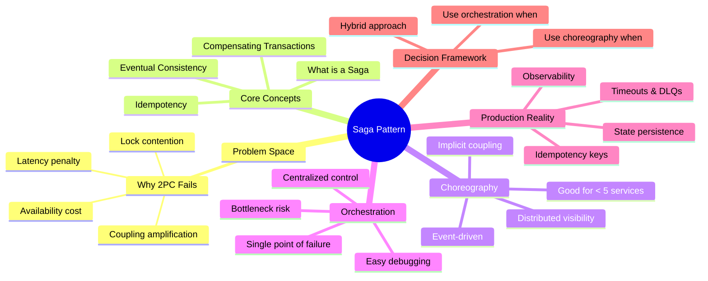
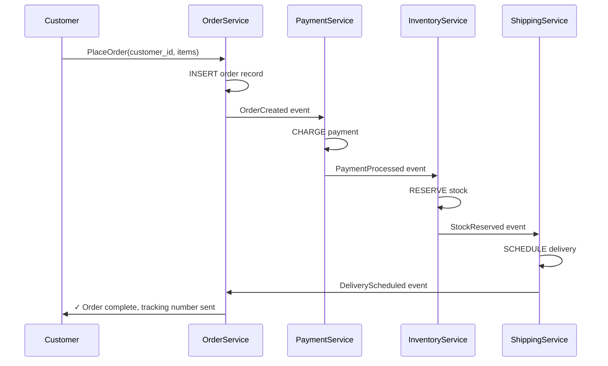
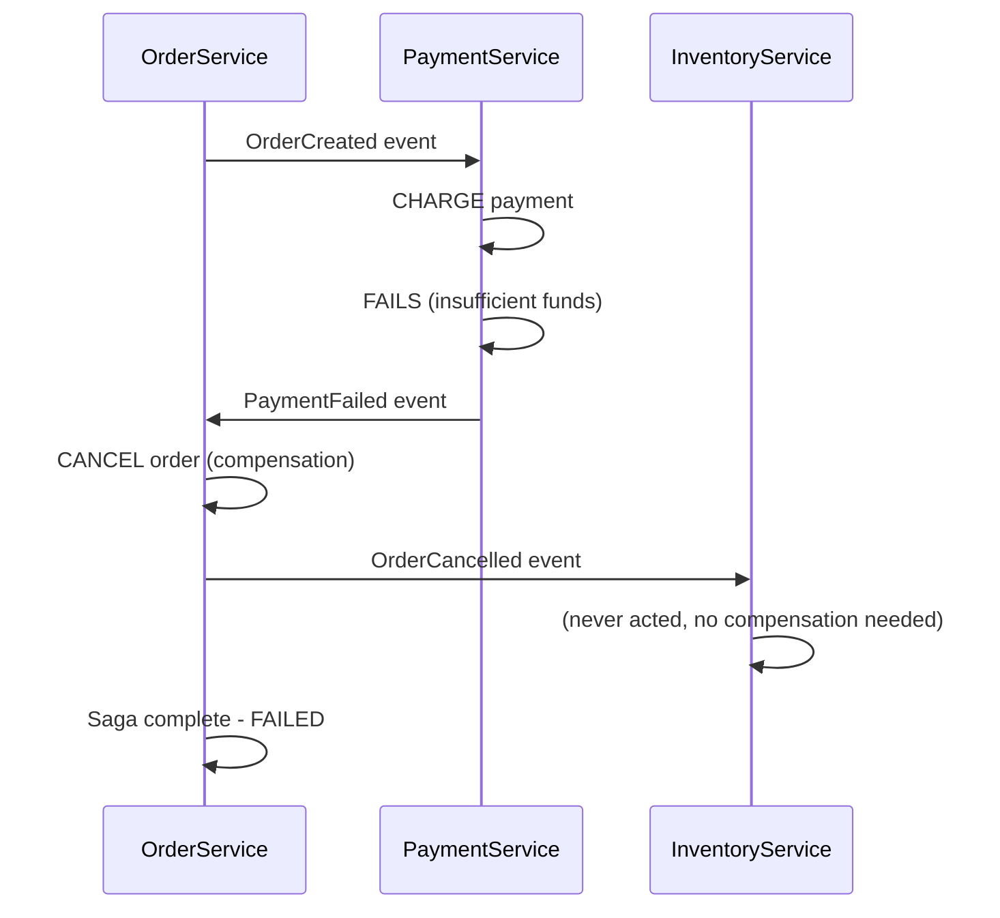
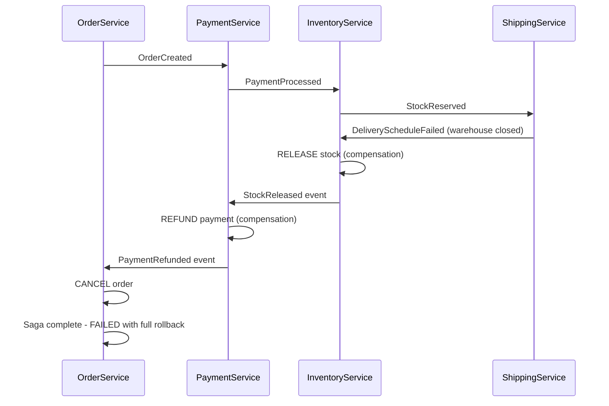
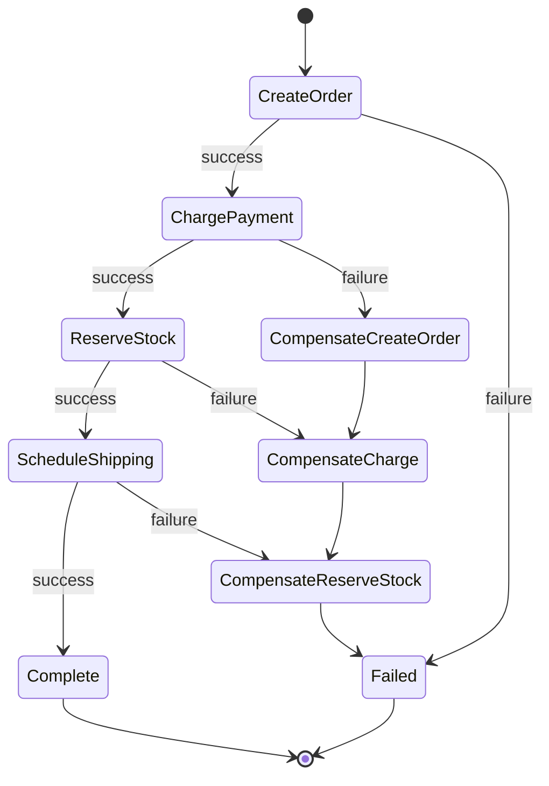
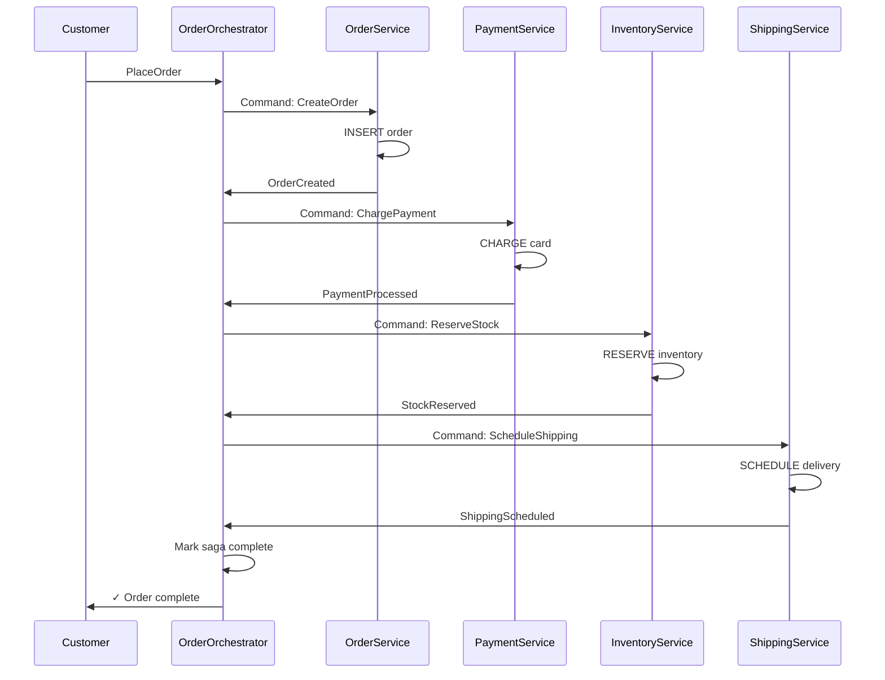
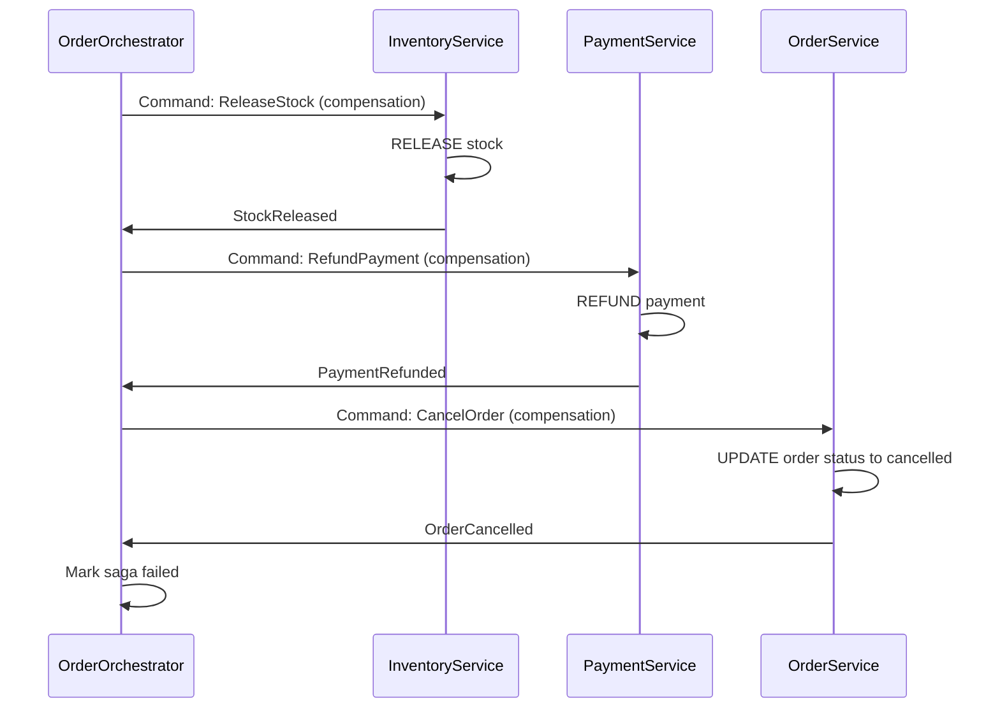
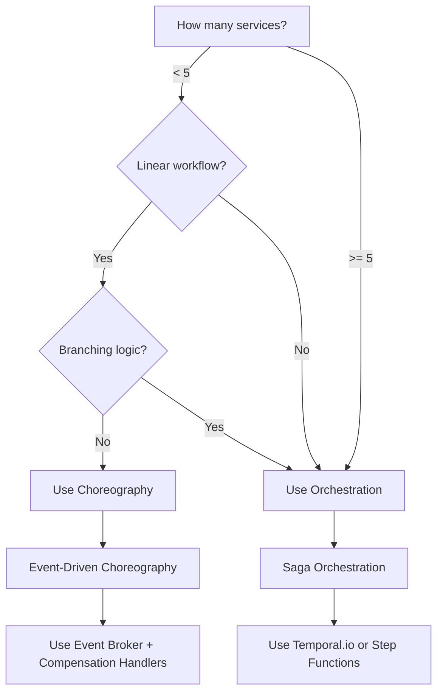

# The Saga Pattern: Managing Distributed Transactions Without 2PC

> "In microservices, we don't get automatic rollback. Instead, we trade atomic consistency for eventual consistency with explicit compensation—and the operational complexity that comes with it." — Hard-won lesson from production systems at scale.

[← Back to Event-Driven Design](./README.md) | **Related:** [Outbox Pattern](./07-outbox-pattern.md) · [Delivery Semantics](./05-delivery-semantics.md)

---

## Quick Revision Mind Map



---

## The Distributed Transaction Problem

### Why 2PC Fails in Microservices

In a monolith, transactions are beautifully simple. You execute within a single database: BEGIN, perform four operations atomically, COMMIT or ROLLBACK. If step three fails, the entire transaction reverts instantaneously. There's a single BEGIN-COMMIT boundary protecting you.

Microservices shattered that illusion. Those four operations now live in four separate databases, owned by four independent services. There is no single transaction boundary. You've eliminated a single point of failure but introduced something exponentially harder: **coordinating consistency across boundaries you don't directly control**.

Two-Phase Commit (2PC) was the theoretical answer. The coordinator sends "prepare" to all participants, collects votes, then commits or aborts based on unanimous consent. Theoretically sound. Practically, it fails spectacularly in distributed systems:

#### Availability Cost

If the coordinator dies, all transactions hang. If any participant is unreachable, the entire system blocks waiting for a response that may never come. In geographically distributed deployments, network partitions become a regular occurrence. I've watched systems grind to a halt because a regional network partition made the coordinator unreachable from half the participants. In cloud environments where failures are normal, 2PC's availability guarantees collapse.

#### Latency Tax

2PC requires synchronous coordination across all services. Every transaction must wait for a round-trip to the coordinator, which must in turn contact every participant service. Add network latency, database contention, and processing time, and you're looking at multi-second transaction times. This latency compounds—users experience slow responses, timeouts increase, retries pile up, and the system cascades into degradation. By the time you've added monitoring and resilience patterns around 2PC's latency, you've built a system so slow it's operationally untenable.

#### Coupling Trap

2PC couples every service to every other service through the coordinator. You can't deploy one service without potentially affecting transaction semantics across the entire ecosystem. A bug in one service's prepare handler can cause transactions to hang system-wide. The "decoupling" that microservices promise—the ability to scale and deploy independently—evaporates.

### The Alternative: Sagas

**Stop trying to distribute the ACID properties themselves.** Instead, break the large transaction into a sequence of local transactions, each a fully committed, independent operation with its own undo handler.

A saga trades immediate consistency for eventual consistency. The system may be temporarily inconsistent—an order might be charged but not yet shipped—but the commitment to completing or fully rolling back is absolute. Each step is a local ACID transaction within a single service. If a step fails, the saga coordinates compensation in reverse through previous successful steps.

This is fundamentally different from 2PC. You're not trying to keep all participants in sync while the transaction is in progress. Instead, you accept that the transaction will move through states, and if it fails partway, you explicitly undo what's been done rather than relying on automatic rollback.

---

## Core Saga Concepts

### What a Saga Is

A saga is a sequence of local transactions coordinated by one of two patterns: choreography (event-driven, distributed) or orchestration (centralized state machine). Each step is a fully committed ACID transaction within a single service's database. There's no two-phase prepare phase. No voting. No waiting.

When a step fails, the saga is responsible for explicitly calling compensating transactions in reverse order through all previously successful steps. This is explicit failure handling, not automatic rollback.

### The Saga Guarantee: Eventual Consistency via Compensation

Unlike a traditional transaction, a saga doesn't guarantee immediate consistency. At any given moment, the system may be partially committed—an order charged but inventory not yet reserved. But the system **commits** to one of two outcomes:

1. **Success:** All steps execute in order. The entire business operation succeeds.
2. **Failure:** At least one step fails. Compensation executes in reverse through all successful steps. The saga ends in a rollback state, and the business operation is undone.

There is no third state where the saga is "stuck." This is the saga guarantee: eventual consistency with guaranteed completion or rollback.

### Saga Terminology

| Term | Definition | Example |
|------|-----------|---------|
| **Saga** | A sequence of local transactions with compensation handlers | Order → Payment → Inventory → Shipping |
| **Compensating Transaction** | An explicit undo operation that reverses a forward transaction | Refund payment, release inventory, cancel order |
| **Saga Orchestrator** | Centralized service that manages state and coordinates steps | Tempo or AWS Step Functions |
| **Choreography** | Event-driven coordination where services listen and react | PaymentService publishes "PaymentProcessed"; InventoryService listens |
| **Idempotency Key** | Unique identifier ensuring an operation has same effect if retried | hash(saga_id + step_name) |
| **Dead Letter Queue** | Storage for sagas that failed and require manual intervention | Sagas stuck in compensation |

---

## Choreography: Event-Driven Sagas

Choreography means: **no central coordinator.** Services communicate through events. When something happens, a service publishes an event. Other services listen. When they complete their work, they publish events that trigger the next step.

### How Choreography Works

#### The Happy Path: E-Commerce Order Flow

Picture an online retailer. A customer places an order:



Each service owns its operation. Order Service creates the order and publishes "OrderCreated." Payment Service listens, charges the card, publishes "PaymentProcessed." Inventory Service reserves stock, publishes "StockReserved." Shipping Service schedules delivery. Nothing waits synchronously. The saga flows as pure events through the system. There is no orchestrator, no central point that knows about all the others.

#### The Failure Path: Compensation Flow

Payment fails. Now compensation must undo what succeeded:



Simple case. But now imagine Shipping fails after Inventory succeeds:



Notice the compensation order: **it flows reverse through the chain of successful steps.** Shipping failed first, so nothing needs to compensate for it. Inventory succeeded and must be undone. Payment succeeded and must be undone. The system must remember which steps actually completed to know what to undo.

### The Real-World Problem: Implicit Coupling

I've been in production war rooms where choreography broke down. Here's what happened:

We built a saga across six services: Order → Payment → Inventory → Shipping → Notification → Analytics. Each service published events. Things worked... until they didn't.

**The debugging nightmare:** A customer's order got stuck in limbo. We had no central visibility. Events were scattered across six service logs, six databases, six monitoring dashboards. The order had been charged, inventory reserved, shipping label created—but no notification email was sent. Which service was supposed to handle that? Did Notification Service miss the event? Did it process it but fail to persist? Is it retrying in the background? We spent hours reconstructing the saga state from event logs spread across multiple systems because there was no central source of truth.

**The coupling problem:** We added a new Fraud Detection service. It needed to listen to "PaymentProcessed" and decide whether to approve or reject. If it rejected, compensation had to flow through Inventory, Shipping, and Notification. Now all those services had to know about fraud rejection. The "decoupling" of choreography was illusory—we'd just made coupling implicit and distributed. Every service became tightly coupled to every other service's event schema. Changing a field in the PaymentProcessed event required coordinating with five other teams.

**The cascade failure:** One night, Notification Service went down briefly. It recovered fine. But it had missed events while offline. Orders were stuck—fully charged, shipped, but never notified. We manually replayed events, which created duplicate notifications. Then we added idempotency keys, which meant adding database state to track processed events. Then we had to handle events arriving out of order, which required buffering and reordering logic. Testing became a nightmare because services could legitimately process events out of order.

### When Choreography Works

Choreography shines in **specific, limited scenarios**:

- **Simple, linear flows with 2-4 services:** Order creation (Order → Payment → Inventory). The straightforward left-to-right flow is easy to reason about.
- **High autonomy requirement:** Services truly don't need to know about each other's logic. They publish domain events and react independently.
- **Low infrastructure overhead:** You already have an event broker (Kafka, RabbitMQ, EventBridge). No orchestrator service to run and scale.
- **Built-in resilience:** No single point of failure. If Payment Service is slow, it doesn't block Order Service. Services can fail and recover independently.

The sweet spot: **fewer than 5 services in a purely linear flow with no branching logic.**

### When Choreography Breaks Down

The moment you add branches, conditions, or more than five services, choreography's hidden costs explode:

- **Implicit failure paths:** When compensation is distributed, every service must know how to undo its work. But what if Inventory's release fails? Do we retry indefinitely? Escalate to a manual review queue? This logic is scattered across services.
- **Testing nightmare:** You must mock all service interactions. Integration testing requires starting six services and simulating network failures. Each failure scenario explodes the test matrix.
- **Operational complexity:** Debugging failures requires reconstructing state from distributed logs. On-call engineers spend hours chasing sagas through multiple systems.

---

## Orchestration: Centralized Saga Coordination

Orchestration makes the opposite bet: **a single Saga Orchestrator owns the workflow state.** It tells each service what to do, waits for responses, and decides the next step based on the result.

### How Orchestration Works

#### The Orchestrator State Machine

The orchestrator is a state machine. It has states representing each step in the saga:



#### The Happy Path

Customer places an order. The orchestrator drives the entire saga:



Every step goes through the orchestrator. It has **total visibility.** It knows exactly which steps succeeded and which are pending.

#### The Failure Path: Directed Compensation

Shipping fails. The orchestrator has stored the saga state. It knows "steps 1-3 succeeded, step 4 failed." It executes compensation in reverse:



The orchestrator runs through a failure path defined in code. There's no ambiguity about who should compensate. There's no distributed reasoning. The orchestrator simply follows its state machine.

### The Real-World Problem: Orchestrator Bottleneck

Orchestration has its own production costs. I've been in systems where orchestration became the constraint.

We implemented a Saga Orchestrator using a commercial workflow engine. It handled all order sagas. At 100 orders/second, it was fine. At 500 orders/second, the orchestrator became saturated. Every decision flowed through it. If orchestrator processing latency increased from 10ms to 50ms, all orders slowed proportionally. We tried horizontal scaling, but the engine's distributed state synchronization became the bottleneck.

**The operational burden:** The orchestrator had its own state machine definition. If it crashed mid-saga, we needed to replay from the last known state. If state got corrupted (rare but it happened), we had to manually inspect saga instances and update their state. Adding a new service to the workflow meant updating the orchestrator's definition and redeploying. The orchestrator became a critical service requiring obsessive monitoring.

**But here's the win:** When something went wrong, we had one place to look. We could see the entire state history in the orchestrator. Debugging was infinitely easier. "Order saga failed at step 3" pointed us directly to the right place. In choreography, we'd have spent hours reconstructing that information from logs.

### When Orchestration Makes Sense

Orchestration excels when complexity demands centralized coordination:

- **Complex workflows with branches:** "If fraud check passes, charge immediately. If it fails, hold and review."
- **Multiple failure paths:** Different compensation strategies for different failure scenarios.
- **5+ services:** The coordination overhead justifies the orchestrator's existence.
- **Strong audit requirements:** You need a complete, ordered log of what happened and when.
- **Strict ordering requirements:** Services must be called in a specific sequence, with conditional branching based on results.

---

## Choreography vs. Orchestration: Decision Framework

### Comparison Matrix

| Dimension | Choreography | Orchestration |
|-----------|--------------|---------------|
| **Control Flow** | Services react to events (distributed) | Orchestrator decides next step (centralized) |
| **Coupling** | Loosely coupled to services; tightly coupled to event schema | Tightly coupled to orchestrator; loosely coupled to event schemas |
| **Visibility** | Poor (distributed across logs) | Excellent (single source of truth) |
| **Testing** | Hard (mock all services and events) | Easy (mock orchestrator responses) |
| **Scaling** | Linear (add service, add listener) | Potential bottleneck if orchestrator saturates |
| **Debugging** | Distributed (reconstruct from events) | Centralized (query saga state) |
| **Failure Recovery** | Implicit (events trigger compensation) | Explicit (orchestrator manages compensation) |
| **Operational Complexity** | Distributed reasoning across teams | Centralized state to manage |
| **Infrastructure** | Event broker (already exists) | New orchestrator service needed |
| **Latency** | Slightly higher (event processing delay) | Slightly lower (direct RPC) |
| **Network Calls** | Same (event publish + consume) | Same (command + response) |
| **Best For** | Simple, linear, high-autonomy workflows | Complex, branching, audit-heavy workflows |

### The Hybrid Approach

Many production systems use **hybrid choreography-orchestration.** Use choreography for simple, cross-service notifications. Use orchestration for critical financial sagas that require strict ordering and audit trails.

For example, at Uber, the trip booking system likely orchestrates the core saga (matching → payment → route assignment) but uses choreography for notifications (send SMS to driver, email to customer).

### How I Decide: Decision Tree



**My rule of thumb:** If you can draw the workflow as a simple left-to-right line with no branches, and it has fewer than 5 services, use choreography. The moment you need branching (fraud checks, multi-warehouse allocation, international shipping variants) or more than 5 services, the operational complexity of debugging and testing choreography exceeds the overhead of running an orchestrator. Switch to orchestration.

---

## Compensating Transactions: The Hardest Part

This is where architect-level thinking separates from junior understanding. **Anyone can execute a happy path.** The real skill is designing failure gracefully.

### What Compensation Really Means

A compensating transaction is **not** an automatic rollback. It's an explicit, deliberate business operation that undoes the side effects of the forward transaction.

In a monolith:
```
BEGIN TRANSACTION
  INSERT order
  INSERT payment
  RESERVE inventory
COMMIT
```

If RESERVE fails, everything rolls back automatically. Instant, atomic, no partial state.

In a saga:
```
STEP 1 (local txn): INSERT order → succeeds, COMMITTED
STEP 2 (local txn): INSERT payment → succeeds, COMMITTED
STEP 3 (local txn): RESERVE inventory → FAILS
→ Now we're partially committed. We must explicitly undo steps 1 and 2.
```

The compensating operations are business operations, not database rollbacks:
- Compensate step 2: **Refund payment** (call the payment processor's refund endpoint)
- Compensate step 1: **Cancel order** (update order status, notify customer)

### Transactions That Cannot Be Compensated

Some operations fundamentally cannot be undone. This is critical to understand:

**Sending an email:** You've published a customer confirmation. The compensation is... what? You can't "unsend" an email. You could send a cancellation email, but the customer's already seen the first. The best you can do is send a follow-up and flag the order as cancelled. The customer's inbox is forever changed.

**Calling an external API with side effects:** You've submitted a payment to a third-party processor (Stripe, PayPal). The processor has taken the money. Compensation is to call the refund API, but that's a separate operation that can fail. If the refund API is down, you're in an inconsistent state—payment charged, refund pending. You need manual intervention.

**Creating a user account:** You've created a user in Auth0. Compensation would be to delete the user, but that's risky—the user might have already logged in. Better to deactivate and let an admin review.

**Allocating from multiple warehouses:** You've reserved 5 units from Warehouse A and 5 from Warehouse B. If Warehouse B's release fails, you have partial compensation. You're now inconsistent.

**Publishing to read replicas:** You've written an order to your analytics warehouse. Compensation is to delete it, but the deletion is asynchronous. Other consumers might have already read the write.

**The design principle:** Put operations that cannot be easily compensated at the **end** of the saga. Execute them last, when you've already verified all earlier steps will succeed.

### Compensation Design Patterns

#### Reverse Dependency Order

Compensate in **reverse order of successful execution.**

```
Forward execution:
  1: CreateOrder → success
  2: ChargePayment → success
  3: ReserveStock → success
  4: ScheduleShipping → FAIL

Compensation order:
  3: ReleaseStock (release what was reserved)
  2: RefundPayment (refund what was charged)
  1: CancelOrder (cancel what was created)
```

Order matters. If you refund before releasing stock, and releasing stock fails, you're in a worse state.

#### Idempotent Compensation

Every compensating transaction must be **idempotent.** You must be able to execute it twice and get the same outcome as executing it once.

Networks fail. Messages duplicate. If a service times out while refunding, the client might retry, causing duplicate refunds.

**How to achieve idempotency:**

1. **Idempotency key:** Each operation has a unique key:

```java
String key = hashSagaIdAndStep("order-12345", "refund_payment");
// key = hash of saga_id + step_name, guaranteed unique per saga+step
```

2. **Check-before-execute:** Before issuing the refund, check: "Have I already refunded this saga?"

```java
Optional<Refund> existingRefund = db.query(
  "SELECT * FROM refunds WHERE idempotency_key = ?", key
);
if (existingRefund.isPresent()) {
  return existingRefund.get(); // already done, return same result
} else {
  Refund refund = paymentProcessor.refund(amount);
  db.insert("refunds", { key, refund_id: refund.id });
  return refund;
}
```

3. **Persist idempotency records:** Store which operations you've already done. On orchestrator restart, replays are safe.

Without idempotency, a network retry during compensation causes cascade failures: you refund twice, send two emails, confuse accounting. Now you're debugging financial discrepancies instead of handling the original failure.

#### Compensation with Retry Budget

What if compensation itself fails?

```
Forward: 1 → 2 → 3 → 4 (fails)
Compensation: 3 (fails)
            → Now what?
```

You're in a **stuck state.** The forward couldn't complete. The compensation can't complete. You need a saga abort handler:

1. **Log the failure** with full context (saga ID, step, error, timestamp)
2. **Move to Dead Letter Queue** for manual review
3. **Alert ops** with enough detail to investigate
4. **Once ops fixes** the underlying issue (payment processor recovers, warehouse comes back online), replay compensation

This is why **saga state persistence is non-negotiable.** You must store the saga's entire state in durable storage, not in memory.

### The "Unsure State" Problem

The orchestrator is executing the saga. Step 3 of 4. It sends "ReleaseStock" to Inventory Service. Inventory executes it and publishes "StockReleased." But before the orchestrator receives the response, **it crashes.**

On restart, the orchestrator replays the saga from stored state. It sees "step 3 was started but status is unknown." Does it retry ReleaseStock? If it retries without idempotency, stock gets released twice.

**The solution:**

1. **Saga state persistence:** Store complete state in PostgreSQL or DynamoDB:

```json
{
  "saga_id": "order-12345",
  "status": "in_progress",
  "current_step": 3,
  "steps": [
    { "name": "CreateOrder", "status": "succeeded", "timestamp": 1234567890 },
    { "name": "ChargePayment", "status": "succeeded", "timestamp": 1234567900 },
    { "name": "ReserveStock", "status": "in_progress", "sent_at": 1234567920 },
    { "name": "ScheduleShipping", "status": "pending" }
  ],
  "compensation_status": null
}
```

2. **Heartbeat and timeout:** If a step's status is "in_progress" for longer than expected (30 seconds), assume failure. Trigger compensation.

3. **Idempotency on replay:** When you retry "ReleaseStock," Inventory Service sees the same idempotency key and returns the same result without duplicating.

---

## Production Implementation

### Saga State Persistence

You must durably persist saga state. Here are the trade-offs:

| Approach | Pros | Cons |
|----------|------|------|
| **Relational Database** | ACID guarantees, easy to query, can use DB triggers for timeouts | Schema changes require migration, less flexible |
| **NoSQL (DynamoDB/MongoDB)** | Flexible schema, scales horizontally, cheap at scale | Eventual consistency; querying can be slow; snapshots needed for history |
| **Event Sourcing** | Complete audit trail, reproducible from events, compliance-friendly | Queries can be slow without snapshots; eventual consistency |
| **In-Memory + Backup** | Ultra-low latency | Lost on crash; only suitable for non-critical sagas |

**My preference:** Relational database with a `sagas` table and a `saga_steps` table. Use a database trigger or a background job to check for timeouts.

### Spring Boot Orchestrator Example

Here's production-grade code for a saga orchestrator using Spring Boot:

```java
@Service
public class OrderSagaOrchestrator {
  @Autowired private SagaStateRepository sagaRepo;
  @Autowired private PaymentServiceClient paymentClient;
  @Autowired private InventoryServiceClient inventoryClient;
  @Autowired private ShippingServiceClient shippingClient;

  private static final Duration STEP_TIMEOUT = Duration.ofSeconds(30);

  public void startOrderSaga(OrderRequest request) {
    String sagaId = UUID.randomUUID().toString();
    SagaState saga = new SagaState();
    saga.setSagaId(sagaId);
    saga.setStatus(SagaStatus.IN_PROGRESS);
    saga.setCurrentStep(0);
    saga.setOrder(request);
    sagaRepo.save(saga);

    executeNextStep(sagaId);
  }

  @Transactional
  private void executeNextStep(String sagaId) {
    SagaState saga = sagaRepo.findBySagaId(sagaId)
      .orElseThrow(() -> new SagaNotFoundException(sagaId));

    if (saga.getStatus() == SagaStatus.COMPLETED || saga.getStatus() == SagaStatus.FAILED) {
      return;
    }

    int stepIndex = saga.getCurrentStep();

    // Define step handlers
    switch (stepIndex) {
      case 0:
        executeStep(saga, "CreateOrder", () -> {
          // Local transaction: create order in database
          Order order = new Order();
          order.setOrderId(saga.getSagaId());
          order.setCustomerId(saga.getOrder().getCustomerId());
          order.setStatus("CREATED");
          return orderRepository.save(order);
        }, sagaId);
        break;

      case 1:
        executeStep(saga, "ChargePayment", () -> {
          PaymentRequest payReq = new PaymentRequest();
          payReq.setIdempotencyKey(saga.getSagaId() + "-charge");
          payReq.setAmount(saga.getOrder().getAmount());
          PaymentResponse payResp = paymentClient.charge(payReq);
          if (!payResp.isSuccess()) {
            throw new PaymentException("Payment declined");
          }
          return payResp;
        }, sagaId);
        break;

      case 2:
        executeStep(saga, "ReserveStock", () -> {
          InventoryRequest invReq = new InventoryRequest();
          invReq.setIdempotencyKey(saga.getSagaId() + "-reserve");
          invReq.setItems(saga.getOrder().getItems());
          InventoryResponse invResp = inventoryClient.reserve(invReq);
          if (!invResp.isSuccess()) {
            throw new InventoryException("Stock not available");
          }
          return invResp;
        }, sagaId);
        break;

      case 3:
        executeStep(saga, "ScheduleShipping", () -> {
          ShippingRequest shipReq = new ShippingRequest();
          shipReq.setIdempotencyKey(saga.getSagaId() + "-ship");
          shipReq.setOrderId(saga.getSagaId());
          ShippingResponse shipResp = shippingClient.schedule(shipReq);
          if (!shipResp.isSuccess()) {
            throw new ShippingException("Cannot schedule delivery");
          }
          return shipResp;
        }, sagaId);
        break;

      default:
        saga.setStatus(SagaStatus.COMPLETED);
        sagaRepo.save(saga);
        return;
    }
  }

  private void executeStep(SagaState saga, String stepName,
                          Supplier<Object> action, String sagaId) {
    SagaStep step = new SagaStep();
    step.setSagaId(sagaId);
    step.setName(stepName);
    step.setStatus(StepStatus.IN_PROGRESS);
    step.setSentAt(Instant.now());
    sagaRepo.addStep(saga.getSagaId(), step);

    try {
      Object result = action.get();

      // Step succeeded
      step.setStatus(StepStatus.SUCCEEDED);
      step.setCompletedAt(Instant.now());
      sagaRepo.updateStep(saga.getSagaId(), step);

      saga.setCurrentStep(saga.getCurrentStep() + 1);
      sagaRepo.save(saga);

      // Execute next step
      executeNextStep(sagaId);

    } catch (Exception e) {
      log.error("Step {} failed for saga {}: {}", stepName, sagaId, e.getMessage());

      // Step failed: trigger compensation
      step.setStatus(StepStatus.FAILED);
      step.setError(e.getMessage());
      sagaRepo.updateStep(saga.getSagaId(), step);

      saga.setStatus(SagaStatus.COMPENSATING);
      sagaRepo.save(saga);

      triggerCompensation(saga);
    }
  }

  private void triggerCompensation(SagaState saga) {
    List<SagaStep> successfulSteps = saga.getSteps().stream()
      .filter(s -> s.getStatus() == StepStatus.SUCCEEDED)
      .sorted((a, b) -> Integer.compare(b.getOrder(), a.getOrder())) // reverse
      .collect(Collectors.toList());

    for (SagaStep step : successfulSteps) {
      try {
        compensateStep(saga.getSagaId(), step);
      } catch (Exception e) {
        log.error("Compensation failed for step {} in saga {}", step.getName(), saga.getSagaId());
        saga.setStatus(SagaStatus.FAILED_MANUAL_INTERVENTION);
        sagaRepo.save(saga);
        // Alert ops
        alertOps("Saga " + saga.getSagaId() + " stuck in compensation");
        return;
      }
    }

    saga.setStatus(SagaStatus.FAILED);
    sagaRepo.save(saga);
  }

  private void compensateStep(String sagaId, SagaStep step) {
    switch (step.getName()) {
      case "ReserveStock":
        InventoryRequest invReq = new InventoryRequest();
        invReq.setIdempotencyKey(sagaId + "-release");
        inventoryClient.release(invReq);
        break;

      case "ChargePayment":
        PaymentRequest payReq = new PaymentRequest();
        payReq.setIdempotencyKey(sagaId + "-refund");
        paymentClient.refund(payReq);
        break;

      case "CreateOrder":
        Order order = orderRepository.findByOrderId(sagaId);
        order.setStatus("CANCELLED");
        orderRepository.save(order);
        break;
    }
  }
}
```

### Timeouts and Dead Letter Queues

Set a timeout for each step. If a service doesn't respond within the timeout, assume failure:

```java
@Scheduled(fixedRate = 5000) // Check every 5 seconds
public void checkForTimedOutSteps() {
  Instant timeout = Instant.now().minus(STEP_TIMEOUT);

  List<SagaStep> timedOut = sagaRepo.findStepsInProgressBefore(timeout);

  for (SagaStep step : timedOut) {
    SagaState saga = sagaRepo.findBySagaId(step.getSagaId()).get();

    log.warn("Step {} timed out for saga {}", step.getName(), saga.getSagaId());

    step.setStatus(StepStatus.TIMEOUT);
    sagaRepo.updateStep(saga.getSagaId(), step);

    saga.setStatus(SagaStatus.COMPENSATING);
    sagaRepo.save(saga);

    triggerCompensation(saga);
  }
}

@Scheduled(fixedRate = 60000) // Check every minute
public void checkDeadLetterQueue() {
  List<SagaState> stuck = sagaRepo.findSagasWithStatus(SagaStatus.FAILED_MANUAL_INTERVENTION);

  if (!stuck.isEmpty()) {
    AlertService.sendAlert("Dead Letter Queue has " + stuck.size() + " sagas");
  }
}
```

### Monitoring and Observability

Sagas are invisible by default. You must instrument them:

**Key metrics:**
- **Saga duration (p50, p99):** How long sagas take end-to-end. A spike means services are slow.
- **Failure rate by step:** Which step fails most often? Indicates unreliable services.
- **Compensation frequency:** How often do sagas fail? If > 5%, your services aren't stable enough.
- **Dead Letter Queue size:** Growing DLQ is an alarm.
- **State recovery latency:** When the orchestrator restarts, how long to resume pending sagas?

**Distributed tracing:**

```java
@Before
public void startTrace(String sagaId) {
  MDC.put("saga_id", sagaId);
  MDC.put("trace_id", UUID.randomUUID().toString());
}

log.info("Step executed", MDC.get("saga_id"), MDC.get("trace_id"));
```

**Alert thresholds:**
- Saga duration > 5 minutes: something is backed up
- Failure rate > 5%: services are unstable
- Compensation frequency > 10%: consider retry strategy changes
- DLQ growth > 0.1% of total sagas: manual intervention needed

---

## Testing Sagas

### Unit Testing Individual Steps

Test step logic in isolation with mocked services:

```java
@Test
public void testPaymentStepWithSuccess() {
  PaymentRequest request = new PaymentRequest();
  request.setAmount(100.0);

  PaymentResponse response = new PaymentResponse();
  response.setSuccess(true);
  response.setTransactionId("txn-123");

  when(paymentClient.charge(any())).thenReturn(response);

  Object result = orchestrator.executePaymentStep(request);

  assertThat(result).isNotNull();
  verify(paymentClient).charge(any());
}

@Test
public void testPaymentStepWithFailure() {
  when(paymentClient.charge(any())).thenThrow(new PaymentException("Declined"));

  assertThrows(PaymentException.class, () -> {
    orchestrator.executePaymentStep(any());
  });
}
```

### Integration Testing the Happy Path

Test the complete saga flow with real (in-memory) databases and mock services:

```java
@Test
public void testCompleteOrderSagaHappyPath() {
  OrderRequest request = new OrderRequest();
  request.setCustomerId("customer-1");
  request.setAmount(50.0);

  orchestrator.startOrderSaga(request);

  await().atMost(Duration.ofSeconds(5))
    .until(() -> sagaRepo.findBySagaId(any())
      .map(s -> s.getStatus() == SagaStatus.COMPLETED)
      .orElse(false));

  SagaState saga = sagaRepo.findBySagaId(any()).get();
  assertThat(saga.getStatus()).isEqualTo(SagaStatus.COMPLETED);
}
```

### Chaos Testing: Failure Injection

Deliberately introduce failures at different points to verify compensation:

```java
@Test
public void testCompensationWhenShippingFails() {
  when(shippingClient.schedule(any()))
    .thenThrow(new ShippingException("Warehouse closed"));

  orchestrator.startOrderSaga(validRequest);

  await().until(() -> sagaRepo.findBySagaId(any())
    .map(s -> s.getStatus() == SagaStatus.FAILED)
    .orElse(false));

  SagaState saga = sagaRepo.findBySagaId(any()).get();

  // Verify compensation happened in reverse order
  List<SagaStep> steps = saga.getSteps();
  assertThat(steps.get(2).getStatus()).isEqualTo(StepStatus.SUCCEEDED); // Reserve
  assertThat(steps.get(3).getStatus()).isEqualTo(StepStatus.FAILED);    // Ship (failed)

  // Compensation should have undone steps 2 and 1
  verify(inventoryClient).release(any());
  verify(paymentClient).refund(any());
}
```

### Testing Compensating Transactions

Verify that compensation is idempotent:

```java
@Test
public void testCompensationIsIdempotent() {
  String sagaId = "order-123";
  String idempotencyKey = sagaId + "-refund";

  PaymentRequest req1 = new PaymentRequest();
  req1.setIdempotencyKey(idempotencyKey);

  PaymentRequest req2 = new PaymentRequest();
  req2.setIdempotencyKey(idempotencyKey);

  PaymentResponse resp1 = paymentService.refund(req1);
  PaymentResponse resp2 = paymentService.refund(req2);

  assertThat(resp1.getTransactionId()).isEqualTo(resp2.getTransactionId());
  // Same transaction ID means same effect
}
```

### The Test Matrix

| Scenario | Test Type | What to Verify |
|----------|-----------|----------------|
| **Happy path** | Integration | All steps succeed in order |
| **Single step failure** | Integration + Chaos | Compensation triggers for failed step only |
| **Compensation failure** | Chaos | Dead letter queue receives saga |
| **Timeout** | Chaos | Compensation triggers after timeout |
| **Orchestrator crash mid-saga** | Integration | Saga resumes from persisted state on restart |
| **Duplicate messages** | Chaos | Idempotency keys prevent double execution |
| **Service unavailable** | Chaos | Retry or timeout, not hang |
| **Network partition** | Chaos | Saga moves to compensation or DLQ |
| **Out-of-order events** | Integration (choreography only) | Saga handles reordered steps |

---

## Common Mistakes

| Mistake | What Happens | Fix |
|---------|-------------|-----|
| **Forgetting idempotency keys** | Network retries cause duplicate charges, double refunds | Add unique idempotency key to every operation |
| **Storing saga state in memory** | Orchestrator crash = lost sagas | Persist to durable database |
| **No timeout on steps** | Stuck sagas wait forever | Set per-step timeout, trigger compensation if exceeded |
| **Compensation without reverse order** | Dangling dependencies; e.g., refund before releasing stock | Always compensate in reverse order |
| **Assuming all operations can be compensated** | Can't "unsend" emails; stuck states | Design: put hard-to-compensate operations last |
| **No dead letter queue** | Stuck sagas have nowhere to go | Implement DLQ with ops alert |
| **Testing only happy path** | Failures in production are surprising | Chaos test every failure scenario |
| **No distributed tracing** | Debugging distributed failures takes hours | Use correlation IDs across all logs |
| **Tight coupling in choreography** | Changing one service breaks others | Use event contracts, version events |
| **Orchestrator as single point of failure** | One crash stops all sagas | Multi-instance orchestrator with state replication |

---

## Who Uses This in Production

### Amazon: Order Fulfillment Pipeline

Amazon's order fulfillment pipeline is a saga orchestrated system. When you place an order, it flows through Order Service → Payment Service → Inventory Allocation Service → Warehouse Picking Service → Shipping Service. If any step fails (e.g., item goes out of stock), compensation automatically refunds the payment and cancels the order. At Amazon's scale (millions of orders per day), this is orchestration-based—they need the visibility and control to handle complex business rules and regulatory compliance.

### Uber: Trip Lifecycle Management

Uber's ride booking uses a saga pattern. When you request a ride, the system coordinates: Find Driver → Accept Ride → Process Payment → Assign Route → Notify Driver and Passenger. If payment fails after a driver accepts, the saga compensates by releasing the driver and returning the ride request to the queue. Uber likely uses orchestration for the core ride saga (they need strict ordering and audit trails for accounting) and choreography for notifications (driver notifications are eventually consistent).

### Netflix: Content Ingestion Workflow

Netflix's content ingestion for new titles involves multiple services: Ingest Service → Encoding Service → DRM Licensing → Metadata Service → Recommendation System → Publishing. If encoding fails, the entire ingestion saga rolls back. Netflix built Conductor, an open-source workflow orchestration platform, specifically to handle these complex content pipelines at scale.

---

## Decision Framework: When to Use Sagas

### When to Use Sagas

- **Multi-service business operations** that must eventually complete or fully roll back
- **No 2PC available** (or 2PC is too expensive)
- **Acceptable eventual consistency** (temporary inconsistency is OK)
- **Operations can be compensated** (or failures can be absorbed)

**Example:** E-commerce order, travel booking, payment processing, content publishing

### When NOT to Use Sagas

- **Strong immediate consistency required** (e.g., financial reconciliation where every transaction must be visible instantly)
- **Operations cannot be compensated** and failures are not acceptable (e.g., mission-critical operations with no fallback)
- **Simple single-service transactions** (just use ACID)
- **Real-time operations with extremely tight latency** (saga overhead is too high)

**Example:** Core banking balance updates, nuclear plant controls, single-service account operations

### Alternatives to Sagas

| Alternative | When to Use | Trade-off |
|-----------|-----------|----------|
| **2PC** | Strong immediate consistency required; low geographical distribution | Availability cost, latency penalty, poor scaling |
| **Manual Reconciliation** | High-value transactions where manual review is acceptable | Operational overhead, slower recovery |
| **Event Sourcing** | Audit trails and reproducibility are critical | More complex, eventual consistency |
| **Distributed Locks** | Preventing concurrent conflicting operations | Deadlock risk, performance hit |

---

## Interview Tip

**At senior/principal level, you're expected to know not just how sagas work, but the production costs of each approach.**

Prepare examples:

1. **A successful choreography:** Simple 3-step order pipeline (Order → Payment → Inventory). Explain why choreography worked here.

2. **Where choreography broke:** A system that grew to 6 services with branching logic (fraud checks, multi-warehouse allocation). Explain the debugging nightmare and implicit coupling.

3. **A successful orchestration:** Financial saga with 7 services and complex compensation. Explain how the orchestrator's visibility saved you hours in debugging.

4. **A failure case:** Orchestrator bottleneck under load, or orchestrator crash mid-saga and how you recovered.

Show that you understand the **trade-off between visibility and coupling.** Show that you've thought about **compensation failures and idempotency.** Show that you know **sagas aren't magic—they move complexity from "distributed transactions" to "distributed failure handling."**

The best answer isn't "use orchestration, it's always better." It's "choreography for this use case, orchestration for that one, and here's why I'd monitor these metrics to prove it's working."

---

**Navigation:** [← 07 Outbox Pattern](./07-outbox-pattern.md) | [01 Core Principles →](./01-principles.md)
